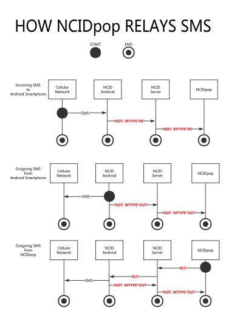

<!-- NCID-API.md -->

<!-- date placeholder notes
Note: #1 ("Last edited:") doesn't have to be the same date as #2 and #3.
Note: #2 and #3 are used in two places and must be the same date (just different formats).
dateplaceholder1=date +"%B %e, %Y"
dateplaceholder2=date +"%B %e, %Y"
dateplaceholder3=date +"%Y-%m-%d"
 -->

<head>
<!-- without this, some browsers will render '&nbsp;' as '&#194;' -->
<meta charset="UTF-8">
</head> 

<!-- see tail end of this file for markdown editor specific formatting/layout notes -->

<!-- Haroopad won't render centered heading - outputs '#' as-is -->

# 
 NCID API Documentation 

# 
  

API 1.12

<!-- 

Last edited: dateplaceholder1

-->

Last edited: April 19, 2022
 

Copyright &copy; 2010-2022

John L Chmielewski

This document contains information needed to develop servers, clients, 
client output modules and gateways for NCID (Network Caller ID). 

All example phone numbers and names contained herein are intended to be 
fictional.

There are 5 feature sets of NCID conformance:

-   Feature Set 1: Modem and Device Support (required)

-   Feature Set 2: Gateway Support (optional)

-   Feature Set 3: Client Job Support (optional)

-   Feature Set 4: Acknowledgment Support (optional)

-   Feature Set 5: Relay Job Support (optional)

<!--
NOTE:
A link ref MUST be contained entirely on one line. Do not split. Not all
Markdown parsers handle split links correctly.
-->

##  Table of Contents

> **[Before you begin](#b4-begin)**

>> [ABOUT CONFIGURATION OPTIONS FOR SERVER IMPLEMENTATIONS](#about-config)

>> [ABOUT END-OF-LINE TERMINATORS](#about-eol)

>> [ABOUT LINE TYPES AND FIELD PAIRS](#about-pairs)

>> [GUIDELINES FOR CALCULATING CALL DURATION](#about-duration)

>> [ENSURING CONNECTIVITY WITH THE SERVER](#connectivity)

>> [COMPANION DOCUMENTS](#companion)

> **[Call/Message Line Types, Categories and Structure (new in API 1.7)](#comm)**

>> [OVERVIEW](#comm-overview) 

>> [TABLE](#comm-table)

>> [{CALLTYPE} CATEGORY STRUCTURE](#comm-calltype)

>> [{MSGTYPE} CATEGORY STRUCTURE](#comm-msgtype)

>>> [Server Output Lines](#comm-msgtype-server)

>>> [Client/Gateway Output Lines](#comm-msgtype-client-gw)

> **[Feature Set 1: Modem and Device Support](#fs1-modem-support)**

>> [SERVER IMPLEMENTATION](#fs1-server-impl)

>>> [Server Output Lines](#fs1-server-output)

>>> [Server Alias Support](#fs1-alias-support)

>>> [Server Hangup Support](#fs1-hangup-support)

>>> [Modem-to-Server](#fs1-modem2server)

>>> [Optional Server Extensions](#fs1-server-ext)

>>> [Optional Server Hangup Extension](#fs1-hangup-ext)

>>> [Optional NetCallerID Device-to-Server](#fs1-netcid2server)

>>> [Optional TCI Device-to-Server (new in API 1.1)](#fs1-tci2server)

>> [CLIENT IMPLEMENTATION](#fs1-client-impl)

>>> [Client-to-Server](#fs1-client2server)

>>> [Optional Client-to-Module](#fs1-client2module)

>>> [<strike>Optional Client-to-TiVo Display</strike> (Removed in API 1.6) ](#fs1-client2tivo)

> **[Feature Set 2: Gateway Support](#fs2-gw-support)**

>> [SERVER IMPLEMENTATION](#fs2-server-impl)

>>> [XDMF Input (new in API 1.8)](#fs2-xdmf-input)

>>> [Server Output Lines](#fs2-server-output)

>> [GATEWAY IMPLEMENTATION](#fs2-gw-impl)

>>> [Gateway-to-Server](#fs2-gw2server)

>>> [Forwarding Gateway (Server-to-Server) (new in API 1.4)](#fs2-fwdgw)

>> [CLIENT IMPLEMENTATION](#fs2-client-impl)

>>> [Optional Client-to-Module](#fs2-client2module)

> **[Feature Set 3: Client Job Support](#fs3-client-job-support)**

>> [OVERVIEW OF AVAILABLE CLIENT JOBS](#fs3-overview)

>> [SERVER IMPLEMENTATION](#fs3-server-impl)

>>> [Server Output Lines](#fs3-server-output)

>> [CLIENT IMPLEMENTATION](#fs3-client-impl)

>>> [Client-to-Server](#fs3-client2server)

>> [REQUIREMENTS FOR DIAL-A-NUMBER CLIENT JOB (new in API 1.6)](#fs3-dial-req)

>>> [*lineid*](#fs3-dial-lineid)

>>> [Server Implementation](#fs3-dial-server-impl)

>>> [Client Implementation](#fs3-dial-client-impl)

>> [CLIENT JOB EXAMPLES](#fs3-examples)

> **[Feature Set 4: Acknowledgment Support](#fs4-ack-support)**

>> [SERVER IMPLEMENTATION](#fs4-server-impl)

>>> [Server Output Lines](#fs4-server-output)

>> [GATEWAY IMPLEMENTATION](#fs4-gw-impl)

>>> [Gateway-to-Server](#fs4-gw2server)

>> [CLIENT IMPLEMENTATION](#fs4-client-impl)

>>> [Client-to-Server](#fs4-client2server)

> **[Feature Set 5: Relay Job Support (new in API 1.4)](#fs5-relay-job-support)**

>> [RELAY JOB OVERVIEW](#fs5-overview)

>> [SERVER IMPLEMENTATION](#fs5-server-impl)

>> [RELAY JOB ORIGIN (RJO) IMPLEMENTATION](#fs5-origin-impl)

>>> [RJO Line Type Definition](#fs5-def-rjo)

>> [RELAY JOB TARGET (RJT) IMPLEMENTATION](#fs5-target-impl)

>>> [RJT Line Type Definition](#fs5-def-rjt)

>> [RELAY JOB EXAMPLES](#fs5-examples)

> **[Sending a Text Message](#sending-messages)**

> **[Emulation Programs and Test Files](#emulation)**

> **[Appendix A: Quick Reference List of all {CALLTYPE} and {MSGTYPE} line types](#quick-ref-call-types)**

> **[Appendix B: Index to all line type definitions](#index-line-types)**

> **[Appendix C: Quick Reference List of all server configuration settings](#quick-ref-serv-config)**

> **[Appendix D: More info about modem MESG hexadecimal characters](#modem-mesg-hex)**

> **[Appendix E: SMS Relay Job sequence diagram (new in API 1.4)](#ncidpop-sms-relay)**

> **[Appendix F: Index to all field pair definitions](#index-field-pairs)**

> **[Appendix G: Field pair definitions](#all-field-pairs)**

> **[API Version Change History](#api-history-top)**

>> [Release Summary](#api-release-summary)

>> [Version 1.11](#api-history-1.11)

>> [Version 1.10](#api-history-1.10)

>> [Version 1.9](#api-history-1.9)

>> [Version 1.8](#api-history-1.8)

>> [Version 1.7](#api-history-1.7)

>> [Version 1.6](#api-history-1.6)

>> [Version 1.5](#api-history-1.5)

>> [Version 1.4](#api-history-1.4)

>> [Version 1.3](#api-history-1.3)

>> [Version 1.2](#api-history-1.2)

>> [Version 1.1](#api-history-1.1)

>> [Version 1.0](#api-history-1.0)

> **[Documentation Change History](#doc-history-top)**

<!-- 
>> [dateplaceholder2](#doc-history-dateplaceholder3) 
-->

>> [April 19, 2022](#doc-history-2022-04-19) 

>> [August 1, 2021](#doc-history-2021-08-01) 

>> [April 26, 2019](#doc-history-2019-04-26)

>> [October 27, 2018](#doc-history-2018-10-27)

>> [August 17, 2018](#doc-history-2018-08-17)

>> [May 31, 2018](#doc-history-2018-05-31)

>> [November 5, 2017](#doc-history-2017-11-05)

>> [November 6, 2016](#doc-history-2016-11-06)

>> [September 30, 2016](#doc-history-2016-09-30)

>> [July 23, 2016](#doc-history-2016-07-23)

>> [May 7, 2016](#doc-history-2016-05-07)

>> [December 29, 2015](#doc-history-2015-12-29)

  

##  Before you begin

> ###  ABOUT CONFIGURATION OPTIONS FOR SERVER IMPLEMENTATIONS

>> This API document attempts to describe server interactions with
gateways, clients, extensions, etc. without regard to a specific operating
system or specific programming methods and conventions. However, for the
purpose of reading this document we will reference configuration options
using the following convention:

>>**&lt;configuration file name::setting name&gt;**

>> In the case of the official NCID distribution for Unix/Linux platforms,
there are several configuration files. Here are just a few of them:

>>>
Purpose                   | Unix/Linux File Name | Convention used in this API
--------------------------|----------------------|:---------------------------
Server settings           | ncidd.conf           | **&lt;ncidd.conf::setting name&gt;**
Alias mappings            | ncidd.alias          | **&lt;ncidd.alias::alias definition&gt;**
Blacklist                 | ncidd.blacklist      | **&lt;ncidd.blacklist::call name or number&gt;**
Whitelist                 | ncidd.whitelist      | **&lt;ncidd.whitelist::call name or number&gt;**
Universal Client settings | ncid.conf            | **&lt;ncid.conf::setting name&gt;**
SIP Gateway settings      | sip2ncid.conf        | **&lt;sip2ncid.conf::setting name&gt;**
YAC Gateway settings      | yac2ncid.conf        | **&lt;yac2ncid.conf::setting name&gt;**
XDMF Gateway settings     | xdmf2ncid.conf       | **&lt;xdmf2ncid.conf::setting name&gt;**

>> An example of a setting name in the server configuration file would be 
`lockfile`. Within this document you would see the setting referenced 
as **ncidd.conf::lockfile**.

>> If a developer wishes to create his or her own NCID server, any 
configuration file name and setting name convention desired can be used. 
For example, an NCID server for Windows might use a file name called
**ncid-server.ini** and a setting called **LockFile=**. 

>> Using the **&lt;configuration file name::setting name&gt;** convention 
allows a developer to correlate the setting names referenced in this API 
with the developer's own conventions. In this regard, you can think of
**&lt;configuration file name::setting name&gt;** as a reference to a 
concept or definition. **ncidd.conf::lockfile** therefore refers to the 
path of the server's serial port lock file. An alphabetized summary of 
all server options, including a brief description, can be found
in [Appendix C: Quick Reference List of all server configuration settings](#quick-ref-serv-config).

> ###  ABOUT END-OF-LINE TERMINATORS
> 
>> Carriage return characters may appear in this document as &lt;CR&gt;, 
x0D, or \r.  Line feeds a.k.a. new lines may appear as &lt;LF&gt;, 
&lt;NL&gt;, x0A, or \n.

>> Because of NCID's Unix origin, generally speaking, line feeds are the 
preferred line terminator. This applies not only to client/server 
communications but also to reading files (e.g., **ncidd.conf**, 
**ncidd.alias**, **ncid.conf**, **ncid-mysql.conf**, etc.) as well as 
writing files (e.g., **ncidd.log**, **ncidd.alias**, **cidcall.log**, 
etc.).

>> Even though line feeds are preferred, the Unix distributions of NCID 
will generally play it safe and look for both &lt;CR&gt; and &lt;LF&gt;,
stripping these characters prior to storing data in memory or otherwise 
processing the read/received data. In other words, NCID does not enforce 
which end-of-line terminator is used when reading files or receiving data,
it just requires a minimum of one (&lt;CR&gt; or &lt;LF&gt;) to be used.

>> The exception is when NCID must *write* or *send* data to third party 
hardware, processes, or protocols. In these cases, third party 
requirements will dictate the end-of-line terminators to be used. NCID 
already takes this exception into account for all officially supported 
third party interactions.

  

> ###  ABOUT LINE TYPES AND FIELD PAIRS

>> The reason for the following restrictions is to allow future NCID 
   programs and scripts to be as backward compatible as possible. This is
   particularly important in the case of third party software that may
   not be updated at the same time as a new NCID release.

>> ### Line Types

>> - This document uses XXX, XXX:,
     XXXLOG:, etc. where XXX
     is a place holder when discussing something that applies to multiple
     line types.

>> - It is very important for a program or script to ignore line types
     (e.g., 200, 210, 
     CID:, HUP:, 
     REQ: etc.) that it does not recognize. It
     should not trigger a fatal error.
   
>> ### Field Pairs - Overview

>>- A field pair is defined as &lt;field label&gt;&lt;field data&gt;,
   with zero or more delimiter characters between them.
   
>>- The very first field pair for a line **might** begin with the three 
   characters \#\#\# to indicate the data is being sent TO the server, or 
   begin with the three characters \*\*\* to indicate the data is being
   received FROM the server.
   
>>- **It is very important NOT to assume that the <u>order</u> of field 
   pairs will always be the same across NCID versions.** 
     
>>-   For example, if today a hypothetical layout of field pairs looks like this:
 
>>>> `XYZ: ***DATE*<date>*TIME*<time>*LINE*<lineid>*NMBR*<number>*MESG*<hexchars>*NAME*<name>*`

>>-  There is no guarantee that the order won't be changed. Perhaps a
     future version would swap MESG and NAME:

>>>> `XYZ: ***DATE*<date>*TIME*<time>*LINE*<lineid>*NMBR*<number>*NAME*<name>*MESG*<hexchars>*`

>>- Another example showing ###/.../+++ field delimiters for the field 
    pairs:
   
>>>> `ABCD: ###DATE<datetime>...CALL<type>...LINE<lineid>...NMBR<number>...
    NAME<name>+++`

>>>> might someday get changed to put NMBR and NAME first:

>>>> `ABCD: ###NMBR<number>...NAME<name>...DATE<datetime>...CALL<type>...
    LINE<lineid>+++`
   
>>- Any programs or scripts you develop on your own must be flexible in
    parsing out &lt;field label&gt;&lt;field data&gt;, wherever they
    might be located in a line.
   
>>- **It is very important for a program or script to ignore
   &lt;field label&gt;&lt;field data&gt; pairs that it does not
   recognize. **
     
>>-  For example, if at some point in the future a new field
     pair with the hypothetical label of JJJJ was added, your programs
     or scripts should not trigger a fatal error. And it might be
     added at any location in the line, not just at the end:

>>>> `XYZ: ***DATE*<date>*TIME*<time>*LINE*<lineid>*NMBR*<number>*JJJJ*<data>*MESG*<hexchars>*NAME*<name>*`

>>>> `ABCD: ###DATE<datetime>...CALL<type>...LINE<lineid>...NMBR<number>...
    JJJJ<data>...NAME<name>+++`

>>-  It is expected that if a field label is present there will also be field data.

>> - Do not leave &lt;field data&gt; empty (null). Although 
 this is not strictly enforced you may get unpredictable results. The 
 best practice is to use the special reserved word or phrase assigned
 to a field pair for this purpose. For example, the &lt;field data&gt;
 for an unknown NAME should be *NO NAME*; for an unknown NMBR 
 use *NO-NUMBER*.

>> - Clients should allow for the &lt;field data&gt;
to be a single dash to suppress the text from being displayed, that 
is, if &lt;field data&gt; contains a dash don't show anything. 

  

>> #### Field Pairs - Frequently Used

>> Click on a link to be taken to its definition.  

>>
Field Label|Description
:-----------|:--------------------------
[DATE](#fpd-date)  | date  
[TIME](#fpd-time)  | time  
[LINE](#fpd-line)  | phone line identifier  
[NMBR](#fpd-nmbr)  | phone number  
[FNMBR](#fpd-fnmbr)| formatted phone number  (new in API 1.11)  
[NTYPE](#fpd-ntype)| phone number's device type  (new in API 1.11)  
[CARI](#fpd-cari) | phone number's carrier name  (new in API 1.11)  
[CTRY](#fpd-ctry) | phone number's two-letter uppercase country code  (new in API 1.11)  
[LOCA](#fpd-loca) | phone number's location within the country  (new in API 1.11)  
[NAME](#fpd-name)  | caller's name  

> ###  GUIDELINES FOR CALCULATING CALL DURATION (new in API 1.12)

>> NCID 1.13 includes an enhanced Universal Client with an option to
show incoming/outgoing call duration. There is no field pair for
duration, and this section provides guidelines how you could
implement call duration in your own clients and gateways by using
the SCALL and ECALL field pairs that are present in the END: line type.
This section also describes how the enhanced Universal Client shows
call duration at call completion. The SCALL and ECALL field pairs
have been part of NCID since release 0.86.1.

>> Call duration can only be calculated for input devices and 
gateways that are able to detect when a call begins and ends.
Some input devices and gateways already calculate their own call
duration, and of those some only have a minimum resolution in 
minutes. When properly implemented, NCID can track call duration 
with a minimum resolution in seconds.

>> Simply put, call duration is calculated by first converting 
each human readable SCALL/ECALL field pair into seconds, then 
subtracting the converted SCALL seconds from the converted ECALL
seconds.

>> **Duration caculation with the start and end hour the same, and ignored:**

>>> `OUT: *DATE*03032022*TIME*0935*LINE*WC09*NMBR*4185558765*MESG*NONE*FNMBR*418-555-8765*NTYPE*FIX/CELL*CTRY*US*LOCA*California*CARI*NEW CINGULAR WIRELESS PCS LLC*NAME*WIRELESS CALLER*`

>>> `END: *HTYPE*BYE*DATE*03032022*TIME*0935*SCALL*03/03/2022 09:34:59*ECALL*03/03/2022 09:37:38*CTYPE*OUT*LINE*WC09*NMBR*4185558765*FNMBR*418-555-8765*NTYPE*FIX/CELL*CTRY*US*LOCA*California*CARI*NEW CINGULAR WIRELESS PCS LLC*NAME*WIRELESS CALLER*`

>>>`Duration = End - start = 09:37:32 - 09:34:59 = 37*60+34 - 34*60+59 = 2254-2099 = 155 seconds = 02 min 35 sec = 02:35`

>> **Duration caculation with the start and end hour different**

>>> OUT: *DATE*03032022*TIME*0939*LINE*WC09*NMBR*4185558765*MESG*NONE*FNMBR*418-555-8765*NTYPE*FIX/CELL*CTRY*US*LOCA*California*CARI*NEW CINGULAR WIRELESS PCS LLC*NAME*WIRELESS CALLER*

>>> END: *HTYPE*BYE*DATE*03032022*TIME*0939*SCALL*03/03/2022 09:39:18*ECALL*03/03/2022 10:04:36*CTYPE*OUT*LINE*WC09*NMBR*4185558765*FNMBR*418-555-8765*NTYPE*FIX/CELL*CTRY*US*LOCA*California*CARI*NEW CINGULAR WIRELESS PCS LLC*NAME*WIRELESS CALLER*

>>>`Duration = End - start = 10:04:36 - 09:39:18 = 10*60*60+4*60+36 - 09*60*60+39*60*18 = 36276-34758 = 25 min 18 sec = 25:18`
>!
@taa@ possibly add something about off-hook time vs. BGR's talk-time
-->

> ###  ENSURING CONNECTIVITY WITH THE SERVER

>> There are three different methods that clients and gateways can use
   to test their connection to the server.

>> - ##### \\n (newline)

>>> Supported in Feature Set 1. This is the most basic method. A client 
    or gateway simply sends a \\n (newline) to
    the server and checks for errors. The server will make a note in its
    log that it received a blank line, but otherwise ignores it. The 
    server does not send any response.

>> - ##### REQ: YO

>>> Supported in Feature Set 4. A client or gateway can send 
    REQ: YO and expect an
    ACK: REQ YO response from the server.
   
>> - ##### REQ: ACK

>>> Supported in Feature Set 4. A client or gateway can send 
    REQ: ACK &lt;commands and arguments&gt;  and 
    expect an ACK: REQ ACK &lt;commands and 
    arguments&gt; response from the server. 
    ACK: REQ ACK sets an "ack" flag for the
    client that tells the server to acknowledge gateway 
    CALL:, CALLINFO:
    and NOT: lines. In other words, the server 
    is expected to echo back all commands and arguments it receives.

> ###  COMPANION DOCUMENTS

>> You may wish to have the following documents handy as you work with
   the API:
   
>> ### User Manual:

>>> - ["Using NCID" chapter -> "Using Aliases" section](http://ncid.sourceforge.net/doc/NCID-UserManual.html#alias_top)

>>> - ["Using NCID" chapter -> "Using Hangup" section](http://ncid.sourceforge.net/doc/NCID-UserManual.html#hangup_top)

  

##  Call/Message Line Types, Categories and Structure (new in API 1.7)

> ###  OVERVIEW

>> New NCID releases are often accompanied by new line types for call- 
and/or message-type data. The actual structure of the data is usually 
identical with already defined line types and they differ only by the 
XXX: code at the beginning of each line.

>> In order to remove a significant amount of redundant info in this API, 
we've introduced the concept of *category types*. As new line types are 
added that have the same structure, they'll be assigned to a category. 

>> The categories have a secondary benefit in that they will make it 
easier to insure backward compatibility with output modules. Prior to 
API 1.7 it was necessary for end users to carefully examine their 
customized output module configuration files when upgrading to a new 
NCID release. If a new line type was added, it usually meant that the 
configuration file would need to be manually edited in order to make use 
of the new line type. Now, whenever possible and practical, line type 
categories can be used in the configuration files and new NCID releases 
will automatically include the new line types, all without requiring 
customized configuration files to be manually edited.

>> Configuration files can still explicitly use line types if desired or 
if the use of categories is not practical.

>> Over time, we'll be updating all documentation to use the categories. 
This will result in less maintenance work for us.

> ###  TABLE

>> The **FS** and **API** columns, respectively, indicate the minimum 
Feature Set and API version required.

>> Click on a link to be taken to its definition.

>>
 \#|Type                                           |Category | Description               |FS|API
--:|----------------------------------------------:|---------|:--------------------------|--|---
  1|[BLK:](#line-type-blk)|CALLTYPE|Blacklisted Call Blocked   |2 |1.0
  2|[CID:](#line-type-cid)|CALLTYPE|Incoming Call              |1 |1.0
  3|[HUP:](#line-type-hup)|CALLTYPE|Blacklisted Call Hangup    |1 |1.0
  4|[MWI:](#line-type-mwi)|CALLTYPE|Voicemail Message Waiting  |2 |1.7
  5|[OUT:](#line-type-out)|CALLTYPE|Outgoing Call              |2 |1.0
  6|[PID:](#line-type-pid)|CALLTYPE|Incoming Smartphone Call|2 |1.0
  7|[PUT:](#line-type-put)|CALLTYPE|Outgoing Smartphone Call   |2 |1.7
  8|[RID:](#line-type-rid)|CALLTYPE|Ringback Call              |2 |1.7
  9|[WID:](#line-type-wid)|CALLTYPE|Call Waiting Caller ID     |2 |1.1
 10|MSG:                  |MSGTYPE |Message  [(client output)](#line-type-msg-client) or  [(server alert)](#line-type-msg-server-alerts) or [(gateway alert)](#line-type-msg-gw-alerts) or  [(server output)](#line-type-msg-server-output) or [(gateway output)](#line-type-msg-gw-output)|1 |1.0
 11|NOT:                  |MSGTYPE |Notice of a Smartphone Message  [(server output)](#line-type-not-server) or [(gateway output)](#line-type-not-gateway) |2 |1.0

  

> ###  {CALLTYPE} CATEGORY STRUCTURE

>> The text line is comprised of field pairs, the first contains the 
>> field label and the second contains the field data. Fields are 
>> separated by a \* and the first field starts after a single \*.
>> The category does not appear in the data.

>>> `XXX: ***DATE*<date>*TIME*<time>*LINE*<lineid>*NMBR*<number>*MESG*<hexchars>*FNMBR*<formatted number>*NTYPE*<Number Type>*CTRY*<country>*LOCA*<location>*CARI*<carrier>*NAME*<name>*`

>> The line is comprised of the following field pairs:

>>>
  &lt;label&gt;\*&lt;data&gt;\*     | Description
  ------------------|:--------------------------------------------------------
  DATE\*date\*      | where date is [mmddyyyy or ddmmyyyy](#fpd-date), m = month, d = day, y = year
  TIME\*time\*      | where time is [hhmm in 24-hour format](#fpd-time), h = hour, m = minute
  LINE\*lineid\*    | where lineid is the [phone line identifier](#fpd-line), NO-LINE or -
  NMBR\*number\*    | where number is the [caller's phone number](#fpd-nmbr), NO-NUMBER or -
  MESG\*chars\*  | where chars is a [string of hexadecimal characters, text ](#fpd-mesg) or NONE 
  FNMBR\*formatted number\* | where formatted number is the [caller's formatted phone number](#fpd-fnmbr) or - (new in API 1.11)
  NTYPE\*Number Type\* | where number type is the [phone number's device type](#fpd-ntype) or - (new in API 1.11)
  CTRY\*country\* | where country is a [phone number's two-letter uppercase country code](#fpd-ctry) or ZZ for unknown country (new in API 1.11)
  LOCA\*location\* | where location is the [phone number's area within the country](#fpd-loca) or - (new in API 1.11)
  CARI\*carrier\* | where carrier is the [phone number's carrier name](#fpd-cari) or - (new in API 1.11)
  NAME\*name\*      | where name is the [caller's name](#fpd-name), a name from the smartphone address book (use "UNKNOWN" if not in the address book), NO NAME or -

  

> ###  {ENDTYPE} CATEGORY STRUCTURE

>> The text line is comprised of field pairs, the first contains the 
>> field label and the second contains the field data. Fields are 
>> separated by a \* and the first field starts after a single \*.
>> The category does not appear in the data.

>>>> `END: *HTYPE*<ec>*DATE*<date>*TIME*<time>*SCALL*<dt>*ECALL*<dt>*CTYPE*<io>*LINE*<lineid>*NMBR*<number>*FNMBR*<formatted number>*NTYPE*<Number Type>*CTRY*<country>*LOCA*<location>*CARI*<carrier>*NAME*<name>*`

>>> The END: line has the following field pairs 
(field label and field data): 

>>>>
  &lt;label&gt;\*&lt;data&gt;\*     | Description
  ------------------|:--------------------------------------------------------
  HTYPE\*ec\*       | where ec = BYE or CANCEL
  DATE\*date\*      | where date is [mmddyyyy or ddmmyyyy](#fpd-date), m = month, d = day, y = year
  TIME\*time\*      | where time is [hhmm in 24-hour format](#fpd-time), h = hour, m = minute
  SCALL\*date time\*| where start of call date is [mm/dd/yyyy](#fpd-date), a space and time is [hh:mm:ss in 24-hour format](#fpd-time), m = month, d = day, y = year,  h = hour, m = minute, s=second
  ECALL\*date time\*| where end of call date is [mm/dd/yyyy](#fpd-date), a space and time is [hh:mm:ss in 24-hour format](#fpd-time), m = month, d = day, y = year,  h = hour, m = minute, s=second
  CTYPE\*io\*       | where io is either IN or OUT (this is not a pass through of the CALL: CALLtype)
  LINE\*lineid\*    | where lineid is the [phone line identifier](#fpd-line), NO-LINE or -
  NMBR\*number\*    | where number is the [caller's phone number](#fpd-nmbr), NO-NUMBER or -
  FNMBR\*formatted number\* | where formatted number is the [caller's formatted phone number](#fpd-fnmbr) or - (new in API 1.11)
  NTYPE\*Number Type\* | where number type is the [phone number's device type](#fpd-ntype) or - (new in API 1.11)
  CTRY\*country\* | where country is a [phone number's two-letter uppercase country code](#fpd-ctry) or ZZ for unknown country (new in API 1.11)
  LOCA\*location\* | where location is the [phone number's area within the country](#fpd-loca) or - (new in API 1.11)
  CARI\*carrier\* | where carrier is the [phone number's carrier name](#fpd-cari) or - (new in API 1.11)
  NAME\*name\*      | where name is the [caller's name](#fpd-name), NO NAME or -

 

> ###  {MSGTYPE} CATEGORY STRUCTURE

>> {MSGTYPE} allow for free-form text following 
the line type.

>> Alerts have no field pairs. The Server and Client/Gateway lines do have
field pairs and the difference is that the first field after the free-form 
text begins with \*\*\* (sent from server) or \#\#\# (sent to server) 
respectively.

>> ###  Server/Gateway Alerts

>>>> `MSG: <message>`

>>> Alerts have a MSG: line type followed by 
free-form text; they have no field pairs.

>> ###  Server Output Lines

>>>> `XXX: <message> ***DATE*<mmddyyyy>*TIME*<hhmm>*LINE*<id>*NMBR\*<nmbr>\*MTYPE*IN|OUT|SYS|USER*FNMBR*<formatted number*NTYPE*FIX/CELL*CTRY*<cc>*LOCA*<location>*CARI*<carrier>*NAME*<name>*`

>>> The line is comprised of the following field pairs:

>>>>
  &lt;label&gt;\*&lt;data&gt;\*     | Description
  ------------------|:--------------------------------------------------------
  \*\*\*            | start of the information part of the message being sent from the server
  DATE\*date\*      | where date is [mmddyyyy or ddmmyyyy](#fpd-date), m = month, d = day, y = year
  TIME\*time\*      | where time is [hhmm in 24-hour format](#fpd-time), h = hour, m = minute
  LINE\*lineid\*    | where lineid is the [phone line identifier](#fpd-line), NO-LINE or -  
  NMBR\*number\*    | where number is the [caller's phone number](#fpd-nmbr), NO-NUMBER or -
  MTYPE\*io\*       | where io is either IN, OUT, SYS or USER
  FNMBR\*formatted number* | where formatted number is the [caller's formatted phone number](#fpd-fnmbr) or -
  NTYPE\*Number Type* | where number type is the [phone number's device type](#fpd-ntype) or - (new in API 1.11)
  CTRY\*country\* | where country is a [phone number's two-letter uppercase country code](#fpd-ctry) or ZZ for unknown country   (new in API 1.11)
  LOCA\*location* | where location is the [phone number's area within the country](#fpd-loca) or -   (new in API 1.11)
  CARI\*carrier\* | where carrier is the [phone number's carrier name](#fpd-cari) or - (new in API 1.11)
  NAME\*name\*      | where name is the [caller's name](#fpd-name), NO NAME or -

  

>> ###  Client/Gateway Output Lines

>>>> `XXX: <message>###DATE*<date>*TIME*<time>*NAME*<name>*NMBR*<number>*LINE*<lineid>*MTYPE*<io>*`

>>> The line is comprised of the following field pairs:

>>>>
  &lt;label&gt;\*&lt;data&gt;\*     | Description
  ------------------|:--------------------------------------------------------
  \#\#\#            | start of the information part of the message being sent to the server
  DATE\*date\*      | where date is [mmddyyyy or ddmmyyyy](#fpd-date), m = month, d = day, y = year
  TIME\*time\*      | where time is [hhmm in 24-hour format](#fpd-time), h = hour, m = minute
  LINE\*lineid\*    | where lineid is the [phone line identifier](#fpd-line), NO-LINE or -
  NMBR\*number\*    | where number is the [caller's phone number](#fpd-nmbr), NO-NUMBER or -
  MTYPE\*io\*       | where io is either IN, OUT, SYS, USER, NONE or -
  NAME\*name\*      | where name is the [caller's name](#fpd-name), NO NAME or -

##  Feature Set 1: Modem and Device Support

> ###  SERVER IMPLEMENTATION

>> If you want to implement a server to communicate with NCID clients
and gateways:

>> - listen to port 3333 for a connection or whatever port is specified
    by **ncidd.conf::port**/landline

>> - send a 200 text message to identify the 
    server and version

>> - send a 210 text message to identify the 
    API version and supported feature sets

>> - (New in API 1.5) immediately after sending a 210 line,
     receive and process zero or more HELLO: lines

>> - check server 
    **ncidd.conf::send cidlog** to determine whether to send the call log      

>>> - if not configured to send it, or the size exceeds 
     **ncidd.conf::cidlogmax**, send a 
     251 Call log not sent message 

>>> - if configured to send it but it is empty, send a 
     252 Call log empty message

>>> - if configured to send it but the file does not exist, send a
     253 No Call log message

>>> - if configured to send it and it is not empty, send a
     254 Start of call log message

>>> - if configured to send it and it is not empty, send the call log 
     and end with a  250 End of call log
     message

>> - optionally, send a list of server-supported Client Job options to 
    client, one OPT: &lt;option&gt; line for 
    each option

>> - if a server setting is being temporarily overridden by a 
     HELLO: CMD: &lt;command&gt; line,
     clear the override so it will not apply to future connections

>> - send a 300 End of server startup message

>> - putting all of the above together, a typical client connection
   start-up looks like this:
>>
>>>          200 Server: ncidd (NCID) x.x  
>>>          210 API: x.x Feature Set x x x x ...  
>>>          Client Sent: HELLO: IDENT: client ncid (NCID) x.x  
>>>          Client Ident: client ncid (NCID) x.x  
>>>          CIDLOG: \*DATE\*12012015\*TIME\*0028\*LINE\*POTS\*NMBR\*...  
>>>          HUPLOG: \*DATE\*12012015\*TIME\*0105\*LINE\*POTS\*NMBR\*...  
>>>          ...  
>>>          254 Start of call log  
>>>          250 End of call log  
>>>          OPT: hangup-1  
>>>          OPT: ...  
>>>          300 End of connection startup
          

>> - when a call is received:

>>> - if configured by **ncidd.conf::send cidinfo** to send ring info, 
    send a CIDINFO: line at each ring with a 
    LINE indicator (default '-') and the ring count

>>> - generate an alias for the name, number and/or line if it is in the 
    alias file

>>> - (New in API 1.11) format the telephone number oountry specific

>>> - if optional Internal Hangup support (**ncidd.conf::hangup**) is 
    implemented:

>>>> - hangup a call if it is in the **ncidd.alias** file
     but not in the **ncidd.whitelist** file

>>>> - hangup a call using a modem:

>>>>> - modem off-hook
>>>>> - send HUP: line to connected clients
>>>>> - delay
>>>>> - modem on-hook

>>> - if optional Hangup Extensions support (**ncidd.conf::hupmode**) is 
    implemented:

>>>> - hangup a call if the Hangup Extension script determines it should 
     be terminated

>>>> - hangup a call using a modem:

>>>>> - modem off-hook
>>>>> - send HUP: line to connected clients
>>>>> - delay
>>>>> - modem on-hook

>>> - otherwise, if the call is not being terminated, send a 
    CID: line to connected clients when a call
    is received

>>> - send a CIDINFO: line after ringing stops,
    with a ring count of 0

>>> - send a CIDINFO: when automatic hangup is completed,
    with a ring count of -4.

>> - send a MSG: line to connected clients with
   an important server warning or a user message

>> - maintain a constant TCP connection with the clients

>> - allow clients to send a \\n (newline) to
     determine if the server is still available but ignore it (no
     response is sent back to the client)

>> - detect clients as they come and go

>>> - (New in API 1.6) allow clients to send an optional
     GOODBYE (note that there is no trailing 
     colon) line to close the connection to the server

>> 

>> ### Server Output Lines

>> When the server sends information to a client or gateway, it sends the
   data as lines of text that start with a line label. This defines line
   types. The current line labels are:

>> - 200

>>> The server version message. The wording stays the same, but the 
    version number changes each time the server is updated.

>>> For example, if the server was version 1.0:

>>>> `200 Server: ncidd (NCID) 1.0`

>> - 210

>>> The server API version and feature sets. This is to inform clients 
    and gateways what features are implemented. All supported feature 
    sets must be included.

>>> For example, if the API version is 1.0 then four feature sets are
    supported:

>>>> `210 API: 1.0 Feature Set 1 2 3 4`

>> - 250 - 254

>>> A call log message sent at server startup:

>>>> `250 End of call log`

>>>> `251 Call log not sent`

>>>> `252 Call log empty`

>>>> `253 No Call log`

>>>> `254 Start of call log`

>> - 300

>>> End of the connection startup message:

>>>> `300 End of connection startup`

>> - CID:

>>> An incoming Caller ID text line. It is sent to the clients and saved
    in the call log when a call is received. 
    
>>> It has the [{CALLTYPE} Category Structure](#comm-calltype).
    
>> - CIDINFO:

>>> A text line that indicates the telephone LINE identifier and ring
information. The text line is comprised of field pairs, the first
contains the field label and the second contains the field data. Fields
are separated by a \* and the first field starts after a \*. The ring
information is only obtained from modems that indicate each ring or
gateways that use ring to indicate the type of call termination. Note 
that "termination" for CIDINFO: lines does not
refer to *automatic* Internal Hangups or Hangup Extensions. Instead, it 
refers to a person on the phone who triggers the hangup manually, or the
telco that ends a call that has not been answered after a certain number
of rings.

>>>> `CIDINFO: *LINE*<lineid>*RING*<count>*TIME*<time>*`

>>> The CIDINFO: line has the following fields:

>>>>
  &lt;label&gt;\*&lt;data&gt;\*     | Description
  ------------------|:--------------------------------------------------------
  LINE\*lineid\*    | where lineid is the [phone line identifier](#fpd-line), NO-LINE or -
  RING\*count\*     | where count is 0, -1, -2, -3, -4 or a positive value incremented at each ring &nbsp;0 = (modem) ringing has stopped -1 = (gateway) call terminated without pickup -2 = (gateway) call terminated after pickup -3 = (gateway) BUSY signal for incomplete call -4 = (modem) automatic hangup completed
  TIME\*time\*      | where time is [hh:mm:ss in 24-hour format](#fpd-time), h = hour, m = minute, s=second

>>> Ring indication example sent to the clients for ring count 4 and line 1:

>>>> `CIDINFO: *LINE*1*RING*4*TIME*16:20:05*`

>>> Example of a POTS line label and the end of ringing indicator:

>>>> `CIDINFO: *LINE*POTS*RING*0*TIME*16:20:05*`

>>> A SIP gateway example indicating termination without pickup and a 
VOIP line label:

>>>> `CIDINFO: *LINE*VOIP*RING*-1*TIME*16:20:05*`

>>> A SIP gateway example indicating termination after pickup and a 
VOIP line label:

>>>> `CIDINFO: *LINE*VOIP*RING*-2*TIME*16:20:05*`

>> - HUP:

>>> If Internal Hangup support (**ncidd.conf::hangup**) or Hangup 
Extensions support (**ncidd.conf::hupmode**) is implemented, then when a 
call is automatically terminated, a HUP: (Hung 
Up Phone) line is created by replacing the CID: 
label with the HUP: label. 
    
>>> It has the [{CALLTYPE} Category Structure](#comm-calltype).
    
>> - LOG:

>>> When the server sends the call log, it adds the LOG: tag to every line that does not contain a 
    recognized line label. The following is an example of a comment line
    that may be in the file: 

>>>> `LOG: # Aug  1 00:30:01 localhost newsyslog[35020]: logfile turned over`
>>

>> - MSG: (server alerts)

>>> A text line containing a server alert that is sent to the 
    clients and saved in the call log. It has free-form text only and no
    field pairs.

>>> It has the [{MSGTYPE} Category Structure for Server/Gateway Alerts](#comm-msgtype-alerts).

>>> Example:

>>>> 
    MSG: Caller ID Logfile too big: (95000 > 90000) bytes

>> - MSG: (server output)

>>> A text line containing a server message that is sent to the 
    clients and saved in the call log.

>>> It has the [{MSGTYPE} Category Structure for Server Output Lines](#comm-msgtype-server).
    
>> - OPT: &lt;hangup-X|hupmode-X|ignore1|regex-X&gt; 
>> -  OPT: LineIDs: &lt;lineid&gt; &lbrack;&lt;lineid&gt;&rbrack; .... (new in API 1.6) 
>> - OPT: country: &lt;country code&gt;  (new in API 1.11)

>>> A server option sent to all the clients. Multiple 
    OPT: lines are permitted and the lines do not
    need to be sent in any particular order. Unless otherwise indicated, options
    are always in lowercase. 

>>>- OPT: hangup-X

>>>> Informational only, corresponds to the value of **ncidd.conf::hangup**
     where "X" is in the range 1-3. This line is not sent if **ncidd.conf::hangup** 
     has the value zero.

>>>- OPT: hupmode-X

>>>> Informational only, corresponds to the value of **ncidd.conf::hupmode**
     where "X" is in the range 1-3. This line is not sent if **ncidd.conf::hupmode** 
     has the value zero.
     
>>>- OPT: ignore1

>>>> Informational only, corresponds to the value of **ncidd.conf::ignore1**.
     This line is not sent if **ncidd.conf::ignore1** has the value zero.
     
>>>- OPT: regex-X

>>>> Informational only, corresponds to the value of **ncidd.conf::regex**
     where "X" is in the range 0-2.
     
>>>- OPT: LineIDs: &lt;lineid&gt; &lt;lineid&gt; ....

>>>> When **ncidd.conf::cidinput** indicates that an "AT" modem is connected,
     OPT: LineIDs: becomes a list of each 
     **ncidd.conf::lineid**, up to a maximum
     of four, after applying LINE alias(es). This is a space-delimited 
     list and if any **ncidd.conf::lineid** contains embedded spaces, 
     enclose it in quotes.
    

  

>>>> Example:

>>>>> `OPT: LineIDs: "POTS" "WORK 1" "VOIP" "WORK 2"`

>>>> OPT: LineIDs: is not sent if 
     **ncidd.conf::cidinput** indicates no "AT" modem is attached.
     
>>>> When there is more than one lineid, clients must allow the user to 
     select from this list when implementing Feature Set 3 
     REQ: DIAL.
     
>>>> Multiple modems are supported, 
      OPT: LineIDs: will contain one or more lineids,
      each one in quotes.

>>>- OPT: country: &lt;country code&gt; 

>>>> Required, indicates the two-letter uppercase country code. 
The default country code is US 
unless **ncidd.conf::country** is set.

>>>  (New in API 1.3) Unless otherwise noted, all OPT: 
lines output by the server are for informational and troubleshooting 
purposes only. Clients can optionally make use of them by giving the user 
a way to display them. Otherwise, clients are not required to display 
them, do not need to take any action on them and can safely ignore them.
See [Feature Set 1: Client Implementation](#fs1-client-impl) for 
more information.    

>> ###  Server Alias Support
>>

>> The name, number and telephone line of a call are checked for an 
   alias. If a match is found it will be replaced by its alias 
   before the call is added to the call log and before the call 
   information is sent to the clients.
   
>> NCID's support for aliases is extensive and there is an entire 
   section in the User Manual devoted to the subject (see the chapter 
   "Using NCID"). Continue reading below for:
   
>> - only API-specific topics

>> - a summary of all alias types

>> - a summary of alias-related configuration options in **ncidd.conf**

>> Alias support is required in Feature Set 1.
     
>> Clients implementing Feature Set 3: Client Job Support, can also
   be used to maintain aliases. Such clients will also provide a way
   to force the server to reload its alias table.

>>> ##### Alias Types

>>> There are six types of aliases. The text in the Code column below 
   is used internally by NCID to distinguish the types and you'll see it 
   used throughout this document. 
 
>>> 
  Type           |   Code   
  :--------------|----------
  number         | NMBRONLY 
  name           | NAMEONLY 
  number & name  | NMBRNAME 
  number if name | NMBRDEP  
  name if number | NAMEDEP  
  lineid         | LINEONLY 

 

>>> ##### Alphabetical list of related configuration options:

>>> - ncidd.conf::cidalias  
>>> - ncidd.conf::ignore1  
>>> - ncidd.conf::lineid  
>>> - ncidd.conf::regex  
    

  

>> ###  Server Hangup Support
>>

>> At a high-level, there are two sets of procedures available to 
   automatically hangup calls. Both are optional and one or both can be 
   enabled at the same time. They are:

>> * Internal Hangups. This is built in to the NCID server and uses the
   **ncidd.blacklist::<call name or number>** and 
   **ncidd.whitelist::<call name or number>** files.

>> * Hangup Extensions. This lets you use an external script or program.

>> Internal Hangups are described below.
>> [Hangup Extensions are optional.](#fs1-hangup-ext)

>> When Caller ID is received from a modem and if the caller name or 
   number is in the blacklist file but not the whitelist file, hangup 
   is automatic. 
   
>> NCID's support for automatic hangups is extensive and there is an 
   entire section in the User Manual devoted to the subject (see the 
   chapter "Using NCID"). Continue reading below for:
   
>> - only API-specific topics

>> - details of the *AT* commands sent for all hangup types

>> - a summary of Internal Hangup-related configuration options in 
>> **ncidd.conf**

>> Internal Hangup support is optional in Feature Set 1.
     
>> Clients implementing Feature Set 3: Client Job Support, can also
   be used to maintain the blacklist and whitelist. Such clients will
   also provide a way to force the server to reload these tables.

>> When the server hangs up the line, it sends a 
   HUP: line to the clients and call log. The
   HUP: line has the same layout as the
   CID: line generated from the call, but 
   with CID: replaced by 
   HUP:. 

>>> ##### Internal Hangup Types        

>>> If enabled by **ncidd.conf::hangup**, there are three types of hangups:

>>> - ##### Normal (required)

>>>> When the server receives the Caller ID and if the name or number is
    in the blacklist file but not the whitelist file, the modem does a
    pickup, delays for one second and then does a hangup.  

<!--
Sometimes (only sometimes) Pandoc doesn't like a table row to end with 
nothing; Pandoc loses track of the fact that it is rendering a table.
So use '&nbsp;'. '&#32;' also works.
-->
    
>>>>>
  Action          | Send this *AT* command
  ----------------|-----------------------
  PICKUP the line | ATH1
  delay 1 second  | &nbsp;
  HANGUP          | ATH0

>>> - ##### FAX (optional)

>>>> When the server receives the Caller ID and if the name or number is
    in the blacklist file but not the whitelist file, the modem sets
    FAX mode, does a FAX answer, generates a FAX tone, delays for 10
    seconds, hangs up and resets to data mode.

>>>>>
  Action           | Send this *AT* command | Expected modem response
  -----------------|------------------------|------------------------
  Set FAX Mode     | AT+FCLASS=1            | OK
  * PICKUP the line| ATH1                   | OK
  FAX Answer       | ATA                    |
  delay 10 seconds |                        |
  HANGUP           | ATH0                   | OK
  Set DATA Mode    | AT+FCLASS=0            |

>>>> \* NOTE: **PICKUP** is a configuration option. Older modems may 
fail to generate a FAX tone if there is a PICKUP. 

>>> - ##### Announce (optional)

>>>> When the server receives the Caller ID and if the name or number is
in the blacklist file but not the whitelist file, the modem sets
VOICE mode, answers the call, plays a recording, hangs up and
resets to data mode.

>>>>>
  Action                       | Send this *AT* command | Expected modem response
  -----------------------------|------------------------|------------------------
  Set VOICE Mode               | AT+FCLASS=8            | OK
  Set speaker volume to normal | AT+VGT=128             | OK
  * Select compression method  | AT+VSM=130             | OK
  Answer call                  | AT+VLS=1               | OK
  Set echo off                 | ATE0                   | OK
  Select VOICE TRANSFER Mode   | AT+VTX                 | CONNECT
  Send recording to modem      |                        |
  Send end of recording        | &lt;DLE&gt;&lt;ETX&gt; | OK
  Set echo on                  | ATE1                   | OK
  HANGUP                       | ATH0                   | OK
  Set DATA Mode                | AT+FCLASS=0            |

>>>> \* NOTE: AT+VSM=130 is the default compression method used for the 
Conexant CX93001 chipset used in a lot of modems. 

>>> #####  Alphabetical list of related server configuration options:

>>> - ncidd.conf::announce  
>>> - ncidd.conf::audiofmt  
>>> - ncidd.conf::blacklist  
>>> - ncidd.conf::cidinput  
>>> - ncidd.conf::hangup  
>>> - ncidd.conf::ignore1  
>>> - ncidd.conf::initcid  
>>> - ncidd.conf::initstr  
>>> - ncidd.conf::lockfile  
>>> - ncidd.conf::pickup  
>>> - ncidd.conf::regex  
>>> - ncidd.conf::ttyclocal  
>>> - ncidd.conf::ttyport  
>>> - ncidd.conf::ttyspeed  
>>> - ncidd.conf::whitelist  

>> ###  Modem-to-Server

>>> In the US, telcos transmit the Caller ID between the first and
second rings. Telcos in other countries may transmit it before the first ring.
Nothing needs to be configured in NCID to accommodate this difference,
however, it is important that modems be configured for the
correct country code. The default is normally set based on where it is
purchased. If not, the user will need to do a one-time, manual 
configuration of the country code, usually using the AT+GCI command.

>>  ASCII Plain Format Caller ID

>>> This is a human-readable version of detected Caller ID. It is 
controlled by setting **ncidd.conf::initcid**. Typical values are 
"AT+VCID=1" or "AT#CID=1". Formatted Caller ID is the NCID default.

>>> An example of a modem's Caller ID output is shown below. The order 
of the lines is unimportant and some of the lines may not be
present. For example, the MESG line is normally not emitted by modems.

>>> There may or may not be a space before the '='.

>>> The NMBR label may be DDN\_NMBR (Dialable Directory Number) instead,
>>> depending on the country.

>>>> 
    RING    
>>>> 
    MESG = 110101    
    DATE = 0511    
    TIME = 1852    
    NMBR = 4075550000 or DDN_NMBR = 4075550000    
    NAME = JOHN DOE
>>>> 
    RING

>>>> 

>>  ASCII Hex Format Caller ID (SDMF, MDMF a.k.a. XDMF) (new in API 1.7)

>>> This is an "ASCII Hex" version of detected Caller ID. It is controlled
by setting **ncidd.conf::initcid**. Typical values are "AT+VCID=2" or 
"AT#CID=2". This is the actual data stream supplied by telcos. Not all 
modems support enabling unformatted output.

>>> The XDMF format for Caller ID from modems is a long line in hexadecimal characters as
    *ASCII text*.  XDMF is either MDMF or SDMF.

>>> It is important to note that only *modems* configured for XDMF Caller ID send the output 
    as *ASCII text*.

>>> As long as the modem has been initialized with the appropriate 
**ncidd.conf::initcid** string, the NCID server automatically detects 
Formatted and Unformatted Caller ID data streams.

>>>  SDMF (Single Data Message Format) 
allows telcos to supply the date, time and Caller ID phone number only. 
If the phone number is unavailable, a single letter in place of the 
phone number will indicate the reason: A = anonymous,  O = out of area, 
P = private.

>>> Here is the SDMF equivalent of the above Formatted Caller ID:

>>>> 
    RING    
>>>> 
    041230353131313835323430373535353030303059    
>>>> 
    RING

>>>> 

>>> The hexadecimal string is parsed as follows:

>>>> 
    0412 3035313131383532 34303735353530303030 59    
>>>> 
    Type Len             ASCII Hex                 DATA  
     04h 12h SDMF Call  
             DateTime    3035 3131 3138 3532       '05111852'  
             Number      3430 3735 3535 3030 3030  '4075550000'  
     59h     Checksum

>>> The data consists of:

>>> -  a one-byte (two hexadecimal characters) parameter type
('04' means SDMF in this example) 
>>> -  a one-byte (two hexadecimal characters) 
parameter length ('12' in hex, 18 in decimal) excluding the checksum byte
>>> - zero or more bytes of parameter data (date, time, phone number). 
>>> - a one-byte (two hexadecimal characters) checksum value calculated 
as the two's complement of the modulo 256 sum of all preceding bytes.

>>>  MDMF (Multiple Data Message Format) 
is an enhanced version of SDMF that adds the Caller ID name and 
can also include the data for other telco services (e.g. voicemail 
message waiting). Most telcos now use MDMF.

>>> Whereas SDMF consists of a single parameter "block" followed by a 
checksum, MDMF consists of multiple parameter blocks followed by a 
checksum.

>>> Here is the MDMF equivalent of the above Formatted Caller ID:

>>>> 
    RING
>>>> 
    802001083035313131383532020A3430373535353030303007084A4F484E20444F4584
>>>> 
    RING

>>>> 

>>> The hexadecimal string is parsed as follows:  

>>>> 
    8020 01083035313131383532 020A34303735353530303030
    07084A4F484E20444F45 84
>>>> 
    Type Len             ASCII Hex                 DATA  
     80h 20h MDMF Call
     01h 08h DateTime    3035 3131 3138 3532       '05111852'
     02h 0Ah Number      3430 3735 3535 3030 3030  '4075550000'
     07h 08h Name        4A4F 484E 2044 4F45       'JOHN DOE'
     84h     Checksum

>>> Here, '80' indicates MDMF, '20' is 32 in decimal for the number of 
bytes to follow excluding the checksum byte.

>>> For a good overview of SDMF and MDMF, 
see: http://melabs.com/resources/callerid.htm  
Note that not all of the checksums shown on the above page are correct 
and the site's owner has been notified.

>> ###  Optional Server Extensions

>> A Server Extension is an optional external script or program that is 
  called by ncidd to perform a function and return a result. Server 
  Extensions are a way for users to add functionality to NCID without 
  requiring changes to NCID itself, especially when the functionality is 
  atypical and would not have a broad appeal to other NCID users.

>> Server Extensions are isolated from the main NCID distribution and 
  because of this they do not normally require any changes when NCID is 
  upgraded to a later version.
    
>> One of the design philosophies that has always existed with NCID is to
  accept incoming Caller ID as quickly as possible and to send it to all
  connected clients as quickly as possible. With a Server Extension, there
  is a risk that executing one can impact performance. For this reason,
  users are cautioned to create Server Extensions that are optimized for 
  fast execution.

>> The overall theory of operation is that ncidd will pass call info to
  the Server Extension, it will do whatever processing is desired and
  return back to ncidd some sort of result.
  
>> In order for ncidd to use Server Extensions, there is a minimal amount
  of configuration information required in **ncidd.conf**. Typically this
  consists of a setting to enable/disable the Server Extension and a
  setting to tell ncidd the Server Extension name. Server Extensions
  may have specific options that also need to be in **ncidd.conf**.
  
>> Beyond the minimal info needed to make ncidd aware of the Server Extension,
  there is no reason that a Server Extension could not have its own 
  configuration file.
  
>> You can use any scripting or programming language desired, however, if 
  it is a scripting language and not a compiled binary, the first line 
  must use the normal Unix convention of a "#!" path to the interpreter.
  
>>  Examples:  
>>
>>>     #!/bin/bash  
>>>     #!/usr/bin/perl

>> Currently the only Server Extension supported is the Optional Server Hangup
>> Extension.

>>> ####  Optional Server Hangup Extension

>>> You might want to implement a Hangup Extension if you want additional
   or alternative call termination checking beyond the basic Internal Hangup 
   that's implemented with the **ncidd.blacklist** and **ncidd.whitelist**
   files. All **ncidd.conf::hangup** modes (normal, fax, announce) are supported.
      
>>> One advantage that Hangup Extensions have over the basic Internal Hangup
   is the ability to associate a different **ncidd.conf::announce** file for 
   every Caller ID number or name.

>>> The Hangup Extensions script determines what calls to hang up on.  It does not use
    **ncidd.blacklist** but does use **ncidd.whitelist**.  If the call is in
    **ncidd.whitelist** or if the basic Internal Hangup is enabled and has hung up on the call,
    the hangup script is not executed.

>>> Alphabetical list of related server configuration options:
  
>>> - ncidd.conf::hupmode  
>>> - ncidd.conf::hupname  
>>> - ncidd.conf::huprmd  

>>> The **ncidd.conf::hupname** file must begin with `hangup-`.

>>> ncidd passes one string of call info as a single command line argument. 
   It passes it at the point just prior to changing the line type from
   CID: to HUP:. ncidd
   must wait for the Hangup Extension response data before continuing.
   
>>> The string of call info has the following format and is subject to
   the rules described in [About line types and field pairs](#about-pairs).

>>>> `*DATE*<date>*TIME*<time>*LINE*<lineid>*NMBR*<number>*NAME*<name>*MODE*<hupmode>*`

>>> It has the following fields:

>>>>
  &lt;label&gt;\*&lt;data&gt;\*     | Description
  ------------------|:--------------------------------------------------------
  DATE\*date\*      | where date is [mmddyyyy or ddmmyyyy](#fpd-date), m = month, d = day, y = year
  TIME\*time\*      | where time is [hhmm in 24-hour format](#fpd-time), h = hour, m = minute
  LINE\*lineid\*    | where lineid is the [phone line identifier](#fpd-line), NO-LINE or -
  NMBR\*number\*    | where number is the [caller's phone number](#fpd-nmbr), NO-NUMBER or -
  NAME\*name\*      | where name is the [caller's name](#fpd-name), NO NAME or -
  MODE\*hupmode\*   | where hupmode is in the range of 1 to 3

>>> Data to be passed back from the Hangup Extension to ncidd must be sent to STDOUT.

>>> Format 1:  
>>>
>>>> One of these optional lines, depending on the value of hupmode:  
>>>>
>>>>>     Using HUPMODE 1 - Normal Hangup  
>>>>>     Using HUPMODE 2 - FAX Hangup  
>>>>>     Using HUPMODE 3 - VOICE Hangup

>>>>     HangupReason:<your optional custom hangup reason>  
>>>>     hangup|OK

>>> Format 2, when **ncidd.conf::hupmode** = 3 you can specify an optional voice file:  
>>>
>>>> One of these optional lines, depending on the value of hupmode:  
>>>>
>>>>>     Using HUPMODE 1 - Normal Hangup  
>>>>>     Using HUPMODE 2 - FAX Hangup  
>>>>>     Using HUPMODE 3 - VOICE Hangup  

>>>>     Recording:<file name or full path>  
>>>>     HangupReason:<your optional custom hangup reason>  
>>>>     hangup|OK

>>> Format 3, when **ncidd.conf::hupmode** != 3 and hupmode 3 is required:  
>>>
>>>> One of these optional lines, depending on the value of hupmode:
>>>>
>>>>>     Using HUPMODE 1 - Normal Hangup  
>>>>>     Using HUPMODE 2 - FAX Hangup  
>>>>>     Using HUPMODE 3 - VOICE Hangup  

>>>>     Voice hangup is required  
>>>>     abort

>>> (New in API 1.6) You can specify an optional reason that the Hangup Extension
>>> is terminating the call by sending the `HangupReason:` line. When the
>>> ncidd server detects this line, it will append &lt;your optional custom
>>> hangup reason&gt; to the NAME appearing in the HUP:
>>> line. The `HangupReason:` line must be sent prior to the `hangup` line.

>>> The `Recording:` line must be sent prior to the `hangup` line. If it
   is not present, it will default to the voice file in **ncidd.conf::huprmd**.
   If **ncidd.conf::huprmd** is not defined, the **ncidd.conf::announce** voice file will be
   used.

>>> All data sent to STDOUT by the Hangup Extension will be saved to ncidd.log.

>>> If and only if `hangup` is passed back to ncidd will the call be immediately
   terminated. Passing back `OK` is not required (no response at all is 
   also acceptable) but it is suggested because you'll be able to see it 
   in **ncidd.log**.

>> ###  Optional NetCallerID Device-to-Server

>> The NetCallerID serial device outputs the Caller ID on a single line 
with the following format: 

>>> `###DATE<datetime>...NMBR<number>...NAME<words>+++\r`

>> The NetCallerID line has the following fields:

 

>>>
  &lt;label&gt;&lt;data&gt;     | Description
  ------------------|:--------------------------------------------------------
  \#\#\#            | start of the information part of the message being sent to the server
  DATEdatetime      | where datetime is [mmddhhmm or ddmmhhmm](#fpd-datetime), m = month, d = day, h = hour, m = minute
  ...               | field separator
  NMBRnumber        | where number is the phone number
  ...               | field separator
  NAMEwords         | where words is a name or -UNKNOWN CALLER- or -MSG OFF- or similar
  +++               | end of the information part of the message

>> Examples:

>>> 
    ###DATE03301423...NMBR4075551212...NAMEWIRELESS CALL+++\r    
    ###DATE03301423...NMBR...NAME-UNKNOWN CALLER-+++\r    
    ###DATE03301423...NMBR...NAME+++\r    
    ###DATE...NMBR...NAME-MSG OFF-+++\r    
>>

  

>> ###  Optional TCI Device-to-Server (new in API 1.1)

>> Serial **TCI** devices output a single line using the **Telephone 
Collectors International** output standard. 

>> To make sure the text line is from a TCI device, the server tests to 
make sure all of the following are true: 

>>> line length &gt; 30 characters  
>>> position 0 is a digit  
>>> position 9 is a &#39;/&#39;  
>>> position 24 is an &#39;M&#39;

>> The TCI line has the following fields:

>>>
  Positions | Length | Description
  ---------:|:------:|:-----------
   0-1      |  2     | LINE
   7-11     |  5     | DATE
  17-24     |  8     | TIME
  29-43     | 15     | NUMBER
  55-69     | 15     | NAME

>> Example:

>>> 
    01      9/03      2:25 PM       806-672-1767           WIRELESS CALLER
    0123456789012345678901234567890123456789012345678901234567890123456789
              1         2         3         4         5         6

>> **NOTE:**

>>> All fields except NAME are right justified. Five spaces separate each field,
>>> except NUMBER and NAME fields which are separated by 11 spaces.
>>
>
>

> ###  CLIENT IMPLEMENTATION

>> - connect to port 3333 or whatever port is specified in server
    configuration

>> - receive a 200 server version text message

>> - receive a 210 server API version text message

>> - (New in API 1.5) send zero or more HELLO: lines

>> - if no call log is sent by the server, receive a 251 Call log not sent or a 252 Call 
log empty or a 253 No Call log message 

>> - if a call log is sent by the server, it:

>>> - may contain CIDLOG: text lines to be parsed and displayed

>>> - may contain HUPLOG: text lines to be parsed and displayed

>>> - may contain LOG: text lines which must be ignored

>>> - may contain MSGLOG: text lines to be parsed and displayed

>>> - will end with a 250 End of call log message

>> - receive zero or more OPT: &lt;option&gt; lines.

>>> ###### New in API 1.3
>>>
>>>> Unless otherwise noted, all OPT: lines output by 
     the server are for informational and troubleshooting purposes 
     only. Clients can optionally make use of them by giving the user a
     way to display them. Otherwise, clients are not required to display 
     them, do not need to take any action on them and can safely ignore them.
     See also [Feature Set 1 OPT: definition](#line-type-opt) 
     for more information.

>>>> If a client wants to optionally display the OPT: 
     lines then it will need to do the following:  
     
>>>> - Retrieve all OPT: lines during the initial 
     connection to the server.   
     
>>>> - Have a way for users to easily view the OPT: lines.
    They can be displayed however is convenient for the programming language the 
    client is written in. Displaying the leading OPT:
    text is optional, but the text following OPT:
    must be shown.  
    
>>>> - Handle OPT: hangup (i.e., with no 
    dash-value) in order to accommodate servers that are not yet compliant 
    with API 1.3.  

>>>> - Handle OPT: regex (i.e., with no 
    dash-value) in order to accommodate servers that are not yet compliant 
    with API 1.7.  

    
>>>> - Show "none" if no OPT: lines were received.

>>>> It is suggested, but not required:  

>>>> - That the lines be shown in a vertical list. 

>>>> - That user-friendly text be shown to allow easy interpretation of 
     the setting.  
     
>>>> - That the lines be shown in a Help Menu.

>>>> Examples below show OPT: hangup for a
     pre-API 1.3 server and OPT: hangup-3, even 
     though they won't both be generated by the same server. Similarly
     for a pre-API 1.7 server, OPT: regex and
     OPT: regex-2 won't both be present.

>>>> Minimum suggested examples: 

>>>>  
     Server-enabled options:  
     OPT: hangup  
     OPT: hangup-3  
     OPT: hupmode-2  
     OPT: ignore1  
     OPT: regex 
     OPT: regex-2 
     OPT: LineIDS: "LandLine" "VoIP"

>>>> or

>>>>  
     Server-enabled options:  
     hangup  
     hangup-3  
     hupmode-2  
     ignore1  
     regex
     regex-2     
     LineIDS: :LandLine" "VoIP"

>>>> or

>>>>  
     Server-enabled options:  
     none

  

>>>> Ideal suggested examples showing all options: 

>>>>
  Server-enabled option| Description
  ---------------------| -----------
  none                 | &nbsp;
  hangup&#x7C;hangup-1 | Internal Hangup Mode 1: Terminate Blacklisted Call  
  hangup-2             | Internal Hangup Mode 2: Generate FAX Tone and Terminate Blacklisted Call  
  hangup-3             | Internal Hangup Mode 3: Play Announcement and Terminate Blacklisted Call  
  hupmode-1            | Hangup Extension Mode 1: Terminate Blacklisted Call  
  hupmode-2            | Hangup Extension Mode 2: Generate FAX Tone and Terminate Blacklisted Call  
  hupmode-3            | Hangup Extension Mode 3: Play Announcement and Terminate Blacklisted Call  
  ignore1              | Server Ignores Leading 1 for Calls/Aliases  
  regex&#x7C;regex-1   | Use POSIX Extended Regular Expressions for Server List Matching  
  regex-2              | Use Perl Regular Expressions for Server List Matching  
  LineIDS:&nbsp;"LandLine"&nbsp;"VoIP" | Available lines for dialing numbers
  (anything else)      | Unknown/invalid  

>> - receive a 300 End of server startup message

>> - possibly receive a CIDINFO: line at each 
ring or just at the end of the call 

>> - possibly receive a CID: line whenever a 
call is received 

>> - possibly receive an HUP: line whenever a 
call is automatically terminated 

>> - clients are allowed to send a text message to the server using a
    MSG: line

>> - clients are allowed to connect and disconnect as they please

>>> - (New in API 1.6) possibly send an optional GOODBYE
    (note that there is no trailing colon) line to the server to close the
    connection

>> - possibly send a \\n (newline) to the server
     to determine if the server is still available.

>> - (New in API 1.4) clients must always ignore line types that begin
>> with "+" (e.g., +CID:, +CIDINFO:) 
>> because these represent call activity from a [Forwarding Gateway (Server-to-Server)](#fs2-fwdgw)
>> that are processed only by the NCID server

>> ###  Client-to-Server

>> - \\n (newline)

>>> Clients are allowed to send a \\n (newline) 
    to the server to determine if the server is still available. It 
    should be sent only after at least 15 minutes of no server activity. 
    There is no server response, however, the server will log this action
    as "Client xxx sent empty line." It is up to the client to check to
    see if sending a \\n (newline) results in
    an error and take appropriate action (e.g., try to reconnect to the
    server).
    
>>> If a client needs a more robust way of making sure the server is
    still available by requiring a server response,
    implement [Feature Set 4: Acknowledgment Support](#fs4-ack-support).

>> -  (New in API 1.6) GOODBYE
     (note that there is no trailing colon)

>>>- This optional line type allows the client to force a graceful disconnect
     from the server, rather than relying on the server to disconnect due
     to a connection timeout or error. This is an experimental feature to
     allow a simple register/unregister of clients using alternative 
     connection protocols (e.g., a RESTful interface).

>> - HELLO: IDENT: &lt;ident&gt;  
     HELLO: CMD: &lt;command&gt;
    
>>>- &lt;ident&gt; is any freeform text, upper 
    and/or lowercase and any number of words separated by spaces. It is used
    to identify the client.

>>>>- Only one &lt;ident&gt; line is expected but 
    this is not strictly enforced.

>>>>- The recommended client &lt;ident&gt; contents are:
    
>>>>> &lt;client&gt; &lt;program name&gt; &lt;version number&gt;

>>>>> *or*

>>>>> (New in API 1.6)   

>>>>> &lt;client&gt; &lt;[hostname/]program name&gt; &lt;version number&gt; [OUT]

>>>>- A server has the option of logging or displaying the &lt;ident&gt; string as clients
    connect and disconnect.
    
>>>> New in API 1.6

>>>>- *hostname* is optional, but if present it should end with a trailing 
   slash and be followed immediately by the program name.
    
>>>>- The presence of the special uppercase text *[OUT]* following the version
   in the &lt;ident&gt; string is used
   in [Feature Set 2: Gateway Support](#line-type-hello-gw)
   and [Feature Set 3: Client Job Support](#line-type-req-dial) to tell the 
   server that the client or gateway will be generating OUT:
   lines. For more information, [go to REQ: DIAL](#line-type-req-dial).
    
>>>- &lt;command&gt; controls a 
    server setting or action. There can only be one &lt;command&gt; per line
    and unless otherwise indicated, commands are always in lowercase.

>>>- Multiple lines are permitted. 
    The order of IDENT: &lt;ident&gt; and 
    CMD: &lt;command&gt; lines does not matter.
    
>>>- HELLO: line types are sent only when
    a connection is first established. The server delays on connect after 
    sending a 210 line in order give a client the opportunity to send the optional 
    HELLO: lines. To clarify, 
    HELLO: line types must be sent by the client 
    immediately after receiving a 210 line. 
    
>>>- Any HELLO: line type received after the server
    starts sending the call log is handled as an unknown line type.

>>>-  An example client connection start-up looks like this:  
>>>  
>>>>          200 Server: ncidd (NCID) x.x  
>>>>          210 API: x.x Feature Set x x x x ...  
>>>>          HELLO: IDENT: client ncid x.x.x  
>>>>          HELLO: CMD: no_log  
>>>>          HELLO: ...  
>>>>          251 Call log not sent: /var/log/cidcall.log  
>>>>          OPT: hangup-1  
>>>>          OPT: ...  
>>>>          300 End of connection startup
        
>>>- Unlike most other line types, HELLO: line types 
    must NOT be sent to clients.

>>>- At present, there are two commands:
>>>
>>>>          HELLO: CMD: no_log  
>>>>          HELLO: CMD: send_log  

>>>> The purpose of the no_log command is to temporarily override the server's
    **ncidd.conf::send cidlog** setting. By doing so, the client or gateway 
    can finish connecting much quicker because no call log will be sent.
    The override is maintained only for the currently connecting client
    or gateway and only for the duration of its connection startup.

>>>> (New in API 1.6) If **ncidd.conf::send cidlog** is enabled and HELLO: CMD: no_log
     is sent to the server, instead of sending the log, the server must respond with
     251 Call log not sent. The connection startup
     continues normally, ending with 300 End of connection startup.
     It is critical that the server clears this temporary override so that
     it is not carried over to future connections.

>>>> (New in API 1.6) If **ncidd.conf::send cidlog** is *not* enabled and HELLO: CMD: send_log
    is sent to the server, the server must try to send the log and respond with either
    250 End of call log, 252 Call log empty,
    or 253 No Call log. The connection startup
    continues normally, ending with 300 End of connection startup.
    It is critical that the server clears this temporary override so that
    it is not carried over to future connections.

>>>> The no_log command has no effect on the Feature Set 3 
     REQ: REREAD Client Job that causes the call log to be resent.

>>>> (New in API 1.6) The send_log command has no effect on 
     REQ: REREAD either.

>> - MSG: (client output)

>>> A text line containing a user-generated message that is sent to the 
    server, saved in the call log and then forwarded to all listening clients.

>>> It has the [{MSGTYPE} Category Structure for Client/Gateway Output Lines](#comm-msgtype-client-gw).

>>> Example:

>>>> 
    MSG: This is a user message ###DATE ...

>> ###  Optional Client-to-Module

>> When the client is configured to use an output module, it splits the 
single server call line into thirteen lines for passing via standard input 
to the output module. 

>>> `<DATE>\n<TIME>\n<NMBR>\n<NAME>\n<LINE>\n<TYPE>\n<MTYPE>\n<MESG>\n<FNMBR>\n<NTYPE>\n<CTRY>\n<LOCA>\n<CARI>\n`

>> Click on a link to be taken to its definition.  

>>>
  Line | Field                         | Description
  ----:| ------------------------------|--------------------------------------------------------
  1    | &lt;[DATE](#fpd-date)&gt; mm/dd/yyyy or dd/mm/yyyy | date of either the call or message  where m = month, d = day, y = year
  2    | &lt;[TIME](#fpd-time)&gt; hh:mm or hh:mm&nbsp;am/pm     | time of either the call or message  where h = hour, m = minute
  3    | &lt;[NMBR](#fpd-nmbr)&gt;                          | phone number of either the call or message
  4    | &lt;[NAME](#fpd-name)&gt;                          | caller's name
  5    | &lt;[LINE](#fpd-line)&gt;                          | lineid of either the call or message
  6    | &lt;[TYPE](#fpd-type)&gt;                          | one of the \{CALLTYPE\} or \{MSGTYPE\} line types from the [Categories table](#comm-table)
  7    | &lt;[MESG](#fpd-mesg)&gt;                          | message, or blank for a call
  8    | &lt;[MTYPE](#fpd-mtype)&gt;                         | If &lt;[TYPE](#fpd-type)&gt; indicates a call then &lt;[MTYPE](#fpd-mtype)&gt; will be null. Otherwise, &lt;[MTYPE](#fpd-mtype)&gt; will be IN, OUT, SYS, USER, NONE or -.
  9    | &lt;[FNMBR](#fpd-fnmbr)&gt;                         | formatted phone number (new in API 1.11)
  10   | &lt;[NTYPE](#fpd-ntype)&gt;                         | phone number's device type (new in API 1.11)
  11   | &lt;[CTRY](#fpd-ctry)&gt;                          | phone number's two-letter uppercase country code   (new in API 1.11)
  12   | &lt;[LOCA](#fpd-loca)&gt;                          | phone number's location within the country   (new in API 1.11)
  13   | &lt;[CARI](#fpd-cari)&gt;                          | phone number's carrier name or - (new in API 1.11)  

  
>>
>>

>>

>> ###  <strike>Optional Client-to-TiVo Display</strike> (Removed in API 1.6)

>> <strike>If the TiVo (--tivo|-T) option is given on the command line when 
launching the ncid client, or the TivoFlag is 
set to 1 in ncid.conf, the output is two lines. 
The first line contains the Caller ID name and number. The second line 
contains the type of call and a telephone lineid. If the lineid is 
blank, then there is no second line: 

>>> 
    PASADENA, CA (800)555-1212
>>> 
    PASADENA, CA (800)555-1212  
    CID POTS
</strike>

  

##  Feature Set 2: Gateway Support

> ###  SERVER IMPLEMENTATION

>> If you want to implement a server to communicate with NCID clients 
and gateways: 

>> - implement a Feature Set 1 server

>> - detect gateways as they come and go
    
>> - if a gateway sends a line prefixed with CALL:, 
process it to generate a {CALLTYPE} line 

>> - if a gateway sends a line prefixed with CALLINFO:, process it to generate: 

>>> - an END: line and

>>> - a CIDINFO: line with CANCEL if the ring count is -1, or 

>>> - a CIDINFO: line with BYE if the ring count is -2, or

>>> - a CIDINFO: line with BUSY if the ring count is -3 

>> - if a gateway sends a [{MSGTYPE} Client/Gateway Output Line](#comm-msgtype-client-gw), 
process it to generate a [{MSGTYPE} Server Output Line](#comm-msgtype-server)
(normally this is just replacing \#\#\# with 
\*\*\*) 
	 
>> - (New in API 1.6) examine one or more 
   HELLO: IDENT: &lt;ident&gt; lines
     sent by clients and gateways to see if the 
	 &lt;ident&gt; string identifies certain
	 client-specific or gateway-specific features that the server
	 needs to be aware of.

>> ###  XDMF input

>>> The XDMF gateway (xdmf2ncid) accepts either hex input from a modem or binary input from a device.

>>> Devices such as the CTI Comet USB or the Holtek HT9032D based PSTN Caller ID module output XDMF
    (MDMF or SDMF) Caller ID with the same parameter structure as modems, but do so as binary data
    and do not emit RING lines.

>>> Set xdmf2ncid::ht9032 = 0 for input from a Comet or modem.  
    Set xdmf2ncid::ht9032 = 1 for input from a Holtek HT9032D module.

>>> The data consists of:

>>> - a one-byte parameter type for MDMF or SDMF
>>> - a one-byte parameter length excluding the checksum byte
>>> - zero or more bytes of parameter data (date, time, phone number)
>>> - a one-byte checksum value calculated as the two's complement of the modulo 256 sum
      of all preceding bytes.

>>> Refer to [ASCII Hex Format Caller ID (SDMF, MDMF a.k.a. XDMF)](#fs1-modem2server-ascii-hex-format-cid) for:

>>> - ASCII Hex data from modems
>>> - Description of SDMF and an example of the format
>>> - Description of MDMF and an example of the format

>>> An SDMF binary string, same as the example SDMF string in ASCII Hex:

                    0412 05111852 4075550000 59

                    Type Len            DATA        FORMATTED
                     04h 12h SDMF Call
                             DateTime   05111852    05/11  18:52
                             Number     4075550000  407-555-0000
                     59h     Checksum

>>> An MDMF binary string, same as the example MDMF string in ASCII Hex:

                    8020 05111852 020A4075550000 07084A4F484E20444F45 84

                    Type Len            DATA                 FORMATTED
                    80h 20h MDMF Call
                    01h 08h DateTime    05111852             05/11  18:52
                    02h 0Ah Number      4075550000           407-555-0000
                    07h 08h Name        4A4F 484E 2044 4F45  JOHN DOE
                    84h     Checksum

>>  Holtek HT9032D operation mode

>>> The Holtek HT9032D based PSTN Caller ID module also outputs random data. In between this noise is
    the actual XDMF data, preceded by 27 or 28 x 0x55 (U chars), with a final random character.

>>> The following depicts the output from the Holtek HT9032D module:

>>> **&lt;RANDOM DATA&gt;&lt;27 or 28 U's&gt;&lt;RANDOM CHARACTER&gt;&lt;MDMF PACKET&gt;&lt;RANDOM DATA&gt;**

>>> The XDMF packet format: **&lt;XDMF start&gt;&lt;length&gt;&lt;data&gt;&lt;checksum&gt;**

>>> The XDMF packet length is used to strip the random data that follows the XDMF packet checksum.

>>> For a good overview see: [Testing LinkSprite Caller ID Module (based on HT9032) with a PC](https://bigdanzblog.wordpress.com/2015/05/22/testing-linksprite-caller-id-module-based-on-ht9032-with-a-pc/).

>>> The logic for determining data and noise packets takes one or two reads.

>>> - Read1:  
      Must either contain 10 or more U's to indicate the start of a XDMF packet, or end in a U to
      indicate the start of a possible XDMF packet. If neither, read1 is random data and is ignored.

>>> - Read2:  
      Needed if read1 contains 10 or more U's but does not contain any XDMF packet, if read1
      ends in a U or if read1 contains a partial XDMF data packet.

>>> If the number of U's between read1 and read2 is still less than 10, both read1 and read2 are
    random characters and ignored.  A log entry indicates this.

>> ###  Server Output Lines

>> - BLK:

>>> When a call is automatically blocked, a BLK: (Call Blocked) line is created. A blocked call 
is one where the CID device (e.g., Whozz Calling Ethernet Link devices) 
does not pass an incoming call through to connected telephones. The 
calling party simply hears the line ringing. Compare this with a 
terminated (HUP:) call where the calling party 
hears the line disconnect and may or may not hear the line ringing at 
all. 

>>> It has the [{CALLTYPE} Category Structure](#comm-calltype).

  

>> - END:

>>> An end-of-call text line. It is generated from the CALLINFO: text line from a gateway. It provides 
information that can be used for call accounting. 

>>> It has the [{ENDTYPE} Category Structure](#comm-endtype).

>>> For call accounting purposes, it is intended that a client 
use the DATE, TIME, LINE, NMBR and CTYPE field pairs as a unique 
key identifier for records in the call log.

>> - MWI: (new in API 1.7)

>>> A voicemail message waiting text line. It is sent to the clients and saved
    in the call log when a Message Waiting Indicator is received.
    
>>> It has the [{CALLTYPE} Category Structure](#comm-calltype), however,
    NAME and NMBR will have text. See the [CALL:
    definition in the Gateway-to-Server section](#line-type-call).

>>> Example for US telcos:

>>>> 
    MWI: *DATE*04172018*TIME*2005*LINE*HOME*NMBR*Voicemail*MESG*NONE*
    NAME*Message(s) Waiting* 
    MWI: *DATE*04172018*TIME*2136*LINE*HOME*NMBR*Voicemail*MESG*NONE*
    NAME*No Messages Waiting* 
    
>>> Example for UK telcos:

>>>> 
    MWI: *DATE*04222018*TIME*1303*LINE*HOME*NMBR*Voicemail*MESG*NONE*
    NAME*1 Message Waiting* 
    MWI: *DATE*04222018*TIME*1619*LINE*HOME*NMBR*Voicemail*MESG*NONE*
    NAME*5 Messages Waiting* 
    MWI: *DATE*04232018*TIME*0839*LINE*HOME*NMBR*Voicemail*MESG*NONE*
    NAME*No Messages Waiting* 
 
>> - NOT:

>>> A notification text line of a smartphone message. It is sent to all 
clients and saved in the call log. 

>>> It has the [{MSGTYPE} Category Structure for Server Output Lines](#comm-msgtype-server).

>>> Examples:

>>>> 
    NOT: PHONE 4012: PING Test notification ***DATE ...  
    NOT: PHONE 7cd0: SMS from mail@nowhere.com ***DATE ...

>> - OUT:

>>> An outgoing call text line.

>>> It has the [{CALLTYPE} Category Structure](#comm-calltype).

>> - PID:

>>> A smartphone incoming Caller ID text line sent to NCID. It uses the 
PID: label instead of the CID: 
label because the ncid-page client output module can be configured to send 
CID: and MSG: text lines to 
smartphones. This could cause the same message to be sent back and forth 
in an infinite loop if CID: or 
MSG: were used.

>>> It has the [{CALLTYPE} Category Structure](#comm-calltype).

>> - PUT: (new in API 1.7)

>>> A smartphone outgoing Caller ID text line sent to NCID. It uses the 
PUT: label instead of the OUT: 
label.

>>> It has the [{CALLTYPE} Category Structure](#comm-calltype).

>> - RID: (new in API 1.7)

>>> A Ring Back Caller ID text line. Ring back is a service offered by
 some telcos. On making a telephone call to a number that is engaged
 (busy), automatic ring back is a service provided by the telco whereby, 
 when the called number becomes available, the caller is rung back, 
 usually with a distinctive "ring back" ring.

>>> It has the [{CALLTYPE} Category Structure](#comm-calltype).

>> - WID: (new in API 1.1)

>>> A Call Waiting Caller ID text line.

>>> It has the [{CALLTYPE} Category Structure](#comm-calltype).

> ###  GATEWAY IMPLEMENTATION

>> - connect to port 3333 or whatever port is specified in server
    configuration

>> - receive a 200 server version text message

>> - receive a 210 server API version text message

>> - (New in API 1.5) immediately after receiving a 210 line,
     send zero or more HELLO: lines

>> - if no call log sent, receive a 251 Call log not 
sent or a 252 Call log empty or a 253 No Call log message (ignore) 

>> - if call log sent, receive a 250 Call log 
sent message (ignore) 

>> - (New in API 1.5) if a server setting is being temporarily overridden by a 
     HELLO: CMD: &lt;command&gt; line,
     clear the override so it will not apply to future connections.

>> - receive zero or more OPT: &lt;option&gt; 
lines (ignore) 

>> - receive a 300 End of server startup message

>> - connect to the Caller ID service (SIP, YAC, etc)

>> - when incoming CID information is obtained from the service, send the data to 
the server in the CALL: text line format with 
IN in the CALL&lt;type&gt; field

>> - for all other {CALLTYPE}, send the data to
 the server in the CALL: text line format with
 the appropriate line type (e.g., WID)
 in the CALL&lt;type&gt; field

>> (note: "hangup" in the context below does not mean calls automatically 
terminated by Internal Hangup or Hangup Extensions; it refers to hangups 
triggered by a phone user or the telco):

>> - if hangup is detected before answer, send the data to the server in the
    CALLINFO: CANCEL text line format

>> - if hangup is detected after answer, send the data to the server in the
    CALLINFO: BYE text line format

>> - if the gateway receives a notice of a smartphone message, send the 
data to the server in the NOT: text line format 
with IN in the MTYPE field 

>> - if the gateway sends a smartphone message, send the data to the 
server in the NOT: text line format with OUT in the MTYPE field (optional)
>>
>>
>>

>> ###  Gateway-to-Server

>> When the gateway sends information to the server, it sends the data as
lines of text that start with a line label. This defines line types. The
current line labels are:

>> - CALL:

>>> A gateway Caller ID text line. It is sent to the server and 
converted into a CID: or other 
{CALLTYPE} text line when a call is received. 
The text line is comprised of field pairs, one contains the field name and the 
following field contains the field data. Fields are separated by ..., 
the first field starts after \#\#\# and the last field ends in +++: 

>>>> `CALL: ###DATE<datetime>...CALL<type>...LINE<lineid>...NMBR<number>...
     NAME<name>+++`

>>> The CALL: line has the following field 
pairs (field label and field data): 

>>>>
  &lt;label&gt;&lt;data&gt;     | Description
  ------------------|:--------------------------------------------------------
  \#\#\#            | start of the information part of the message being sent to the server
  DATEdatetime      | where datetime is [mmddhhmm or ddmmhhmm ](#fpd-datetime), m = month, d = day, h = hour, m = minute
  ...               | field separator
  CALLtype          | where type is IN, CID, or other \{CALLTYPE\} 
  ...               | field separator
  LINElineid        | where lineid is the [phone line identifier](#fpd-line), NO-LINE or -
  ...               | field separator
  NMBRnumber        | where number is the [caller's phone number](#fpd-nmbr), NO-NUMBER or -
  ...               | field separator
  NAMEname          | where name is the [caller's name](#fpd-name), NO NAME or -
  +++               | end of the information part of the message

>>> - If the gateway is on a smartphone or connects to a smartphone, the 
CALLtype must be PID for incoming calls or
PUT for outgoing calls. (PUT
is new in API 1.7.)

>>> - (New in API 1.7) If the telco transmits a Message Waiting Indicator,
the CALLtype must be MWI.

>>>> - The telco is not expected to supply DATEdatetime and NMBR so the 
gateway must fill these in as follows:

>>>>> - use current date and time for the DATEdatetime field

>>>>> - use the text 'Voicemail' for NMBR

>>>> - The gateway must fill in NAME depending on the kind of MWI sent by
the telco, which is usually one of two types:

>>>>> - a simple on/off MWI, usually used by US telcos, in which case NAME
should contain the text 'Message(s) Waiting' or 'No Messages Waiting'
respectively. An "off" status would be sent only to transition from the
MWI being "on".

>>>>> - a count of the messages waiting, usually used by UK telcos, in
which case NAME should have the text '1 Message Waiting', '2 Messages Waiting',
etc., up to the maximum of '255 Messages Waiting'. The text 'No Messages 
Waiting' should be in NAME when there's a transition from one or more
messages waiting, to zero, after they have all been listened to.

>>>> Example for US telcos:
>>>>
    CALL: ###DATE04172005...CALLMWI...LINEHOME...NMBRVoicemail...
    NAMEMessage(s) Waiting+++
    CALL: ###DATE04172136...CALLMWI...LINEHOME...NMBRVoicemail...
    NAMENo Messages Waiting+++

>>>> Example for UK telcos:
>>>>
    CALL: ###DATE04221303...CALLMWI...LINEHOME...NMBRVoicemail...
    NAME1 Message Waiting+++
    CALL: ###DATE04221619...CALLMWI...LINEHOME...NMBRVoicemail...
    NAME5 Messages Waiting+++
    CALL: ###DATE04230839...CALLMWI...LINEHOME...NMBRVoicemail...
    NAMENo Messages Waiting+++

>> - CALLINFO:

>>> A text line that indicates the telephone lineid and call start/end 
information. It is sent to the server and converted into an END: text line when a call completes. The text line 
is comprised of field pairs, the first contains the field name and the 
second contains the field data. Fields are separated by ..., the first 
field starts after \#\#\# and the last field ends in +++. The call 
start/end information is only obtained from gateways that provide such 
info: 

>>>> `CALLINFO: ###<end>...DATE<datetime>...SCALL<dt>...ECALL<dt>...CALL<io>...
     LINE<lineid>...NMBR<tn>...NAME<name>+++`

>>> The CALLINFO: line has the following fields:

>>>>
  &lt;label&gt;&lt;data&gt;     | Description
  ------------------|:--------------------------------------------------------
  \#\#\#            | start of the information part of the message being sent to the server
  end               | where end is either BYE or CANCEL
  ...               | field separator
  DATEdatetime      | where datetime is [mmddhhmm or ddmmhhmm](#fpd-datetime), m = month, d = day, h = hour, m = minute
  ...               | field separator
  SCALLdate time    | where start of call date is [mm/dd/yyyy](#fpd-date), a space and time is [hh:mm:ss in 24-hour format](#fpd-time), m = month, d = day, y = year,  h = hour, m = minute, s=second
  ...               | field separator
  ECALLdate time    | where end of call date is [mm/dd/yyyy](#fpd-date), a space and time is [hh:mm:ss in 24-hour format](#fpd-time), m = month, d = day, y = year,  h = hour, m = minute, s=second
  ...               | field separator
  CALLio            | where type is either IN or OUT (this is not a pass through of the CALL: CALLtype)
  ...               | field separator
  LINElineid        | where lineid is the [phone line identifier](#fpd-line), NO-LINE or -
  ...               | field separator
  NMBRnumber        | where number is the [caller's phone number](#fpd-nmbr), NO-NUMBER or -
  ...               | field separator
  NAMEname          | where name is the [caller's name](#fpd-name), NO NAME or -
  +++               | end of the information part of the message

>> -  GOODBYE (new in API 1.6) 
     (note that there is no trailing colon)

>>> The definition of GOODBYE lines for gateways 
    is the same as for Feature Set 1 clients. Unless otherwise noted, 
    changes made to GOODBYE lines in API 
    version 1.6 and higher will apply equally to clients and
    gateways. [Click here to go to the Feature Set 1 definition of GOODBYE lines.](#line-type-goodbye-client)

>> - HELLO:  (new in API 1.5)
	 
>>> The definition of HELLO: lines for gateways is the same as for
    Feature Set 1 clients, except that the word 'client' at the beginning of the
	HELLO: IDENT: &lt;ident&gt; string is replaced with the word 'gateway'.
	Unless otherwise noted, changes made to HELLO: lines in API version 1.5
	and higher will apply equally to clients and 
	gateways. [Click here to go to the Feature Set 1 definition of HELLO: lines.](#line-type-hello-client)

>> - MSG: (gateway alerts)

>>> A text line containing a gateway alert that is sent to the 
    server, saved in the call log and then sent to clients. 
    It has free-form text only and no field pairs.

>>> It has the [{MSGTYPE} Category Structure for Server/Gateway Alerts](#comm-msgtype-alerts).
    
>>> Example of an ncid2ncid gateway alert:

>>>> 
    MSG: fromhost1 fedora-server:3333 reconnected

>> - MSG: (gateway output)

>>> A text line containing a gateway message that is sent to the 
    clients and saved in the call log.

>>> It has the [{MSGTYPE} Category Structure for Client/Gateway Output Lines](#comm-msgtype-client-gw).

>> - NOT:

>>> A notification text line of a smartphone message. It is sent to the 
server and converted into a NOT: text line 
when a smartphone notification is received. 

>>> It has the [{MSGTYPE} Category Structure for Client/Gateway Output Lines](#comm-msgtype-client-gw).

>> ###  Forwarding Gateway (Server-to-Server) (new in API 1.4)
>>

>> You might want to implement a Forwarding Gateway in the following scenarios:

>> - You have two or more instances of ncidd running to monitor separate modems
and you want clients to display call activity from both (or more) modems. 
Most clients can connect to only one ncidd instance at a time, but by using 
a Forwarding Gateway you can combine the call activity from several sending
servers to a single receiving server. Then, all clients would connect to 
the single receiving server. 

>> - You have two or more instances of ncidd running on separate network subnets.

>> Distributed with NCID is the ncid2ncid gateway which allows up to four
sending servers to be combined and transmitted to a single receiving server.

>> There needs to be a method to distinguish which call activity is
being forwarded. This method involves prefixing line types with a "+".
When ncid2ncid collects call activity from the sending servers, it adds
the "+" before transmitting it to the single receiving server. The receiving
server (an instance of ncidd) strips the "+" and sends the call activity
to all listening clients.

>> Here's a hypothetical example: Two Raspberry Pi computers are running
ncidd and each have their own modem to monitor. A third computer running
Fedora has no access to modems but does have an Apple iPad and an Android
tablet connecting as ncid clients. All of these devices are on the same
network subnet.

>> - RPi #1, IP address 192.168.9.101, port 3333

>> - RPi #1, IP address 192.168.9.102, port 3334

>> - Fedora, IP address 192.168.9.111, port 3335

>> - Apple iPad and Android tablet both configured to connect to the 
Fedora computer, port 3335.

>> This will require ncid2ncid to be configured such that RPi#1 and RPi#2
are two sending servers and the Fedora computer is the receiving server.

>>  
>>             +-------------------------+
>>             |   ncid2ncid on Fedora   |
>>             |                         |
>>     RPi#1==>|sending server #1 (CID:) |   +-----------------+  
>>             |                         |   |           (CID:)|==>Apple iPad  
>>             | receiving server (+CID:)|==>| ncidd on Fedora |  
>>             |                         |   |           (CID:)|==>Android tablet  
>>     RPi#2==>|sending server #2 (CID:) |   +-----------------+  
>>             |                         |
>>             +-------------------------+

>>  

>

> ###  CLIENT IMPLEMENTATION

>> - implement a Feature Set 1 client

>> - (New in API 1.5) send zero or more HELLO: lines at connect

>> - if a call log is received, it may also:

>>> - contain XXXLOG: text lines where XXX
    is one of the {CALLTYPE} or 
    {MSGTYPE} designated Feature Set 2 in 
    the [Categories table](#comm-table); these should be parsed and displayed

>>> - contain ENDLOG: text lines which can be optionally parsed and displayed

>> - receive zero or more OPT: &lt;option&gt; lines

>> - receive a 300 End of server startup message

>> - configure options received by OPT: lines

>>>  (New in API 1.3) Unless otherwise noted, all OPT: lines output by
     the server are for informational and troubleshooting purposes 
     only. Clients can optionally make use of them by giving the user a
     way to display them. Otherwise, clients are not required to display 
     them, do not need to take any action on them and can safely ignore them.
     See [Feature Set 1 OPT: definition](#line-type-opt) 
     and [Feature Set 1: Client Implementation](#fs1-client-impl) for 
     more information.
     
>> - possibly receive a CIDINFO: at the end of 
the call 

>> - possibly receive any of the {CALLTYPE} or {MSGTYPE} designated Feature Set 2 in the [Categories table](#comm-table)

>> - possibly receive an END: line whenever a 
call completes 

>> - ignore all other lines

>> ###  Optional Client-to-Module

>> The optional client module lines are the same as in Feature Set 1, 
except the call or message type list is expanded and includes the {CALLTYPE} and {MSGTYPE} designated Feature Set 2 in the [Categories table](#comm-table).

>> (New in API 1.5) Send zero or more HELLO:
  lines at connect. In particular, sending a HELLO: CMD: no_log
  line can improve performance because it forces the server not to send
  the call log.

##  Feature Set 3: Client Job Support

> A client can send a "job" to the server to control certain server 
  features and/or to query/update certain server settings. As an example, 
  a connected client can trigger the creation of an entry in 
  **ncidd.alias**, or add a phone number to **ncidd.blacklist**, on-the-fly. 

> The majority of the Client Jobs sent by a client are completed 
  immediately by the server and the server sends back the results. No
  further interaction between the client and server is needed.
   
>  The exceptions are the 
  REQ: UPDATE and 
  REQ: UPDATES Client Jobs (commands). These 
  work by having the server create temporary copies of the call log(s)
  and then applying alias updates to them. The server sends back a
  summary to the user of what **will** be changed. The server is then 
  free to accept the next set of Client Jobs from any connected client. 
   
>> NOTE: The server does not support concurrent clients issuing the
   REQ: UPDATE and 
   REQ: UPDATES Client Jobs.
   This is not enforced.
   
> The temporary call log(s) remain in a limbo state until the server
  receives a WRK: &lt;command&gt; line type.
  When &lt;command&gt; indicates acceptance, the server removes the
  original call log(s) and replaces them with the temporary one(s). 
  When &lt;command&gt; indicates rejection (cancellation), the server
  removes the temporary call log(s).
  
> When you use Client Jobs, you need to keep in mind their effect on
  the state of the alias, blacklist and whitelist tables in the 
  server's memory and the effect on the current call log that may
  already be loaded by all connected clients.
  
> - Updates to the alias, blacklist and whitelist files execute the
    external **ncidutil** tool via the 
    REQ: &lt;alias|black|white&gt; 
    commands. The client that performs these changes should
    follow up with a REQ: RELOAD request to
    update the server's tables in memory. Such changes are then
    immediately available to all connected clients as call activity
    continues. You can batch the updates by sending several changes
    in a row, followed by a single 
    REQ: RELOAD request.
    
> - Updates to call log(s) execute the external **cidupdate** tool via 
    REQ: UPDATE | UPDATES commands.
    The client that performs these changes should follow up with a 
    REQ: REREAD request to have the modified
    current call log resent to the client. You can batch the updates 
    by sending several changes in a row, followed by a single 
    REQ: REREAD request. Only the client that
    requests the REQ: REREAD will be updated;
    all other connected clients will either need to be manually
    restarted, or manually execute a REQ: REREAD
    request.
>

> ###  OVERVIEW OF AVAILABLE CLIENT JOBS

>> Client Jobs are initiated when clients send REQ:
   line types to the server. The general format is:

>>> REQ: &lt;command&gt; &#91;&lt;arguments&gt;&#93;
>>

>> When an already-initiated Client Job requires additional information
   from the user, the client will send WRK:
   line types to the server. The general format is:

>>> WRK: &lt;command&gt; &lt;arguments&gt;
>>

>> Commands and arguments are case sensitive.

>> See the table at the beginning of [Client Job Examples](#fs3-examples) 
   for brief descriptions of each REQ: and 
   WRK: command.

>> At a minimum, the Client Jobs needed to query and add an alias are as 
follows. Blacklist/whitelist queries and updates are similar. 

>> Step | Job Request | What it does
>> ---- | --------------------------------------| ------------
>> 1    | REQ: INFO &lt;number&gt;&&&lt;name&gt;                  | Check to see if an entry exists in alias/blacklist/whitelist
>> 2    | REQ:&nbsp;alias&nbsp;&lt;add&gt;&nbsp;&lt;arguments&gt; | Write a new entry to **ncidd.alias**
>> 3    | REQ: RELOAD                                             | Force the NCID server to reload the modified alias list
>> 4    | REQ: UPDATE &#x7C; UPDATES     | Allow the user to preview the update to the call log(s)
>> 5    | WRK: ACCEPT LOG &#x7C; LOGS    | User commits the update(s)
>> 6    | REQ: REREAD                                             | Force the server to resend the updated current call log to the client performing the update
>
>

> ###  SERVER IMPLEMENTATION

>> - when a client establishes a connection to the server, send a list
     of server-supported Client Job options to client, one 
     OPT: &lt;option&gt; line for each option,
     just before sending 300 End of server startup 
     message 

>> - process user-initiated Client Jobs in response to client 
     REQ: and WRK:
     requests
      

>> ###  Server Output Lines

>> The general structure of Server Output Lines consists of three line 
  types: a start-of-server-data line, one or more lines of the server data, then an 
  end-of-server-data line.
  
>> Each start-of-server-data line is paired with a specific 
   end-of-server-data   line as indicated below. For clarity, lines are
   indented to show  their logical structure.
  

>> - `400 Start of data requiring OK`  
>> &nbsp;&nbsp;&nbsp;&nbsp;&nbsp;&nbsp;&nbsp;&nbsp;`INFO: <data returned for the request>`  
>> &nbsp;&nbsp;&nbsp;&nbsp;&nbsp;&nbsp;&nbsp;&nbsp;`INFO: <data returned for the request>`  
>> &nbsp;&nbsp;&nbsp;&nbsp;&nbsp;&nbsp;&nbsp;&nbsp;`...`  
>>  `410 End of data`
  

>> - `401 Start of data requiring ACCEPT or REJECT`  
>> &nbsp;&nbsp;&nbsp;&nbsp;&nbsp;&nbsp;&nbsp;&nbsp;`INFO: <data returned for the request>`  
>> &nbsp;&nbsp;&nbsp;&nbsp;&nbsp;&nbsp;&nbsp;&nbsp;`INFO: <data returned for the request>`  
>> &nbsp;&nbsp;&nbsp;&nbsp;&nbsp;&nbsp;&nbsp;&nbsp;`...`  
>>  `410 End of data`
  

>> - `402 Start of data showing status of handled request`  
>> &nbsp;&nbsp;&nbsp;&nbsp;&nbsp;&nbsp;&nbsp;&nbsp;`RESP: <a server output line>`  
>> &nbsp;&nbsp;&nbsp;&nbsp;&nbsp;&nbsp;&nbsp;&nbsp;`RESP: <a server output line>`  
>> &nbsp;&nbsp;&nbsp;&nbsp;&nbsp;&nbsp;&nbsp;&nbsp;`...`  
>> `411 End of response`
  

>> - `403 Start of data defining permitted requests`  
>> &nbsp;&nbsp;&nbsp;&nbsp;&nbsp;&nbsp;&nbsp;&nbsp;`INFO: <data returned for the request>`  
>> &nbsp;&nbsp;&nbsp;&nbsp;&nbsp;&nbsp;&nbsp;&nbsp;`INFO: <data returned for the request>`  
>> &nbsp;&nbsp;&nbsp;&nbsp;&nbsp;&nbsp;&nbsp;&nbsp;`...`  
>> `411 End of response`
  

>> The contents of the INFO: and 
   RESP: lines depend entirely on the Client Job
   being processed.

>>  For example, if a client sends a REQ: REREAD
      request ("resend call log"), the server will output line types 
      250 - 
      254, 
      OPT: and 
      300 exactly as specified 
      in [Feature Set 1: Modem and Device Support](#fs1-modem-support-send-log). 
      Their definitions are not included below.

>> The rest of this section contains the definitions of each server output
      line type for Client Jobs.

>> - 400

>>> Start of data that the client should present to the user for
    acknowledgment. The data is in the form of one or more 
    INFO: lines and ends with 
    410.

>>> (Added in API 1.2) Nothing is sent back to the 
    server. 

>>>>   `400 Start of data requiring OK`

>> - 401

>>> Start of data that requires ACCEPT or REJECT from client (a client should follow up with an 
    appropriate WRK: response). The data is in the form 
    of one or more INFO: lines and ends with 
    410. 

>>>> `401 Start of data requiring ACCEPT or REJECT`

>> - 402

>>> Start of data showing the server results of a Client Job. The data
    is in the form of one or more RESP: lines
    and ends with 411.

>>>> `402 Start of data showing status of handled request`

>> - 403

>>> When a Client Job is submitted, the server will validate the
    request and send back one or more 
    INFO: lines to indicate 
    what actions the client can do next, followed by an 
    ending 411 line. 
        
>>> For example, a Client Job can request the status
    of a phone number and as part of the server response
    there will be an indication as to whether the phone number
    is present or not in the blacklist. This tells the client making
    the request whether it can give the user the option to
    remove it from, or add it to, the blacklist.

>>>> `403 Start of data defining permitted requests`

>> - 410

>>> End of data returned from server. Used to end
    400 and 401
    server messages: 

>>>> `410 End of data`

>> - 411

>>> End of response. Used to end 402 
    and 403 server messages: 

>>>> `411 End of response`

>> - INFO:

>>> The server will send an appropriate beginning 
    40x line, then one or 
    more INFO: lines and 
    finally an ending 41x 
    line.

>>> The server outputs INFO: lines
    in one of two formats:
    
>>> - Format 1: Free form text, with as many INFO: lines as needed.

>>>> It will have a beginning 401
    line, then the INFO: lines and 
    finally an ending 410 
    line.
    
>>> - Format 2: A specific structure unique to REQ: INFO requests.

>>>> It will have a beginning 403
    line, then the INFO: lines and 
    finally an ending 411 
    line.

>> - RESP:

>>> The server will send a 402 line, then one or 
    more RESP: lines and finally an ending 
    411 line.

>>> The server sends one RESP: line for each
    line of server output.

>>>          RESP: <a server output line>

>> - RPLY: dial - &lt;status&gt;

>>> Send the client the status of a REQ: DIAL|DIAL_ABORT 
    Client Job, where &lt;status&gt; can be one of:
    
>>>          hungup <number> on line "<lineid>"  
>>> 
>>>          dial failed, modem returned <error text from modem>  
>>> 
>>>          format error: <error text from modem>

>>> A RPLY: line normally follows the server 
    411 response to 
    REQ: DIAL|DIAL_ABORT. However, this is not
    guaranteed and a client should expect RPLY:
    at any time.

>
>

> ###  CLIENT IMPLEMENTATION

>> If you want to implement a client to take advantage of Client Jobs:

>> - you will likely want to design a GUI as Client Jobs
     are intended to interact with a user

>> - client must process server options (OPT:
     lines) which are provided just before a 
     300 End of server startup line

>>>  (New in API 1.3) Unless otherwise noted, all OPT: lines output by 
     the server are for informational and troubleshooting purposes 
     only. Clients can optionally make use of them by giving the user a
     way to display them. Otherwise, clients are not required to display 
     them, do not need to take any action on them and can safely ignore them.
     See [Feature Set 1 OPT: definition](#line-type-opt) 
     and [Feature Set 1: Client Implementation](#fs1-client-impl) for 
     more information.
    
>> A graphical NCID client will typically have the following features:

>> - A window displaying contents of the current call log (a.k.a. call 
     history). When the user selects a displayed line, the client will 
     initiate a REQ: INFO alias request to find 
     out what actions are permitted for the caller phone number and name 
     on that line (e.g., if there is no alias give an option to add a new 
     one, if the number is on the blacklist/whitelist give an option to 
     remove it, etc.).

>> - Provide a way for the user to manually force the server to 
     reload the server's alias, blacklist and whitelist files via a
     REQ: RELOAD request.

>>> - (Removed in API 1.3) <strike>only if the 
    server sends OPT: hangup will the user have
    an option to force the server to reload the blacklist/whitelist files
    </strike> 
      
>> - Provide a way for the user to manually force the server to 
     update the current call log or all call logs with aliases via the
     REQ: UPDATE | UPDATES request.
     
>> - Provide a way for the user to manually force the server to 
     resend the current call log to the client via the 
     REQ: REREAD request.

>> - (New in API 1.6) When the user selects a displayed line, provide a way
     to dial a number, or abort a dial in progress. 

>> - (New in API 1.6) Monitor the server for RPLY:
     lines. These give the success/fail result of dialing a number. Display
     to the user as appropriate.

>>

>> ###  Client-to-Server

>> Client Jobs are initiated when clients send REQ:
   line types to the server. The general format is:

>>> - REQ: &lt;command&gt; [&lt;arguments&gt;]
>>
>> where &lt;command&gt; is one of the following:

>>> alias | black | white | DIAL | DIAL_ABORT | INFO | PAUSE | RELOAD | REREAD | UPDATE | UPDATES

>>> - (New in API 1.6) The DIAL and DIAL_ABORT commands were added to 
    the above list.

>>> - (New in API 1.12) The PAUSE 
command was added to the above list.

>> When an already-initiated Client Job requires additional information
   from the user, the client will send WRK:
   line types to the server. The general format is:

>>> - WRK: &lt;command&gt; &lt;arguments&gt;
>>
>> where &lt;command&gt; &lt;arguments&gt; is one of the following:

>>> ACCEPT LOG | ACCEPT LOGS | REJECT LOG | REJECT LOGS

>> Commands and arguments are case sensitive.

>> The following Client Jobs are supported.

>> - REQ: alias add "&lt;number&gt;&&&lt;alias&gt;" "&lt;type&gt;&&&lt;name&gt;"

>>> Add to alias list. A client would typically offer the user the 
    option to add an item to the alias list if the 
    INFO: alias line returned NOALIAS.
    
>>> where:

>>> - number is from the call log 

>>> - alias is input from the user

>>> - type is the alias type or NOALIAS if none

>>> - name is from the call log 

>> - REQ: alias modify "&lt;number&gt;&&&lt;alias&gt;" "&lt;type&gt;&&&lt;name&gt;"

>>> Modify alias. A client would typically offer the user the option to 
    modify an alias if the INFO: alias line did 
    not return NOALIAS.

>>> where:

>>> - number is from the call log

>>> - alias is new alias

>>> - type is the alias type or NOALIAS if none

>>> - name is from the call log

>>> Modifying an alias and specifying a new alias of nothing (null) is 
    the same as removing an existing alias.

>> - REQ: alias remove "&lt;number&gt;&&" "&lt;type&gt;&&&lt;name&gt;"

>>> Remove alias. A client would typically offer the user the option to 
    modify an alias if the INFO: alias line did 
    not return NOALIAS.

>>> where:

>>> - number is from the call log

>>> - type is the alias type or NOALIAS if none

>>> - name is from the call log

>> - REQ: black add "&lt;item&gt;" "&lt;comment&gt;"

>>> Add an item to the blacklist. Item is the name or number from the 
    call log file. A client would typically offer the user the option to
    add an item to the black list if the INFO: 
    response line was INFO: neither. 
    
>>>> (Removed in API 1.1) <strike> The server must have
     sent and the client must have received,
     OPT: hangup to enable this Client Job.</strike>

>> - REQ: black remove "&lt;item&gt;" ""

>>> Remove from black list. Item is the name or number from the call 
    log file. A client would typically offer the user the option to 
    remove an item from the black list if the 
    INFO: response was either 
    INFO: black name or 
    INFO: black number. 

>>>> (Removed in API 1.1) <strike> The server must have
     sent and the client must have received,
     OPT: hangup to enable this Client Job.</strike>

>> - REQ: white add "&lt;item&gt;" "&lt;comment&gt;"
    
>>> Add to white list. Item is the name or number from the call log 
    file. A client would typically offer the user the option to add an 
    item to the white list if the INFO: response
    line was INFO: neither. 

>>>> (Removed in API 1.1) <strike> The server must have
     sent and the client must have received,
     OPT: hangup to enable this Client Job.</strike>

>> - REQ: white remove "&lt;item&gt;" ""
    
>>> Remove from white list. Item is the name or number from the call 
    log file. A client would typically offer the user the option to 
    remove an item from the white list if the 
    INFO: response line was either 
    INFO: white name or 
    INFO: white number. 

>>>> (Removed in API 1.1) <strike> The server must have
     sent and the client must have received,
     OPT: hangup to enable this Client Job.</strike>

>> - REQ: &lt;DIAL|DIAL_ABORT&gt; &lt;number&gt;&&&lt;name&gt;&&&lt;lineid&gt; (new in API 1.6)  

>>> Use a modem locally connected to the server to dial &lt;number&gt;. 
    &lt;name&gt; is provided for display purposes only. 

>>> When the server has more than one modem configured for dialing out,
    &lt;lineid&gt; specifies which modem, e.g., POTS, HOME, etc, should be
    used. If the lineid does not match a configured modem, the server may
    choose one.

>>> The number, name and lineid are separated by &&.

>>> No check is made to see if &lt;number&gt; is blacklisted; blacklisted
    numbers can be dialed.

>>> Use the REQ: DIAL_ABORT line to cancel a dial in progress.

>>> Once the server has issued the ATDT command, it must start a dial delay 
    timer (a minimum of 5 seconds is suggested) and proceed with its normal 
    polling process to check for client/gateway connections and data, 
    including a possible REQ: DIAL_ABORT Client
    Job. While the dial delay timer counts down, the server must monitor 
    and react to the status of the modem. 
   
>>> If the timer reaches zero without detecting a problem, the dial is 
    considered successful and assumes the user has picked up the line.
    The server then sends a modem ATH0 command sequence to disconnect from
    the phone line; as long as the user is still talking to the dialed party,
    the call itself will not be terminated.
   
>>> When the dial's success, user abort, or failure is determined, the server 
    will send the dial status using the RPLY: 
    line type. It gets sent to the client that initiated the dial.

>>> The server will generate an OUT: line if the number
    is successfully dialed. 

>>> A special case exists where other devices can detect outgoing calls. 
    In order to avoid creating a duplicate OUT:
    line, a server needs to check all
    HELLO: IDENT: &lt;ident&gt; lines for the presence 
    of the uppercase text *[OUT]* following the version. When found, a flag is set
    to prevent the server from generating the OUT: line.
    
>>> For example, the sip2ncid gateway can detect outgoing calls. It depends
    on the SIP implementation of the Telco or VoIP provider.
    When sip2ncid connects to the server, the &lt;ident&gt; string
    will have *[OUT]*, so set a flag. If REQ: DIAL
    is successful, it is assumed that sip2ncid will have generated the 
    OUT: as part of its normal processing. 

>> - REQ: INFO &lt;number&gt;&&&lt;name&gt;   REQ: INFO &lt;number&gt;&&&lt;name&gt;&&&lt;lineid&gt;

>>> Request the status of alias, blacklist and whitelist for a given
    number, name and optional lineid.
    
>>> (New in API 1.6) Also requests the status of whether the number can
    be dialed.

>>> The number, name and optional lineid are separated by &&.

>>> To retrieve the alias status for number and name, there must be an
    exact match on both.

>>> To retrieve the alias status for the optional lineid, there must be
    an exact match on the lineid.

>>> To retrieve whitelist and blacklist status, either number, name, or 
    both number and name can match the blacklist or whitelist entry 
    (i.e. both number and name do not have to match, but one of them must
    match). 

>>> The server responds with three INFO: lines
    that have the following general format:

>>>> - First INFO: line contains alias status:
         
>>>>>> `INFO: alias <name|number type> "<entry>" [<lineid type>] "<entry>"`

>>>>> where &lt;name|number type&gt; can be one of:

>>>>>> NOALIAS&nbsp;  | NMBRONLY | NAMEONLY | NMBRNAME&nbsp;| NMBRDEP&nbsp;  | NAMEDEP

>>>>> and &lt;lineid type&gt; can be one of:

>>>>>> NOALIAS&nbsp; | LINEONLY

>>>>> if alias or lineid is NOALIAS then entry is ""

>>>> - Second INFO: line 
     contains blacklist and whitelist status:

>>>>>> `INFO: <status>`

>>>>> where &lt;status&gt; can be one of:

>>>>>> neither&nbsp;&nbsp;&nbsp;&nbsp;&nbsp;  
>>>>>> `black name|number "<entry>"`  
>>>>>> `white name|number "<entry>"`  
>>>>>> `both name|number "<white entry>" "<black entry>"`

>>>> - (New in API 1.6) Third INFO: line 
     indicates whether the server has been enabled to dial the number 
     using a locally attached modem:

>>>>>> `INFO: dial <status>`

>>>>> where &lt;status&gt; can be one of:

>>>>>> NODIAL&nbsp;|&nbsp;&lt;number&gt;&&&lt;name&gt;&nbsp;&nbsp;     

>> - REQ: PAUSE &lt;minutes&gt; (new in API 1.12)  

>>> where &lt;minutes&gt; can be one of:  
>>>>>> -1 | 0 | &lt;minutes&gt;  

>>> A value of -1 will query the server's remaining pause time 
and return it to the client.  
>>> A value of 0 will immediately resume normal Internal Hangup and external Hangup Extension(s).  
>>>&lt;minutes&gt; to temporarily disable the server's 
Internal Hangup and external Hangup Extension(s) for a duration 
of &lt;minutes&gt;. 

No maximum is defined or enforced by the server but it is 
recommended that clients limit a user to 600 minutes (10 hours).

>>> The server will resume automatic hangup at the end of the 
pause time or when the client requests an end to the pause time. 
You might want to use this new feature if you are expecting a 
legitimate call but you don't yet have the phone number. Once 
they call you, you can then whitelist the caller using the normal means.

>> - REQ: RELOAD

>>> Reload alias, blacklist and whitelist files.

>>> (Removed in API 1.3) <strike> (the blacklist and 
    whitelist files will not be reloaded unless the server 
    OPT: hangup option is received)</strike>

>> - REQ: REREAD

>>> Request that the server resend the call log. It is only sent to the
    client issuing REQ: REREAD. The server
    responds with line types 250 - 
    254, OPT: 
    and 300 exactly as specified 
    in [Feature Set 1: Modem and Device Support](#fs1-modem-support-send-log). 

>> - REQ: UPDATE

>>> Make a temporary copy of the ***current*** call log to process any 
    alias changes. This executes the external **cidupdate** tool. See
    also [Note 1](#fs3-limbo) and [Note 2](#fs3-keep-stamp) below.

>> - REQ: UPDATES

>>> Make temporary copies of ***all*** call logs to process any alias 
    changes.  This executes the external **cidupdate** tool. See
    also [Note 1](#fs3-limbo) and [Note 2](#fs3-keep-stamp) below.

>> - WRK: ACCEPT LOG

>>> The user has indicated that changes to the ***current*** call log by
    REQ: UPDATE have been accepted. This causes
    the original call log to be removed and replaced with the temporary 
    call log. See also [Note 1](#fs3-limbo) and [Note 2](#fs3-keep-stamp)
    below.

>> - WRK: REJECT LOG

>>> The user has indicated that changes to the ***current*** call log by
    REQ: UPDATE have been rejected. This causes
    the temporary call log to be removed and no permanent updates take 
    place. See also [Note 1](#fs3-limbo) below.

>> - WRK: ACCEPT LOGS

>>> The user has indicated that changes to ***all*** call logs by
    REQ: UPDATES have been accepted. This causes
    the original call logs to be removed and replaced with the temporary 
    call logs. See also [Note 1](#fs3-limbo) and [Note 2](#fs3-keep-stamp)
    below.

>> - WRK: REJECT LOGS

>>> The user has indicated that changes to ***all*** call logs by
    REQ: UPDATES have been rejected. This causes
    the temporary call logs to be removed and no permanent updates take 
    place. See also [Note 1](#fs3-limbo) below.

  

>  Note 1: Clients are responsible for keeping 
  track of pending call log updates initiated by 
  REQ: UPDATE | UPDATES. The temporary call 
  logs will remain on the server indefinitely until a client sends a
  WRK: command.

>  Note 2: The **cidupdate** tool preserves
  the date/time stamp of the original call log(s) when replacing them
  with the temporary log(s).

> ###  REQUIREMENTS FOR DIAL-A-NUMBER CLIENT JOB (new in API 1.6)

> ###  *lineid*

>> The lineid is *not* the operating system device name, i.e., it is not
   /dev/ttyACM0 or COM1: or similar.
   
>> Click on the links to be taken to the complete definition:
   
>>- The [REQ: DIAL](#line-type-req-dial) Client 
    Job uses lineid to allow the user to select which modem will be used 
    to dial the number.
   
>>- The [REQ: INFO](#line-type-req-info) Client
    Job uses the optional lineid only to check whether there is an alias 
    for lineid. The associated INFO: dial 
    server response *does not* return a lineid on purpose because the 
    user, not the server, chooses the lineid for dialing.

> ###  Server Implementation

>> The server considers the dial-a-number feature to be enabled if all of the 
>> following are true:

>> - **ncidd.conf::cidinput** indicates an "AT" modem is attached  
>> - the modem was successfully initialized when ncidd was started  
>> - the REQ: INFO number to be dialed consists
   of only digits  

>> If the above conditions are not met, the server will respond to the
   REQ: INFO Client Job with the following third
   INFO: line:

>>> `INFO: dial NODIAL`
   
>> The server does not modify the number to be dialed. It is passed as-is
   to the modem and dialed using a normal modem ATDT command sequence. 
   
>> The server does not care if a number is blacklisted or not. A blacklisted
   number can be dialed like any other number.

> ###  Client Implementation

>> The client usually interacts with the user by presenting the current
   call history and allowing a line to be selected. No validation of the
   selected line type (CID:, HUP:, 
   NOT:, etc.) should be needed because it is
   the NMBR field pair that ultimately determines the number to dial.
   
>> It is the responsibility of the client initiating this Client Job to 
   make sure it sends the proper leading digits to handle long distance 
   calls, send country codes, access outside lines, etc.

<!--
# https://en.wikipedia.org/wiki/555_(telephone_number)#Fictional_usage
# https://www.w3schools.com/tags/ref_urlencode.asp
-->

>> The client can optionally validate the number somewhat: number of 
   digits, not all zeros, proper area code, 
   no [555-01XX fictional numbers](https://en.wikipedia.org/wiki/555%5F%28telephone%5Fnumber%29%23Fictional%5Fusage), etc.
   This validation is optional because it needs to be country specific.
   
>> If the client's number validation fails, the REQ: DIAL 
   Client Job should not be sent to the server.

  

> ###  CLIENT JOB EXAMPLES

>> Clicking on the Job Request will show examples of the Client/Server 
   exchanges. 

>> Clicking on the <u>(client)</u> link in the table 
   below will take you to more detailed information and is usually the
   place you want to start. Clicking on the <u>(server)</u> link takes you to 
   an appropriate Server Output section.
   

>>
>> Job Request | Description
>> ----------------|--------------
>> [REQ:&nbsp;alias&nbsp;&lt;add&#x7C;modify&#x7C;remove&gt;](#fs3-example-abw-manip-a)                                                                      | [(client)](#line-type-req-alias)       [(server 402)](#line-type-402) Manipulate entries in alias file
>> [REQ: black &lt;add&#x7C;remove&gt;](#fs3-example-abw-manip-b)                                                                                            | [(client)](#line-type-req-black)       [(server 402)](#line-type-402) Manipulate entries in blacklist file
>> [REQ: white &lt;add&#x7C;remove&gt;](#fs3-example-abw-manip-w)                                                                                            | [(client)](#line-type-req-white)       [(server 402)](#line-type-402) Manipulate entries in whitelist file
>> [REQ: DIAL&nbsp;&lt;number&gt;&&&lt;name&gt;&&&lt;lineid&gt; REQ: DIAL_ABORT&nbsp;&lt;number&gt;&&&lt;name&gt;&&&lt;lineid&gt;](#fs3-example-dial)                                                                                    | [(client)](#line-type-req-dial)        [(server 402)](#line-type-402) Dial a number (new in API 1.6)
>> [REQ: INFO &lt;number&gt;&&&lt;name&gt;  REQ: INFO  &lt;number&gt;&&&lt;name&gt;&&&lt;lineid&gt;](#fs3-example-abw-query)     | [(client)](#line-type-req-info)        [(server  403)](#line-type-403) Query alias, blacklist and whitelist status for a given number, name and/or lineid
>> [REQ: PAUSE&nbsp;&lt;minutes&gt;](#fs3-example-pause)                                                                                    | [(client)](#line-type-req-pause)        [(server 402)](#line-type-402) Pause hangup for a number of minutes (new in API 1.12)
>> [REQ: RELOAD](#fs3-example-abw-reload)                                                                                                                    | [(client)](#line-type-req-reload)      [(server 400)](#line-type-400) Force the NCID server to reload alias, blacklist and whitelist tables into the server's memory
>> [REQ: REREAD](#fs3-example-reread)                                                                                                                        | [(client)](#line-type-req-reread)      [(server)](#fs3-server-reread) Force the NCID server to resend the ***current*** call log to the client
>> [REQ: UPDATE](#fs3-example-update)                                                                                                                        | [(client)](#line-type-update)          [(server 401)](#line-type-401) Temporarily update the ***current*** call log to process any alias changes. Changes are made permanent only if client responds with WRK: ACCEPT LOG.
>> [REQ: UPDATES](#fs3-example-updates)                                                                                                                      | [(client)](#line-type-updates)         [(server 401)](#line-type-401) Temporarily update ***all*** call logs to process any alias changes. Changes are made permanent only if client responds with WRK: ACCEPT LOGS.
>> [WRK: ACCEPT LOG](#fs3-example-wrk-log-accept)                                                                                                            | [(client)](#line-type-wrk-accept-log)  [(server)](#fs3-server-steps) Accept and make permanent the server's temporary updates to the ***current*** call log
>> [WRK: REJECT LOG](#fs3-example-wrk-log-reject)                                                                                                            | [(client)](#line-type-wrk-reject-log)  [(server)](#fs3-server-steps) Reject (cancel) the server's temporary updates to the ***current*** call log
>> [WRK: ACCEPT LOGS](#fs3-example-wrk-logs-accept)                                                                                                          | [(client)](#line-type-wrk-accept-logs) [(server)](#fs3-server-steps) Accept and make permanent the server's temporary updates to ***all*** call logs
>> [WRK: REJECT LOGS](#fs3-example-wrk-logs-reject)                                                                                                          | [(client)](#line-type-wrk-reject-logs) [(server)](#fs3-server-steps) Reject (cancel) the server's temporary updates to ***all*** call logs

>> Below are examples of the Client/Server exchanges for Job Requests. 

>> REQ: and WRK: lines 
   are generated by the client. For readability, server responses are 
   indented and long lines split using the "\" continuation character. For 
   brevity, the full paths to **ncidutil**, **cidupdate**, **ncidd.alias**, 
   **ncidd.blacklist**, **ncidd.whitelist** and **ncidd.conf::cidlog** have been
   removed. 

>> The majority of the alias examples use the NAMEDEP type ("change the
   name depending on the phone number") since it is most widely used. 

>>

>> - REQ:&nbsp;alias&nbsp;&lt;add&#x7C;modify&#x7C;remove&gt; "&lt;number&gt;&&&lt;alias&gt;" "&lt;type&gt;&&&lt;name&gt;" 
>> 

>>> - First check to see if there is already an alias on file....
>>> 

>>>>     REQ: INFO 4075551212&&WIRELESS
>>>>     
>>>>          403 Start of data defining permitted requests
>>>>              INFO: alias NOALIAS "" NOALIAS ""
>>>>              INFO: neither
>>>>              INFO: dial 4075551212&&WIRELESS
>>>>          411 End of response
>>>
>>> - We got `alias NOALIAS` for a call, so add it...., the second NOALIAS is for a lineid.
>>>
>>>>     REQ: alias add "4075551212&&John on Cell" "NAMEDEP&&WIRELESS"
>>>>
>>>>          ncidutil --ignore1                                    \
>>>>                   --multi "ncidd.blacklist ncidd.whitelist"    \
>>>>                   "ncidd.alias" Alias add                      \
>>>>                   "4075551212&&John on Cell"                   \
>>>>                   "NAMEDEP&&WIRELESS" 2>&1
>>>>          402 Start of data showing status of handled request
>>>>              RESP: Modified:  ncidd.alias
>>>>              RESP:    added: alias NAME * = "John on Cell" if 4075551212
>>>>              RESP: Done.
>>>>          411 End of response
>>>
>>> - Modify it....
>>>
>>>>     REQ: alias modify "4075551212&&John's iPhone" "NAMEDEP&&John on Cell"
>>>>
>>>>          ncidutil --ignore1                                     \
>>>>                   --multi "ncidd.blacklist ncidd.whitelist"     \
>>>>                   "ncidd.alias" Alias modify                    \
>>>>                   "4075551212&&John's iPhone"                   \
>>>>                   "NAMEDEP&&John on Cell" 2>&1
>>>>          402 Start of data showing status of handled request
>>>>              RESP: Modified: ncidd.alias
>>>>              RESP:     from: alias NAME * = "John on Cell" if "4075551212"
>>>>              RESP:       to: alias NAME * = "John's iPhone" if
>>>>                                             "4075551212"
>>>>              RESP: Done.
>>>>          411 End of response
>>>
>>> - Remove it....
>>>
>>>>     REQ: alias remove "4075551212&&" "NAMEDEP&&John's iPhone"
>>>>
>>>>          ncidutil --ignore1                                     \
>>>>                   --multi "ncidd.blacklist ncidd.whitelist"     \
>>>>                   "ncidd.alias" Alias remove                    \
>>>>                   "4075551212&&" "NAMEDEP&&John's iPhone" 2>&1
>>>>          402 Start of data showing status of handled request
>>>>              RESP: Modified: ncidd.alias
>>>>              RESP:  removed: alias NAME * = "John's iPhone" if
>>>>                                             "4075551212"
>>>>              RESP: Done.
>>>>          411 End of response

>>>> Note that the following are equivalent and are treated as "alias remove"
>>>> because the new "...&&&lt;alias&gt;" is null.
>>>>>     REQ: alias modify "4075551212&&" "NAMEDEP&&John's iPhone"
>>>>>     REQ: alias remove "4075551212&&" "NAMEDEP&&John's iPhone"

>> - REQ: black &lt;add&#x7C;remove&gt; "&lt;number&#x7C;name&gt;" "&lt;comment&gt;"
>>
>>> - First check to see if there is already a blacklist entry on file....

>>>>     REQ: INFO 4075551212&&WIRELESS
>>>>     
>>>>          403 Start of data defining permitted requests
>>>>              INFO: alias NOALIAS "" NOALIAS ""
>>>>              INFO: neither
>>>>              INFO: dial 4075551212&&WIRELESS
>>>>          411 End of response
>>>
>>> - We got `neither` (i.e., not in blacklist nor whitelist) so add it to 
>>> blacklist based on the <u>number</u> and without a comment....
>>>
>>>>     REQ: black add "4075551212" ""
>>>>     
>>>>          ncidutil "ncidd.blacklist" Blacklist add "4075551212" "" 2>&1
>>>>          402 Start of data showing status of handled request
>>>>              RESP: Modified: ncidd.blacklist
>>>>              RESP:    added: 4075551212
>>>>              RESP: Done.
>>>>          411 End of response
>>>
>>> - Client sends REQ: RELOAD (not shown) to force
>>>  server to update the table in the server's memory.
>>> 
>>> - Query the status....

>>>>     REQ: INFO 4075551212&&WIRELESS
>>>>     
>>>>          403 Start of data defining permitted requests
>>>>              INFO: alias NOALIAS
>>>>              INFO: black number "4075551212"
>>>>              INFO: dial 4075551212&&WIRELESS
>>>>          411 End of response
>>>
>>> - We got `black number` as expected.  
>>> 
>>> - Remove it...

>>>>     REQ: black remove "4075551212" ""
>>>>     
>>>>          ncidutil "ncidd.blacklist" Blacklist remove "4075551212" "" 2>&1
>>>>          402 Start of data showing status of handled request
>>>>              RESP: Modified: ncidd.blacklist
>>>>              RESP:  removed: 4075551212
>>>>              RESP: Done.
>>>>          411 End of response
>>> 
>>> - Other miscellaneous examples that assume the blacklist file is empty and that a 
>>> REQ: RELOAD (not shown) is done between updates....
>>> 
>>> - Add a new blacklisted <u>number</u> with a comment....

>>>>     REQ: black add "4075551212" "imposter!"
>>>>
>>>>          ncidutil "ncidd.blacklist" Blacklist add "4075551212" \
>>>>                   "imposter!" 2>&1
>>>>          402 Start of data showing status of handled request
>>>>              RESP: Modified: ncidd.blacklist
>>>>              RESP:    added: 4075551212 # imposter!
>>>>              RESP: Done.
>>>>          411 End of response
>>>
>>> - Add a new blacklisted <u>name</u> with comment, then request status and notice 
>>> `black name` in the response....

>>>>     REQ: black add "WIRELESS" "telemarketer"
>>>>     
>>>>          ncidutil "ncidd.blacklist" Blacklist add "WIRELESS" \
>>>>                   "telemarketer" 2>&1
>>>>          402 Start of data showing status of handled request
>>>>              RESP: Modified: ncidd.blacklist
>>>>              RESP:    added: WIRELESS # telemarketer
>>>>              RESP: Done.
>>>>          411 End of response
>>>>
>>>>     REQ: RELOAD
>>>>     
>>>>          (server responses not shown)
>>>>          
>>>>     REQ: INFO 4075551212&&WIRELESS
>>>>     
>>>>          403 Start of data defining permitted requests
>>>>              INFO: alias NOALIAS "" NOALIAS ""
>>>>              INFO: black name "4075551212"
>>>>              INFO: dial 4075551212&&WIRELESS
>>>>          411 End of response
>>>
>>> - Add a new blacklisted <u>number</u> with a match name....

>>>>     REQ: black add "4075551212" "=Fax machine keeps calling"
>>>>     
>>>>          ncidutil "ncidd.blacklist" Blacklist add "4075551212"  \
>>>>                   "=Fax machine keeps calling" 2>&1
>>>>          402 Start of data showing status of handled request
>>>>              RESP: Modified: ncidd.blacklist
>>>>              RESP:    added: 4075551212 #=Fax machine keeps calling
>>>>              RESP: Done.
>>>>          411 End of response

>> - REQ: white &lt;add&#x7C;remove&gt;
"&lt;number&#x7C;name&gt;" "&lt;comment&gt;"
>>
>>> - For the purpose of this example, before adding whitelist entries
>>> we'll create a blacklist entry to cover the entire area code 407 
>>> and include an appropriate comment...

>>>>     REQ: black add "^407" "blacklist all numbers in area code 407"
>>>>
>>>>          ncidutil "ncidd.blacklist" Blacklist add "^407"         \
>>>>                   "blacklist all numbers in area code 407" 2>&1
>>>>          402 Start of data showing status of handled request
>>>>              RESP: Modified: ncidd.blacklist
>>>>              RESP:    added: ^407 # blacklist all numbers in area code 407
>>>>              RESP: Done.
>>>>          411 End of response
>>>
>>> - Client sends REQ: RELOAD (not shown) to force
>>>  server to update the table in the server's memory.
>>> 
>>> - Check the status on two different phone numbers in area code 407...

>>>>     REQ: INFO 4075551212&&ORLANDO, FL
>>>>     
>>>>          403 Start of data defining permitted requests
>>>>              INFO: alias NOALIAS "" NOALIAS"
>>>>              INFO: black number "4075551212"
>>>>              INFO: dial 4075551212&&ORLANDO, FL
>>>>          411 End of response
>>>>
>>>>     REQ: INFO 8002221515&&TOLL FREE
>>>>     
>>>>          403 Start of data defining permitted requests
>>>>              INFO: alias NOALIAS "" NOALIAS ""
>>>>              INFO: black number "8002221515"
>>>>              INFO: dial 8002221515&&TOLL FREE
>>>>          411 End of response
>>>
>>> - We got `black number` as expected on both numbers. Add the first one to 
>>> the whitelist based on the <u>number</u> and without a comment....
>>>
>>>>     REQ: white add "4075551212" ""
>>>>     
>>>>          ncidutil "ncidd.whitelist" Whitelist add "4075551212" "" 2>&1
>>>>          402 Start of data showing status of handled request
>>>>              RESP: Modified: ncidd.whitelist
>>>>              RESP:    added: 4075551212
>>>>              RESP: Done.
>>>>          411 End of response
>>>>
>>>>     REQ: RELOAD
>>>>     
>>>>          (server responses not shown)
>>>>          
>>> 
>>> - Check the status on the numbers again...

>>>>     REQ: INFO 4075551212&&ORLANDO, FL
>>>>     
>>>>          403 Start of data defining permitted requests
>>>>              INFO: alias NOALIAS "" NOALIAS ""
>>>>              INFO: white number "4075551212"
>>>>              INFO: dial 4075551212&&ORLANDO, FL
>>>>          411 End of response

>>>>     REQ: INFO 8002221515&&TOLL FREE
>>>>     
>>>>          403 Start of data defining permitted requests
>>>>              INFO: alias NOALIAS "" NOALIAS ""
>>>>              INFO: black number "8002221515"
>>>>              INFO: dial 8002221515&&TOLL FREE
>>>>          411 End of response
>>>
>>> - As expected, we got `white number` on the first one and `black number` on the second.  
>>> 
>>> - Remove it...

>>>>     REQ: white remove "4075551212" ""
>>>>     
>>>>          ncidutil "ncidd.whitelist" Whitelist remove "4075551212" "" 2>&1
>>>>          402 Start of data showing status of handled request
>>>>              RESP: Modified: ncidd.whitelist
>>>>              RESP:  removed: 4075551212
>>>>              RESP: Done.
>>>>          411 End of response
>>> 
>>> - Other miscellaneous examples that assume the whitelist file is empty and that a 
>>> REQ: RELOAD (not shown) is done between updates....

>>> 
>>> - Add a new whitelisted <u>number</u> with a comment....

>>>>     REQ: white add "4075551212" "Lottery Commission"
>>>>     
>>>>          ncidutil "ncidd.whitelist" Whitelist add "4075551212"   \
>>>>                   "Lottery Commission" 2>&1
>>>>          402 Start of data showing status of handled request
>>>>              RESP: Modified: ncidd.whitelist
>>>>              RESP:    added: 4075551212 # Lottery Commission
>>>>              RESP: Done.
>>>>          411 End of response
>>>
>>> - Add a new whitelisted <u>name</u> with comment, then request status and notice 
>>> `white name` in the response....

>>>>     REQ: white add "ORLANDO, FL" "Chamber of Commerce"
>>>>     
>>>>          ncidutil "ncidd.whitelist" Whitelist add "ORLANDO, FL"  \
>>>>                   "Chamber of Commerce" 2>&1
>>>>          402 Start of data showing status of handled request
>>>>              RESP: Modified: ncidd.whitelist
>>>>              RESP:    added: "ORLANDO, FL" # Chamber of Commerce
>>>>              RESP: Done.
>>>>          411 End of response
>>>>
>>>>     REQ: RELOAD
>>>>     
>>>>          (server responses not shown)
>>>>          
>>>>     REQ: INFO 4075551212&&ORLANDO, FL
>>>>     
>>>>          403 Start of data defining permitted requests
>>>>              INFO: alias NOALIAS "" NOALIAS ""
>>>>              INFO: white name "ORLANDO, FL"
>>>>              INFO: dial 4075551212&&ORLANDO, FL
>>>>          411 End of response
>>>
>>> - Add a new whitelisted <u>number</u> with a match name....

>>>>     REQ: white add "4075551212" "=Walt Disney World"
>>>>     
>>>>          ncidutil "ncidd.whitelist" Whitelist add "4075551212"   \
>>>>                   "=Walt Disney World" 2>&1
>>>>          402 Start of data showing status of handled request
>>>>              RESP: Modified: ncidd.whitelist
>>>>              RESP:    added: 4075551212 #=Walt Disney World
>>>>              RESP: Done.
>>>>          411 End of response

>> -  REQ: &lt;DIAL|DIAL_ABORT&gt; &lt;number&gt;&&&lt;name&gt;&&&lt;lineid&gt; (new in API 1.6)

>>
>>> - Check the status of the number the user selected from call history...    
>>>
>>> - Server has NOT been configured to dial the number...

>>>>     REQ: INFO 4075551212&&WIRELESS&&POTS
>>>>     
>>>>          403 Start of data defining permitted requests
>>>>              INFO: alias NOALIAS "" NOALIAS ""
>>>>              INFO: neither
>>>>              INFO: dial NODIAL
>>>>          411 End of response
>>>

>>> - Server HAS been configured to dial the number...

>>>>     REQ: INFO 4075551212&&WIRELESS&&POTS
>>>>     
>>>>          403 Start of data defining permitted requests
>>>>              INFO: alias NOALIAS "" NOALIAS ""
>>>>              INFO: neither
>>>>              INFO: dial 4075551212&&WIRELESS
>>>>          411 End of response

>>> - User selects option in client to dial the number and chooses
>>> the option in the client to add a leading 1 for long distance
>>> The dial is successful...

>>>>     REQ: DIAL 14075551212&&WIRELESS&&POTS
>>>>     
>>>>          402 Start of data showing status of handled request
>>>>              RESP: Dialed number 14075551212 on line "POTS"
>>>>              RESP: Pickup phone within 5 seconds
>>>>          411 End of response
>>>>
>>>>          RPLY: dial - hungup 14075551212 on line "POTS"

>>> - Unsuccessful dial...

>>>>     REQ: DIAL 14075551212&&WIRELESS&&POTS
>>>>     
>>>>          402 Start of data showing status of handled request
>>>>              RESP: Dialed number 14075551212 on line "POTS"
>>>>              RESP: Pickup phone within 5 seconds
>>>>          411 End of response
>>>>
>>>>          RPLY: dial - dial failed, modem returned NO DIALTONE

>>> - Abort a dial in progress...

>>>>     REQ: DIAL 14075551212&&WIRELESS&&POTS
>>>>
>>>>          402 Start of data showing status of handled request
>>>>              RESP: Dialed number 14075551212 on line "POTS"
>>>>              RESP: Pickup phone within 5 seconds
>>>>          411 End of response

>>>>     REQ: DIAL_ABORT 14075551212&&WIRELESS&&POTS
>>>>
>>>>          402 Start of data showing status of handled request
>>>>          411 End of response
>>>>
>>>>          RPLY: dial - hungup 14075551212 on line "POTS"

>> - REQ: INFO &lt;number&gt;&&&lt;name&gt;  REQ: INFO &lt;number&gt;&&&lt;name&gt;&&&lt;lineid&gt;

>>> 
>>> - This number and name have no alias, blacklist or whitelist entry...    
>>>
>>>>     REQ: INFO 4075551212&&WIRELESS
>>>>     
>>>>          403 Start of data defining permitted requests
>>>>              INFO: alias NOALIAS "" NOALIAS ""
>>>>              INFO: neither
>>>>              INFO: dial 4075551212&&WIRELESS
>>>>          411 End of response

>>> 
>>> - Same as above, except there's also no alias for &lt;lineid&gt; of POTS....    
>>>
>>>>     REQ: INFO 4075551212&&WIRELESS&&POTS
>>>>     
>>>>          403 Start of data defining permitted requests
>>>>              INFO: alias NOALIAS "" NOALIAS ""
>>>>              INFO: neither
>>>>              INFO: dial 4075551212&&WIRELESS
>>>>          411 End of response
>>>
>>> - An example showing blacklist and white list entries and aliases based on the number 
>>> and lineid. The whitelist entry takes precedence over the blacklist of the entire area
>>> code; this is why REQ: INFO doesn't report `black number`.
>>> For clarity, some server responses to REQ: RELOAD are not shown....
>>> 
>>>>     REQ: RELOAD
>>>>     
>>>>          400 Start of data requiring OK
>>>>          
>>>>              INFO: Alias Table:
>>>>              INFO:     Number of Entries: 2
>>>>              INFO:     SLOT TYPE     FROM TO           DEPEND
>>>>              INFO:     ---- ----     ---- --           ------
>>>>              INFO:     000  NAMEDEP  *    John on Cell "4075551212"
>>>>              INFO:     001  LINEONLY POTS CELL         
>>>>              
>>>>              INFO: Blacklist Table:
>>>>              INFO:     Number of Entries: 1
>>>>              INFO:     SLOT ENTRY  MATCH NAME
>>>>              INFO:     ---- -----  ----------
>>>>              INFO:     000  "^407" 
>>>>              
>>>>              INFO: Whitelist Table:
>>>>              INFO:     Number of Entries: 1
>>>>              INFO:     SLOT ENTRY        MATCH NAME
>>>>              INFO:     ---- -----        ----------
>>>>              INFO:     000  "4075551212" 
>>>>              
>>>>          410 End of data
>>>>
>>>>     REQ: INFO 4075551212&&WIRELESS
>>>>     
>>>>          403 Start of data defining permitted requests
>>>>              INFO: alias NAMEDEP "4075551212'
>>>>              INFO: white number "4075551212"
>>>>              INFO: dial 4075551212&&WIRELESS
>>>>          411 End of response
>>>>
>>>>     REQ: INFO 4075551212&&WIRELESS&&POTS
>>>>     
>>>>          403 Start of data defining permitted requests
>>>>              INFO: alias NAMEDEP "4075551212" lineonly "CELL"
>>>>              INFO: white number "4075551212"
>>>>              INFO: dial 4075551212&&WIRELESS
>>>>          411 End of response

>> - REQ: PAUSE &lt;minutes&gt; (new in API 1.12)

>>> 
>>> - Check the status of a hangup pause...    
>>>
>>>>     REQ: PAUSE -1
>>>>     
>>>>          402 Start of data showing status of handled request
>>>>              RESP: Hangup not paused
>>>>          411 End of response

>>> 
>>> - Pause for 3 hours and 30 minutes...    
>>>
>>>>     REQ: PAUSE 210    
>>>>     
>>>>          402 Start of data showing status of handled request
>>>>              RESP: Pausing hangups for 3 hours 30 minutes
>>>>          411 End of response

>>> 
>>> - Check how much time is left before hangups resume...    
>>>
>>>>     REQ: PAUSE -1    
>>>>     
>>>>          402 Start of data showing status of handled request
>>>>              RESP: Remaining Time: 2 hours 22 minutes 22 seconds
>>>>          411 End of response

>>> 
>>> - Cancel the hangup pause immediately...    
>>>
>>>>     REQ: PAUSE 0    
>>>>     
>>>>          402 Start of data showing status of handled request
>>>>              RESP: Hangup enabled
>>>>          411 End of response

>> - REQ: RELOAD

>>> 
>>> - Force the NCID server to reload alias, blacklist and whitelist 
tables from their respective disk files into the server's memory: 
>>>
>>>>     REQ: RELOAD
>>>>     
>>>>          400 Start of data requiring OK
>>>>              INFO: Received Signal 1: Hangup: 1
>>>>              INFO: Reloading alias, blacklist and whitelist files
>>>>              INFO: Processed alias file: ncidd.alias
>>>>              INFO: Alias Table:
>>>>              INFO:     Number of Entries: 6
>>>>              INFO:     SLOT TYPE     FROM        TO           DEPEND
>>>>              INFO:     ---- ----     ----        --           ------
>>>>              INFO:     000  NAMEDEP  *           John on Cell "4075551212"
>>>>              INFO:     001  LINEONLY POTS        CELL         
>>>>              INFO:     002  NMBRONLY 6768048218  Caleb Vinson
>>>>              INFO:     003  NAMEONLY TOLL FREE   TELEMARKETER
>>>>              INFO:     004  NMBRNAME OUT-OF-AREA UNAVAILABLE
>>>>              INFO:     005  NMBRDEP  *           4075551212   "SMITH JEFF"
>>>>              INFO: Processed blacklist file: ncidd.blacklist
>>>>              INFO: Blacklist Table:
>>>>              INFO:     Number of Entries: 18
>>>>              INFO:     SLOT ENTRY        MATCH NAME
>>>>              INFO:     ---- -----        ----------
>>>>              INFO:     000  "^407" 
>>>>              INFO:     001  "9075551414" "Fax machine keeps calling"
>>>>              INFO:     002  "2133750923" "FCC bad list 2015-12-14"
>>>>              INFO:     003  "2133750992" "FCC bad list 2015-12-14"
>>>>              INFO:     004  "2134150180" "FCC bad list 2015-12-14"
>>>>              INFO:     005  "2134566756" "FCC bad list 2015-12-14"
>>>>              INFO:     006  "2134771084" "FCC bad list 2015-12-14"
>>>>              INFO:     007  "2134879500" "FCC bad list 2015-12-14"
>>>>              INFO:     008  "2135038127" "FCC bad list 2015-12-14"
>>>>              INFO:     009  "2139227973" "FCC bad list 2015-12-14"
>>>>              INFO:     010  "2139925914" "FCC bad list 2015-12-14"
>>>>              INFO:     011  "2139925916" "FCC bad list 2015-12-14"
>>>>              INFO:     012  "2139925922" "FCC bad list 2015-12-14"
>>>>              INFO:     013  "2142284484" "FCC bad list 2015-12-14"
>>>>              INFO:     014  "2142388242" "FCC bad list 2015-12-14"
>>>>              INFO:     015  "2142694345" "FCC bad list 2015-12-14"
>>>>              INFO:     016  "2142698811" "FCC bad list 2015-12-14"
>>>>              INFO:     017  "2142815189" "FCC bad list 2015-12-14"
>>>>              INFO: Processed whitelist file: ncidd.whitelist
>>>>              INFO: Whitelist Table:
>>>>              INFO:     Number of Entries: 3
>>>>              INFO:     SLOT ENTRY        MATCH NAME
>>>>              INFO:     ---- -----        ----------
>>>>              INFO:     000  "4075551212" 
>>>>              INFO:     001  "4074441992" "Walt Disney World"
>>>>              INFO:     002  "ORLANDO, FL"
>>>>              INFO: Reloaded alias, blacklist and whitelist files
>>>>          410 End of data

>> - REQ: REREAD

>>> - Force the server to resend the call log and 
>>>   OPT: lines to the client and if 
>>>   the call log is not empty....
>>>
>>>>     REQ: REREAD
>>>>     
>>>>              CIDLOG: *DATE*12012015*TIME*0028*LINE*POTS*\
>>>>                      NMBR*2956237064*MESG*NONE*NAME*Minnie Wallace*
>>>>              HUPLOG: *DATE*12012015*TIME*0105*LINE*POTS*\
>>>>                      NMBR*2786279268*MESG*NONE*NAME*Sophie Reyes*
>>>>              ...  
>>>>          250 End of call log
>>>>          OPT: hangup-1  
>>>>          OPT: ...  
>>>>          300 End of connection startup

>>>
>>> - Force the server to resend the call log and 
>>>   OPT: lines to the client, but if 
>>>   the server is not configured to send the call log....
>>>
>>>>     REQ: REREAD
>>>>     
>>>>          251 Call log not sent
>>>>          OPT: hangup-1  
>>>>          OPT: ...  
>>>>          300 End of connection startup
>>>
>>> - Force the server to resend the call log and 
>>>   OPT: lines to the client, but if 
>>>   the call log is empty....
>>> 
>>>>     REQ: REREAD
>>>>     
>>>>          252 Call log empty
>>>>          OPT: hangup-1  
>>>>          OPT: ...  
>>>>          300 End of connection startup
>>>
>>> - Force the server to resend the call log and 
>>>   OPT: lines to the client, but if 
>>>   the call log file does not exist...
>>> 
>>>>     REQ: REREAD
>>>>     
>>>>          253 No Call log
>>>>          OPT: hangup-1  
>>>>          OPT: ...  
>>>>          300 End of connection startup

>> - REQ: UPDATE

>>> 
>>> - Update the ***current*** call log file with the latest alias changes,
>>> store the changes temporarily and present a summary for the user to 
>>> accept or reject....
>>> 
>>>>     REQ: UPDATE
>>>>     
>>>>          cidupdate -a ncidd.alias -c cidcall.log < /dev/null 2>&1\
>>>>                    < /dev/null 2>&1
>>>>          401 Start of data requiring ACCEPT or REJECT
>>>>              INFO: There was 1 change to cidcall.log
>>>>              INFO: 
>>>>              INFO: (NAMEDEP) Changed "John on Cell" to           \
>>>>                    "John's iPhone" for 4075551212 1 time
>>>>          410 End of data
>>> 
>>> - If no changes were found, let the user know and do not prompt to
>>> accept or reject....
>>> 
>>>>     REQ: UPDATE
>>>>     
>>>>          cidupdate -a ncidd.alias -c cidcall.log < /dev/null 2>&1\
>>>>                    < /dev/null 2>&1
>>>>          400 Start of data requiring OK
>>>>              INFO: There were no changes to cidcall.log
>>>>          410 End of data

>> - REQ: UPDATES

>>> 
>>> - Update ***all*** call log files with the latest alias changes,
>>> store the changes temporarily and present a summary for the user to 
>>> accept or reject....
>>> 
>>>>     REQ: UPDATES
>>>>     
>>>>          cidupdate -a ncidd.alias -c cidcall.log < /dev/null 2>&1\
>>>>                    --multi --ignore1 < /dev/null 2>&1
>>>>          401 Start of data requiring ACCEPT or REJECT
>>>>              INFO: There were 2 changes to cidcall.log
>>>>              INFO: There were 224 changes to cidcall.log.1
>>>>              INFO: There were 14 cidcall.log.2
>>>>              INFO: There were 18 cidcall.log.3
>>>>              INFO: There were 24 cidcall.log.4
>>>>              INFO: There were 16 cidcall.log.5
>>>>              INFO: 
>>>>              INFO: (NAMEDEP) Changed "John on Cell" to           \
>>>>                    "John's iPhone" for 4075551212 298 times
>>>>          410 End of data
>>> 
>>> - If no changes were found, let the user know and do not prompt to
>>> accept or reject....
>>> 
>>>>     REQ: UPDATES
>>>>     
>>>>          cidupdate -a ncidd.alias -c cidcall.log < /dev/null 2>&1\
>>>>                    --multi < /dev/null 2>&1
>>>>          400 Start of data requiring OK
>>>>              INFO: There were no changes to cidcall.log
>>>>          410 End of data

>> - WRK: ACCEPT LOG

>>> 
>>> - Alias changes have been applied to a temporary copy of the ***current***
>>> call log file and the user has **accepted** the changes. This causes the server
>>> to replace the ***current*** call log file with the temporary copy. No further
>>> interaction with the user is needed. 
>>> 
>>>>     REQ: UPDATE
>>>>     
>>>>          cidupdate -a ncidd.alias -c cidcall.log < /dev/null 2>&1\
>>>>                    < /dev/null 2>&1
>>>>          401 Start of data requiring ACCEPT or REJECT
>>>>              INFO: There was 1 change to cidcall.log
>>>>              INFO: 
>>>>              INFO: (NAMEDEP) Changed "John on Cell" to           \
>>>>                    "John's iPhone" for 4075551212 1 time
>>>>          410 End of data
>>>>          
>>>>     WRK: ACCEPT LOG
>>>>     
>>>>          mv cidcall.log.new cidcall.log

>> - WRK: REJECT LOG

>>> 
>>> - Alias changes have been applied to a temporary copy of the ***current***
>>> call log file and the user has **rejected** the changes. This causes 
>>> the server to remove the temporary copy of the ***current*** call log 
>>> file. No further interaction with the user is needed. 
>>> 
>>>>     REQ: UPDATE
>>>>     
>>>>          cidupdate -a ncidd.alias -c cidcall.log < /dev/null 2>&1\
>>>>                    < /dev/null 2>&1
>>>>          401 Start of data requiring ACCEPT or REJECT
>>>>              INFO: There was 1 change to cidcall.log
>>>>              INFO: 
>>>>              INFO: (NAMEDEP) Changed "John on Cell" to           \
>>>>                    "John's iPhone" for 4075551212 1 time
>>>>          410 End of data
>>>>          
>>>>     WRK: REJECT LOG
>>>>     
>>>>          rm cidcall.log.new

>> - WRK: ACCEPT LOGS

>>> 
>>> - Alias changes have been applied to temporary copies of ***all***
>>> call log files and the user has **accepted** the changes. This causes the server
>>> to replace the existing call log files with the temporary copies. No further
>>> interaction with the user is needed. 
>>> 
>>>>     REQ: UPDATES
>>>>     
>>>>          cidupdate -a ncidd.alias -c cidcall.log < /dev/null 2>&1\
>>>>                    --multi --ignore1 < /dev/null 2>&1
>>>>          401 Start of data requiring ACCEPT or REJECT
>>>>              INFO: There were 2 changes to cidcall.log
>>>>              INFO: There were 224 changes to cidcall.log.1
>>>>              INFO: There were 14 cidcall.log.2
>>>>              INFO: There were 18 cidcall.log.3
>>>>              INFO: There were 24 cidcall.log.4
>>>>              INFO: There were 16 cidcall.log.5
>>>>              INFO: 
>>>>              INFO: (NAMEDEP) Changed "John on Cell" to           \
>>>>                    "John's iPhone" for 4075551212 298 times
>>>>          410 End of data
>>>>          
>>>>     WRK: ACCEPT LOGS
>>>>     
>>>>          for f in cidcall.log.*[0-9]; do mv $f.new $f; done
>>>>          mv cidcall.log.new cidcall.log

>> - WRK: REJECT LOGS

>>> 
>>> - Alias changes have been applied to temporary copies of ***all***
>>> call log files and the user has **rejected** the changes. This causes 
>>> the server to remove the temporary copies of ***all*** call log 
>>> files. No further interaction with the user is needed. 
>>> 
>>>>     REQ: UPDATES
>>>>     
>>>>          cidupdate -a ncidd.alias -c cidcall.log < /dev/null 2>&1\
>>>>                    --multi --ignore1 < /dev/null 2>&1
>>>>          401 Start of data requiring ACCEPT or REJECT
>>>>              INFO: There were 2 changes to cidcall.log
>>>>              INFO: There were 224 changes to cidcall.log.1
>>>>              INFO: There were 14 cidcall.log.2
>>>>              INFO: There were 18 cidcall.log.3
>>>>              INFO: There were 24 cidcall.log.4
>>>>              INFO: There were 16 cidcall.log.5
>>>>              INFO: 
>>>>              INFO: (NAMEDEP) Changed "John on Cell" to           \
>>>>                    "John's iPhone" for 4075551212 298 times
>>>>          410 End of data
>>>>          
>>>>     WRK: REJECT LOGS
>>>>     
>>>>          rm cidcall.log.*.new
>>>>          rm cidcall.log.new

##  Feature Set 4: Acknowledgment Support

> You might want to implement this feature set if the network connection
  between a client/gateway and the server suffers from reliability issues.

> A client/gateway can ask the server to ACK:(nowledge) 
all lines sent to it. Normally only used when a smartphone is involved. 
Requires a Feature Set 2 server.

> A client/gateway can also ask the server to respond to a periodic
  REQ: YO request to make sure the communication to 
  the server is still there. 

> ###  SERVER IMPLEMENTATION

>> If you want to implement a server to take advantage of 
acknowledgments: 

>> - implement a Feature Set 1 server

>> - implement a Feature Set 2 server if a REQ: 
ACK is required 

>> - only send ACK: lines in response to the specific
client/gateway connection that sent the REQ: ACK or 
REQ: YO

>> ###  Server Output Lines

>> - ACK: &lt;line to be sent&gt;

>>> where &lt;line to be sent&gt; is an exact copy of what the server just received

>>> An ACK: is sent under two different scenarios:

>>> - Whenever the server receives a REQ: ACK line 
*and also* all subsequent lines received for the duration of the connection.
Requires a Feature Set 2 server. 

>>>> 
    ACK: REQ: ACK
    ACK: CALL: ###DATE...
    ACK: NOT: <message>
    ACK: CALLINFO: ###END ...

>>> - Every time the server receives a REQ: YO line.

>>>> `ACK: REQ: YO`

> ###  GATEWAY IMPLEMENTATION

>> - implement a Feature Set 2 gateway

>> - if desired, send REQ: ACK to the server to enable 
acknowledgment of all lines

>> - gateways are allowed to send a REQ: YO to 
the server for an ACK: REQ: YO response. The response 
indicates the server is still available. It should be sent only after at 
least 15 minutes of no server activity. 

>> ###  Gateway-to-Server

>> - REQ: ACK

>>> Enables the server to generate an ACK: on each 
subsequent line sent to the server, including the 
REQ: ACK request. This only needs to be sent 
once by the gateway's connection; it remains enabled until the gateway 
disconnects.

>>>> `REQ: ACK`

>> - REQ: YO

>>> A request to the server for an ACK: to make 
sure communication with the server is active. 

>>>> `REQ: YO`

> ###  CLIENT IMPLEMENTATION

>> - implement a Feature Set 1 client

>> - implement a Feature Set 2 client if a REQ: 
ACK is required 

>> - clients are allowed to send a REQ: YO to 
the server for an ACK: REQ: YO response. The response 
indicates the server is still available. It should be sent only after at 
least 15 minutes of no server activity. 

>> ###  Client-to-Server

>> - REQ: ACK

>>> Enables the server to generate an ACK: on each 
subsequent line sent to the server, including the 
REQ: ACK request. This only needs to be sent 
once by the client's connection; it remains enabled until the client 
disconnects.

>>>> `REQ: ACK`

>> - REQ: YO

>>> A request to the server for an ACK: to make 
sure communication with the server is active. 

>>>> `REQ: YO`

##  Feature Set 5: Relay Job Support (new in API 1.4)

> Relay Jobs allow clients and gateways to query and control other clients 
  and gateways. Compare this with Feature Set 3 Client Jobs where clients 
  query and/or control only the server, e.g., adding new numbers to 
  **ncidd.blacklist**.
 

> ###  RELAY JOB OVERVIEW
 
> Relay Jobs were originally conceived as a way for NCIDpop to ask a user
  for an SMS phone number and an SMS text message to be sent using 
  NCID Android running on a smartphone. With the 
  NOT: line type, smartphones could already 
  forward SMS messages to connected NCID clients -- one
  direction only. Relay Jobs allow NCID clients like NCIDpop to "remotely"
  create new SMS messages for sending via smartphones.
  (See [Appendix E: SMS Relay Job sequence diagram](#ncidpop-sms-relay).)
  
> After the initial SMS design, the Relay Job concept was expanded to 
  allow querying the status of certain smartphone properties (e.g., 
  battery level) and to control the smartphone's behavior in limited
  ways (e.g., dial a phone number).
  
> With the final design described below, Relay Jobs are no longer limited
  to querying/controlling smartphones; the Relay Job specification is now
  generic enough that other clients and gateways can be queried/controlled.
  
> A Relay Job consists of three primary pieces of information:

> - a Relay Job Origin (RJO) device (or client/gateway) name 

> - a Relay Job Target (RJT) device (or client/gateway) name 

> - a command to be executed (arguments are included if required)

> RJO and RJT device names should be unique (this is not strictly enforced)
  and are normally configured manually by the user within the NCID client 
  or gateway program. (Quite often the RJT name will be the same value used
  to populate the LINE\*&lt;lineid&gt; field pair for non-RLY: 
  line types.) If there is no way for the user to set the device name, 
  or it's deemed unnecessary, then the default device name is usually the 
  output of the **hostname** program on Unix/Linux, or the Computer name 
  under Windows. When the NCID server sends the Relay Job to all listening 
  clients and gateways, each client/gateway compares its device name against
  the RJT. A special target of '@all' is allowed and, assuming the target 
  can execute the Relay Job command, any and all appropriate targets will 
  carry it out. 

> What queries/actions are allowed is entirely up to the capability of
  the RJT. (For example, a wifi-only tablet would not be able to dial a 
  phone number but its battery level could probably be queried.) For this
  reason, this API document can only suggest possible commands that could 
  be used; the NCID server doesn't care what they are.

> If a target is not enabled for Relay Jobs, or if it is enabled but
  is unable to execute the Relay Job command (e.g., the wifi-only tablet
  can't dial a number), then the target will simply ignore the Relay Job.  

> The NCID server's only role is to be the middle man and "relay" these
  jobs from an RJO to all listening clients and gateways. 
  

> ###  SERVER IMPLEMENTATION

>> If you want to implement a server to handle Relay Jobs: 

>> - implement a Feature Set 1 server

>> - if a client or gateway sends a line where the first field pair is 
>>   prefixed with ###, replace \#\#\#
>>   with \*\*\* and send it to all connected 
>>   clients and gateways
  
>> - if the server is configured to send the call log, change the 
>>   RLY: label to be RLYLOG:

> ###  RELAY JOB ORIGIN (RJO) IMPLEMENTATION

>> An RJO is typically considered to be a client and not a gateway because 
   clients interact with a user. However, gateways can also be RJOs.

>> If you want to implement a client or gateway to *initiate* Relay Jobs:

>> - when connecting to the server, be sure the server indicates it is
     enabled for Feature Set 5
     
>> - ignore (do not display) RLY: lines where
     the RJO matches itself
     
>> - ignore (do not display) RLYLOG: lines

>> - provide a way for the user to specify the RJT, or '@all', that is 
     to execute the Relay Job
    
>> - provide a way for the user to type in, or select from a list, a
     CMD to be sent to the target, along with any required arguments

  

> ###  RJO Line Type Definition

> - RLY:

>> A Relay Job sent to the server.

>>> `RLY: <message> ###DATE*<date>*TIME*<time>*TO*<target>*FROM*<origin>*CMD*<command>*`

>>> `RLY: <message> ###DATE*<date>*TIME*<time>*TO*<target>*FROM*<origin>*CMD*<command>*ARG1*<arg1>*`

>>> `RLY: <message> ###DATE*<date>*TIME*<time>*TO*<target>*FROM*<origin>*CMD*<command>*ARG1*<arg1>*ARG2*<arg2>*...`

>> &lt;message&gt; is optional and depends on &lt;command&gt;.

>> The RLY: line has the following field pairs 
(field label and field data): 

>>>
  &lt;label&gt;\*&lt;data&gt;\*   | Description
  ------------------|:--------------------------------------------------------
  \#\#\#            | start of the information part of the message being sent to the server
  DATE\*date\*      | where date is [mmddyyyy or ddmmyyyy](#fpd-date), m = month, d = day, y = year
  TIME\*time\*      | where time is [hhmm in 24-hour format](#fpd-time), h = hour, m = minute
  TO\*target\*      | where target is a case-sensitive [smartphone device identifier (normally a &lt;lineid&gt;)](#fpd-line) or '@all'
  FROM\*origin\*    | where origin is a case-sensitive [smartphone device identifier (normally a &lt;lineid&gt;)](#fpd-line)
  CMD\*command\*    | where command is a case-sensitive [command to send to a smartphone](#fpd-cmd)
  ARG1\*arg1\*      | optional field pair where arg1 is an [argument value for the above command](#fpd-argx)  
  ARG2\*arg2\*      | optional field pair where arg2 is an [argument value for the above command](#fpd-argx)  
  ...               | ...
  ARGx\*argx\*      | optional field pair where argx is an [argument value for the above command](#fpd-argx)  

>> The following are some suggestions for &lt;command&gt;:

>>>
  &lt;command&gt; | &lt;arg1&gt;        |Description
  ----------------|---------------------|:------------------
  BATTERY         |                     |reply with the battery level in a NOT:
  LOCATION        |                     |reply with the GPS location in a NOT:
  PLACECALL       | &lt;phone number&gt;|remotely dial &lt;phone number&gt;
  RINGTONE        |                     |play the default ringtone to help find the smartphone, or just to annoy someone
  TEXTMSG         | &lt;phone number&gt;|send an SMS &lt;message&gt; to &lt;phone number&gt;

> ###  RELAY JOB TARGET (RJT) IMPLEMENTATION

>> An RJT is typically considered to be a gateway and not a client because
   gateways usually do not interact with a user. However, clients can also
   be RJTs.

>> If you want to implement a client or gateway to *take action* on Relay Jobs:

>> - provide a way for the user to specify the RJT
     
>> - when connecting to the server, be sure the server indicates it is
     enabled for Feature Set 5
     
>> - ignore (do not display) RLY: lines where
     the RJO matches itself
     
>> - ignore (do not display) RLYLOG: lines

>> - ignore (do not display) RLY: lines where
     the RJT is not '@all' and the RJT does not match itself

>> - execute the job's command and use MSG: or
     NOT: line types to send the result back to
     the server     

> ###  RJT Line Type Definition

> - RLY:
     
>> A Relay Job sent to all listening clients and gateways. It is the same
   as the [RJO Line Type Definition](#fs5-def-rjo) except instead of
   \#\#\# before the first field pair, the server changes it to \*\*\*.

> ###  RELAY JOB EXAMPLES

>> The following examples are based on a setup with four devices:

>> - Windows desktop named "Winny" running NCIDpop

>> - Android wi-fi only tablet named "Tabby" running NCID Android

>> - Android smartphone named "Smarty" running NCID Android

>> - Raspberry Pi named "CrayWannaBe" running NCID server

>> ##### CMD\*BATTERY\*  

>> - Request Tabby's battery level:

>>>
  Program      | Device      | Entry in ncidd.log
  -------------|-------------|:----------
  NCIDpop      | Winny       | RLY:&nbsp;\#\#\#DATE\*09052016\*TIME\*0111\*TO\*Tabby \*FROM\*Winny\*CMD\*BATTERY\*
  ncidd        | CrayWannaBe | RLY:&nbsp;\*\*\*DATE\*09052016\*TIME\*0111\*TO\*Tabby \*FROM\*Winny\*CMD\*BATTERY\*
  NCID Android | Tabby       | NOT: Battery is 100.0% (Full) \#\#\#DATE\*09052016 \*TIME\*0111\*NAME\*-\*NMBR\*-\*LINE\*Tabby\*MTYPE\*IN\*
  ncidd        | CrayWannaBe | NOT: Battery is 100.0% (Full) \*\*\*DATE\*09052016 \*TIME\*0111\*NAME\*-\*NMBR\*-\*LINE\*Tabby\*MTYPE\*IN\*

>> - Request battery level from all NCID Android devices:

>>>
  Program      | Device      | Entry in ncidd.log
  -------------|-------------|:----------
  NCIDpop      | Winny       | RLY:&nbsp;\#\#\#DATE\*09052016\*TIME\*0111\*TO\*@all \*FROM\*Winny\*CMD\*BATTERY\*
  ncidd        | CrayWannaBe | RLY:&nbsp;\*\*\*DATE\*09052016\*TIME\*0111\*TO\*@all \*FROM\*Winny\*CMD\*BATTERY\*
  NCID Android | Tabby       | NOT: Battery is 100.0% (Full) \#\#\#DATE\*09052016 \*TIME\*0111\*NAME\*-\*NMBR\*-\*LINE\*Tabby\*MTYPE\*IN\*
  ncidd        | CrayWannaBe | NOT: Battery is 100.0% (Full) \*\*\*DATE\*09052016 \*TIME\*0111\*NAME\*-\*NMBR\*-\*LINE\*Tabby\*MTYPE\*IN\*
  NCID Android | Smarty      | NOT: Battery is 84.0% (Discharging) \#\#\#DATE \*09052016\*TIME\*0111\*NAME\*-\*NMBR\*-\*LINE\*Smarty\*MTYPE\*IN\*
  ncidd        | CrayWannaBe | NOT: Battery is 84.0% (Discharging) \*\*\*DATE \*09052016\*TIME\*0111\*NAME\*-\*NMBR\*-\*LINE\*Smarty\*MTYPE\*IN\*

  

>> ##### CMD\*LOCATION\*  

>> - Request Smarty's GPS coordinates:

>>>
  Program      | Device      | Entry in ncidd.log
  -------------|-------------|:----------
  NCIDpop      | Winny       | RLY:&nbsp;\#\#\#DATE\*09052016\*TIME\*1330\*TO\*Smarty \*FROM\*Winny\*CMD\*LOCATION\*
  ncidd        | CrayWannaBe | RLY:&nbsp;\*\*\*DATE\*09052016\*TIME\*1330\*TO\*Smarty \*FROM\*Winny\*CMD\*LOCATION\*
  NCID Android | Smarty      | NOT: Location is: latitude 45.57175012, longitude -122.67063299 \#\#\#DATE\*09052016\*TIME\*1330\*NAME\*-\*NMBR\*-\*LINE\*Smarty\*MTYPE\*IN\*
  ncidd        | CrayWannaBe | NOT: Location is: latitude 45.57175012, longitude -122.67063299 \*\*\*DATE\*09052016\*TIME\*1330\*NAME\*-\*NMBR\*-\*LINE\*Smarty\*MTYPE\*IN\*

>> ##### CMD\*PLACECALL\*  

>> - Remotely dial a number on Smarty:

>>>
  Program      | Device      | Entry in ncidd.log
  -------------|-------------|:----------
  NCIDpop      | Winny       | RLY:&nbsp;\#\#\#DATE\*09052016\*TIME\*1751\*TO\*Smarty \*FROM\*Winny\*CMD\*PLACECALL\*ARG1 \*4075557777\*
  ncidd        | CrayWannaBe | RLY:&nbsp;\*\*\*DATE\*09052016\*TIME\*1751\*TO\*Smarty \*FROM\*Winny\*CMD\*PLACECALL\*ARG1 \*4075557777\*
  NCID Android | Smarty      | CALL: \#\#\#DATE09061751...CALLOUT...LINESmarty ...NMBR4075557777...NAMEJOHN ON CELL+++
  ncidd        | CrayWannaBe | OUT: \*DATE\*09062016\*TIME\*1751\*LINE\*Smarty \*NMBR\*4075557777\*MESG\*NONE\*NAME \*JOHN ON CELL\*
  NCID Android | Smarty      | CALLINFO: \#\#\#BYE...DATE09061751 ...SCALL09/06/2016 17:51:12...ECALL09/06/2016 17:58:09...CALLOUT...LINESmarty ...NMBR4075557777...NAMEJOHN ON CELL+++
  ncidd        | CrayWannaBe | END: \*HTYPE\*BYE\*DATE\*09062016\*TIME \*1751\*SCALL\*09/06/2016 17:51:12\*ECALL \*09/06/2016 17:58:09\*CTYPE\*OUT\*LINE\*Smarty \*NMBR\*4075557777\*NAME\*JOHN ON CELL\*

>> ##### CMD\*RINGTONE\*  

>> - Remotely play Smarty's default ringtone:

>>>
  Program      | Device      | Entry in ncidd.log
  -------------|-------------|:----------
  NCIDpop      | Winny       | RLY:&nbsp;\#\#\#DATE\*09052016\*TIME\*1241\*TO\*Smarty \*FROM\*Winny\*CMD\*RINGTONE\*
  ncidd        | CrayWannaBe | RLY:&nbsp;\*\*\*DATE\*09052016\*TIME\*1241\*TO\*Smarty \*FROM\*Winny\*CMD\*RINGTONE\*

>> ##### CMD\*TEXTMSG\*  

>> - Use NCIDpop to remotely send an SMS from Smarty:

>>>
  Program      | Device      | Entry in ncidd.log
  -------------|-------------|:----------
  NCIDpop      | Winny       | RLY:&nbsp;Are you coming over to see the surprise eclipse  tonight?\#\#\#DATE\*09052016\*TIME\*2138\*TO \*Smarty\*FROM\*Winny\*CMD\*TEXTMSG\*ARG1 \*4075557777\*
  ncidd        | CrayWannaBe | RLY:&nbsp;Are you coming over to see the surprise eclipse  tonight?\*\*\*DATE\*09052016\*TIME\*2138\*TO \*Smarty\*FROM\*Winny\*CMD\*TEXTMSG\*ARG1 \*4075557777\*
  NCID Android | Smarty      | NOT:Are you coming over to see the surprise eclipse  tonight?\#\#\#DATE\*09062016\*TIME\*2138\*NAME \*JOHN ON CELL\*NMBR\*14075557777\*LINE\*Smarty \*MTYPE\*OUT\*
  ncidd        | CrayWannaBe | NOT:Are you coming over to see the surprise eclipse  tonight?\*\*\*DATE\*09062016\*TIME\*2138\*NAME \*JOHN ON CELL\*NMBR\*14075557777\*LINE\*Smarty \*MTYPE\*OUT\*

##  Sending a Text Message

> The server accepts a single line text message from a client and 
broadcasts it to all connected clients. All messages must begin with the 
MSG: label. 

> Other programs such as netcat can be used to send a message. Telnet is 
not recommended. If netcat is used, please note there are different 
versions with different options. 

> This shell script example creates a 10 minute food timer. The -w1 is a 
one second idle timeout to wait before disconnect: 

>>     sleep 600; echo "MSG: Food Ready" | nc -w1 localhost 3333 > /dev/null  

> (New in API 1.5) At connect, you can send zero or more HELLO: lines
  prior to a MSG: line. In particular, sending 
  a HELLO: CMD: no_log line can improve performance
  because it forces the server not to send the call log before processing the
  MSG:.
  
>>     sleep 600; \
>>     echo -e "HELLO: IDENT: client food timer 1.1\nHELLO: \
>>             CMD: no_log\nMSG: Food Ready" | nc -w1 localhost 3333 > /dev/null  
  

##  Emulation Programs and Test Files

> The **test** directory in the NCID source contains emulation programs 
for the server, client, SIP gateway and modem. There are also test 
files for the server and a client logfile used for screenshots in the 
source test directory. The **README-test** file explains how to use the 
emulation programs and test files. 

##  Appendix A: Quick Reference List of all {CALLTYPE} and {MSGTYPE} line types

> For development purposes, here are non-clickable, copy-and-paste 
friendly versions all on one line. These are the types likely to be used 
when creating new client output modules.

>>
>> No colons:

>>> Space delimited:  
>>> BLK CID HUP MSG MWI NOT OUT PID PUT RID WID  

>>> Comma delimited:  
>>> BLK,CID,HUP,MSG,MWI,NOT,OUT,PID,PUT,RID,WID  

>>> Comma and space delimited:  
>>> BLK, CID, HUP, MSG, MWI, NOT, OUT, PID, PUT, RID, WID  

>>> Pipe delimited:  
>>> BLK|CID|HUP|MSG|MWI|NOT|OUT|PID|PUT|RID|WID  

>>> Regex-ready, pipe delimited:  
>>> &#94;BLK|&#94;CID|&#94;HUP|&#94;MSG|&#94;MWI|&#94;NOT|&#94;OUT|&#94;PID|&#94;PUT|&#94;RID|&#94;WID  

>> With colons:

>>> Space delimited:  
>>> BLK: CID: HUP: MSG: MWI: NOT: OUT: PID: PUT: RID: WID:

>>> Comma delimited:  
>>> BLK:,CID:,HUP:,MSG:,MWI:,NOT:,OUT:,PID:,PUT:,RID:,WID:

>>> Comma and space delimited:  
>>> BLK:, CID:, HUP:, MSG:, MWI:, NOT:, OUT:, PID:, PUT:, RID:, WID:

>>> Pipe delimited:  
>>> BLK:|CID:|HUP:|MSG:|MWI:|NOT:|OUT:|PID:|PUT:|RID:|WID:

>>> Regex-ready, pipe delimited:  
>>> &#94;BLK:|&#94;CID:|&#94;HUP:|&#94;MSG:|&#94;MWI:|&#94;NOT:|&#94;OUT:|&#94;PID:|&#94;PUT:|&#94;RID:|&#94;WID:

##  Appendix B: Index to all line type definitions

> 
Table column| Description
------------|-------------
FS          | Applicable Feature Set
History?    | Yes if saved to call history log
Modules?    | Yes if sent to client output modules
Forwarded?  | Line type that is sent to forwarding gateway

> Arranged alphabetically.
> 
>
>Click on the *Line type* XXX to be taken to its 
definition.
>
>Not included below are XXXLOG: line types. 
If the *History?* column is *Yes*, then when the server sends the call 
history log, it replaces the XXX: label with 
XXXLOG:. Clients parse XXXLOG:
as if they were XXX:.

>Line type                                                                                             | FS | History? | Modules? | Forwarded?
>:---------                                                                                            |----|:--------:|:--------:|:----------
>[\\n (newline)](#line-type-newline)                                          | 1  |          |          |
>[200](#line-type-200)                                                        | 1  |          |          |
>[210](#line-type-210)                                                        | 1  |          |          |
>[250 - 254](#line-type-25x)                         | 1  |          |          |
>[300](#line-type-300)                                                        | 1  |          |          |
>[400](#line-type-400)                                                        | 3  |          |          |
>[401](#line-type-401)                                                        | 3  |          |          |
>[402](#line-type-402)                                                        | 3  |          |          |
>[403](#line-type-403)                                                        | 3  |          |          |
>[410](#line-type-410)                                                        | 3  |          |          |
>[411](#line-type-411)                                                        | 3  |          |          |
>[ACK:](#line-type-ack)                                                       | 4  |          |          |
>[BLK:](#line-type-blk)                                                       | 2  | Yes      | Yes      | +BLK:
>[CALL:](#line-type-call)                                                     | 2  |          |          |
>[CALLINFO:](#line-type-callinfo)                                             | 2  |          |          |
>[CID:](#line-type-cid)                                                       | 1  | Yes      | Yes      | +CID:
>[CIDINFO:](#line-type-cidinfo)                                               | 1  | Yes      |          | +CIDINFO:
>[END:](#line-type-end)                                                       | 2  | Yes      |          | +END:
>[GOODBYE (client)](#line-type-goodbye-client)                                | 1  |          |          |
>[GOODBYE (gateway)](#line-type-goodbye-gw)                                   | 2  |          |          |
>[HELLO: (client)](#line-type-hello-client)                                   | 1  |          |          |
>[HELLO: (gateway)](#line-type-hello-gw)                                      | 2  |          |          |
>[HUP:](#line-type-hup)                                                       | 1  | Yes      | Yes      | +HUP:
>[INFO:](#line-type-info)                                                     | 3  |          |          |
>[LOG:](#line-type-log)                                                       | 1  |          |          |
>[MSG: (client output)](#line-type-msg-client)                                | 1  |          |          |
>[MSG: (gateway alerts)](#line-type-msg-gw-alerts)                            | 2  | Yes      | Yes      | +MSG:
>[MSG: (gateway output)](#line-type-msg-gw-output)                            | 2  |          |          |
>[MSG: (server alerts)](#line-type-msg-server-alerts)                         | 1  | Yes      | Yes      | +MSG:
>[MSG: (server output)](#line-type-msg-server-output)                         | 1  | Yes      | Yes      | +MSG:
>[MWI:](#line-type-mwi)                                                       | 2  | Yes      | Yes      | +MWI:
>[NOT: (gateway)](#line-type-not-gateway)                                     | 2  | Yes      | Yes      | +NOT:
>[NOT: (server)](#line-type-not-server)                                       | 2  | Yes      | Yes      | +NOT:
>[OPT:](#line-type-opt)                                                       | 1  |          |          |
>[OUT:](#line-type-out)                                                       | 2  | Yes      | Yes      | +OUT:
>[PID:](#line-type-pid)                                                       | 2  | Yes      | Yes      | +PID:
>[PUT:](#line-type-put)                                                       | 2  | Yes      | Yes      | +PUT:
>[REQ:](#line-type-req)                                                       | 3  |          |          |
>[REQ: ACK (client)](#line-type-req-ack-client)                               | 4  |          |          |
>[REQ: ACK (gateway)](#line-type-req-ack-gateway)                             | 4  |          |          |
>[REQ: DIAL&nbsp; or DIAL_ABORT](#line-type-req-dial)| 3  |          |          |
>[REQ: INFO](#line-type-req-info)                                             | 3  |          |          |
>[REQ: PAUSE&nbsp;](#line-type-req-pause)                                     | 3  |          |          |
>[REQ: RELOAD](#line-type-req-reload)                                         | 3  |          |          |
>[REQ: REREAD](#line-type-req-reread)                                         | 3  |          |          |
>[REQ: UPDATE](#line-type-update)                                             | 3  |          |          |
>[REQ: UPDATES](#line-type-updates)                                           | 3  |          |          |
>[REQ: YO (client)](#line-type-req-yo-client)                                 | 4  |          |          |
>[REQ: YO (gateway)](#line-type-req-yo-gateway)                               | 4  |          |          |
>[REQ: alias](#line-type-req-alias)                                           | 3  |          |          |
>[REQ: black](#line-type-req-black)                                           | 3  |          |          |
>[REQ: white](#line-type-req-white)                                           | 3  |          |          |
>[RESP:](#line-type-resp)                                                     | 3  |          |          |
>[RID:](#line-type-rid)                                                       | 2  | Yes      | Yes      | +RID:
>[RPLY:](#line-type-rply)                                                     | 3  |          |          |
>[RLY: (Relay Job Origin (RJO))](#line-type-rly-rjo)                          | 5  | Yes      |          | +RLY:
>[RLY: (Relay Job Target (RJT))](#line-type-rly-rjt)                          | 5  | Yes      |          | +RLY: 
>[WID:](#line-type-wid)                                                       | 2  | Yes      | Yes      | +WID:
>[WRK:](#line-type-wrk)                                                       | 3  |          |          |
>[WRK: ACCEPT LOG](#line-type-wrk-accept-log)                                 | 3  |          |          |
>[WRK: ACCEPT LOGS](#line-type-wrk-accept-logs)                               | 3  |          |          |
>[WRK: REJECT LOG](#line-type-wrk-reject-log)                                 | 3  |          |          |
>[WRK: REJECT LOGS](#line-type-wrk-reject-logs)                               | 3  |          |          |

##  Appendix C: Quick Reference List of all server configuration settings

> Arranged alphabetically by setting name.
>
  File Name |Setting name| Brief description
  ----------|------------|:--------------------------------------------------------
  ncidd.conf| addedmodems| a list of file names for multiple modems
  ncidd.conf| announce   | file name of raw modem device (.rmd) file to be played
  ncidd.conf| audiofmt   | "AT" command string to set voice modem audio format
  ncidd.conf| blacklist  | blacklist file name
  ncidd.conf| cidalias   | alias file name
  ncidd.conf| cidinput   | select Caller ID source
  ncidd.conf| cidlog     | log file name for call activity
  ncidd.conf| cidlogmax  | maximum size in bytes of cidlog
  <strike>ncidd.conf</strike>| <strike>cidnoname</strike>  | <strike>enable/disable detection of Caller ID name from Telco</strike> (Removed in API 1.9)
  ncidd.conf| country    | two-letter uppercase [Country Code](https://www.iso.org/obp/ui/#search) where the server is running; used when formatting original NMBR field pair to become FNMBR (new in API 1.11)
  ncidd.conf| datalog    | log file name for raw data received from modems and gateways
  ncidd.conf| gencid     | enable/disable reporting of generic Caller ID
  ncidd.conf| hangup     | disable/select hangup mode
  ncidd.conf| hupmode    | Hangup Extension: disable/select hangup mode
  ncidd.conf| hupname    | Hangup Extension: file name of external script/program
  ncidd.conf| huprmd     | Hangup Extension: file name of raw modem device (.rmd) file to be played
  ncidd.conf| ifaddr     | restrict port connections
  ncidd.conf| ignore1    | enable/disable leading 1 in US/Canada
  ncidd.conf| initcid    | "AT" command string to enable modem's Caller ID
  ncidd.conf| initstr    | "AT" command string to initialize modem
  ncidd.conf| language   | two-letter lowercase [Language Code](https://www.loc.gov/standards/iso639-2/php/English_list.php) where the server is running; used when populating the LOCA field pair (new in API 1.11)
  ncidd.conf| lineid     | phone line identifier
  ncidd.conf| lockfile   | full path to modem/serial device lock file
  ncidd.conf| nanp_format| phone number format for NANP countries (new in API 1.11)
  ncidd.conf| pickup     | enable/disable sending of "AT" command string to pickup phone line
  ncidd.conf| pidfile    | full path to server's process id file, prevents multiple instances
  ncidd.conf| port       | server's listening TCP/IP port number
  ncidd.conf| regex      | enable/disable POSIX or Perl Compatible regular expressions for alias, blacklist and whitelist files
  ncidd.conf| send cidinfo| enable/disable sending of ring info to clients
  ncidd.conf| send cidlog| enable/disable sending of call log to clients
  ncidd.conf| ttyclocal  | enable/disable hardware flow control for modem or serial device
  ncidd.conf| ttyport    | modem or serial device port name
  ncidd.conf| ttyspeed   | modem or serial device communication speed
  ncidd.conf| verbose    | verbose level
  ncidd.conf| whitelist  | blacklist file name

##  Appendix D: More info about modem MESG hexadecimal characters

> When a modem that is configured to 
  output [ASCII Plain Format Caller ID](#fs1-modem2server-ascii-plain-format-cid) 
  instead receives something in 
  the [raw SDMF parameter data](#fs1-modem2server-sdmf) 
  or the [raw MDMF parameter data](#fs1-modem2server-mdmf) 
  that it does not understand, it will generate a MESG line of the 
  unknown parameter block as a series of hexadecimal characters using 
  ASCII text. This does not mean an error was detected, rather it is 
  additional call detail provided by the telco that the modem doesn't 
  know how to decode.
  
> The NMBR label may be DDN\_NMBR (Dialable Directory Number) instead,
> depending on the country.
   
> Example of an incoming call generated by British Telecom in the UK:
  
>> 
    RING
>>    
    MESG = 110101    
    DATE = 0511    
    TIME = 1852    
    NAME = JOHN DOE   
    NMBR = 4075550000 or DDN_NMBR = 4075550000    
>>
    RING
  

> The hexadecimal characters can be interpreted by going to 
> the [British Telecom document index](http://www.sinet.bt.com/sinet/SINs/index.htm),
> accepting the copyright agreement and then selecting Suppliers' 
> Information Notes (SIN) [#227](http://www.sinet.bt.com/sinet/SINs/pdf/227v3p7.pdf).
> Page 22 of 34 has the following info (field names relabeled for clarity):

>>      
  Field name       | Hex byte | Meaning
  ---------------- | ---------| -------
  Parameter Code   | 11       | Call type
  Parameter Length | 01       | 1 byte
  Qualifier        | 01       | Voice call

> This indicates a normal call so the MESG line can be safely ignored.
  
    
> Example of a call from Bell Canada:
  
>> 
    RING
>>    
    DATE = 0511    
    TIME = 1852    
    NAME = JOHN DOE   
    NMBR = 4075550000 or DDN_NMBR = 4075550000    
    MESG = 06014C
>>
    RING
  

> The hexadecimal characters can be interpreted using page 15 of 21 of 
  the [Bell Interface Document (BID), BID-0001 (on the Wayback Machine)](https://web.archive.org/web/20080908040823/http://www.bell.cdn-telco.com/bid/BID-0001Multiple.pdf):

>>    
>>
  Field name       | Hex byte | Meaning
  ---------------- | ---------| -------
  Parameter Code   | 06       | Call type
  Parameter Length | 01       | 1 byte
  Qualifier        | 4C ("L") | Long distance call

> It is unclear what determines the sequence that the MESG line is
  emitted by the modem. For British Telecom, modems seem to generate MESG
  before DATE and for Bell Canada telcos, modems seem to generate it 
  after NMBR/DDN\_NMBR.
  
> Additional info in 
  this [UK Telecom Google Group post](https://groups.google.com/forum/#!msg/uk.telecom/GDX2MEfhCJE/pFS-ioIJJroJ).  

##  Appendix E: SMS Relay Job sequence diagram (new in API 1.4)

> Below is a sequence diagram showing how NCIDpop relays SMS to NCID Android.

> The first two sequences show the use of NOT: 
  only. The third sequence shows how RLY:
  was added to allow NCIDpop to "remotely" send SMS messages.

> 

##  Appendix F: Index to all field pair definitions

> Arranged alphabetically by field label.
>
> Click on a link to be taken to its definition.  

>>
Field Label|Description
:-----------|:--------------------------
[ARG**x**](#fpd-argx)  | RLY: CMD arguments  
[CARI](#fpd-cari) | phone number's carrier name (new in API 1.11)  
[CMD](#fpd-cmd)  | RLY: command  
[CTRY](#fpd-ctry) | phone number's two-letter uppercase country code  (new in API 1.11)  
[CTYPE](#fpd-ctype)  | END: type of call (used for end-of-call accounting)  
[DATE](#fpd-date)  | date  
[ECALL](#fpd-ecall)  | END: date/time the call ends (used for end-of-call accounting)  
[FNMBR](#fpd-fnmbr) | formatted phone number (new in API 1.11)  
[FROM](#fpd-from)  | RLY: sending device identifier
[HTYPE](#fpd-htype) | END: reason the call ended (used for end-of-call accounting)  
[LINE](#fpd-line)  | phone line identifier  
[LOCA](#fpd-loca) | phone number's location within the country (new in API 1.11)  
[MESG](#fpd-mesg)  | text message  
[MODE](#fpd-mode)  | hangup mode for server extension  
[MTYPE](#fpd-mtype) | text message type  
[NAME](#fpd-name)  | caller's name  
[NMBR](#fpd-nmbr)  | phone number  
[NTYPE](#fpd-ntype) | phone number's device type (new in API 1.11)  
[RING](#fpd-ring)  | CIDINFO: ring count and status
[SCALL](#fpd-scall) | END: date/time the call starts (used for end-of-call accounting)  
[TIME](#fpd-time)  | time
[TO](#fpd-to)  | RLY: receiving device identifier
[TYPE](#fpd-type) | line type for output modules  

 <!-- handle old API/Doc history references -->  
 <!-- handle old API/Doc history references -->  

##  Appendix G: Field pair definitions  

> Arranged alphabetically.

> ###  ARG**x**

>- where **x** is an incrementing integer starting at one; there is 
no defined maximum

>- used exclusively for the RLY: line type

> - a string of characters representing a single argument for a CMD 
field pair sent to a device running NCID Android

> - there can be zero or more ARGx field pairs for a single 
RLY: line; specify as many as needed by a 
CMD's field pair

> ###  CARI (new in API 1.11)  

> - a string of characters that indicates the phone number's 
carrier name (telco) of the Caller ID  

> - provided by the Google libphonenumber project integration

> - can include embedded spaces (do not surround with quotes)

> - can include punctuation marks

> - no defined length limit

> - if there is no carrier, it should not be left blank (although this is 
     not strictly enforced and you may get unpredictable results), but 
     instead should contain NONE or a dash ("-") 

> - There is an important caveat to be aware of: number portability
 (moving a number from one carrier to another). From the 
 [Google libphonenumber project FAQ](https://github.com/google/libphonenumber/blob/master/FAQ.md#since-its-possible-to-change-the-carrier-for-a-phone-number-how-is-the-data-kept-up-to-date): 
 *"Not all regions support mobile number portability. For those that 
 don't, we return the carrier when available. For those that do, we 
 return the original carrier for the supplied number."*

> ###  CMD

>- used exclusively for the RLY: line type

> - a string of characters representing a single command to a 
device running NCID Android

> - currently supported commands are: BATTERY, LOCATION, PLACECALL,
RINGTONE, TEXTMSG

> ###  CTRY (new in API 1.11)  

> - caller's two-letter uppercase country code, or, for 
outbound calls, can be the country code where the NCID server is 
located

> - provided by the Google libphonenumber project integration

> - can be ZZ if the country cannot be determined from the incoming Caller ID number

> - can be PARSING_ERROR if the Caller ID number is invalid

> ###  CTYPE

>- used exclusively for the END: call 
accounting line type, it indicates the direction of the call 
(inbound or outbound)

>- can be one of: IN, OUT, PID, PUT

> ###  DATE

>- The general rule of thumb is that dates related to call data will
   already be passed from the telco to NCID in the correct format for
   the country where NCID is running -- month/day or day/month -- as 
   provided by the modem or other device. They will in turn be stored 
   in the call log in the same format.

>- There are three exceptions:

>> - If NCID does not detect a DATE field pair it will create one from
     the current date. Be aware that such dates will always be in the
     format month/day regardless of the country where NCID is running.

>> -  Sometimes 
the DATE will be a date and time "combo" field where the date is 
only four digits (mmdd or ddmm) and the time is the normal four 
(hhmm) digits as described in the definition for [TIME](#fpd-time).
The four digit date follows the general rule of thumb above.       
    
>>- (New in API 1.4) The field pair contents of RLY: 
    line types are NOT checked at all and are expected to include the 
    DATE field pair.
    

> ###  ECALL  

>- used exclusively for the END: call 
accounting line type, it indicates the date and time for the end of
a call 

>- the date will always be in the format month/day regardless of the country where NCID is running

> ###  FNMBR (new in API 1.11)  

> - the result of formatting NMBR using the Google libphonenumber project integration

> - can be PARSING_ERROR if the Caller ID number is invalid

> ###  FROM

>- used exclusively for the RLY: line type

> - a string of characters to identify the sending NCID Android 
device (normally the same as the device's LINE)

> ###  HTYPE  

>- used exclusively for the END: call 
accounting line type, it indicates how the call ended: BYE means a 
normal hangup, CANCEL means ring-no-answer

> ###  LINE

> - Also referred to as &lt;lineid&gt; in this API, it is a string of characters 
     that identifies the *thing* that is submitting data to the NCID
     server. If the data is a call from a modem, smartphone or 
     gateway then &lt;lineid&gt; normally identifies the originating 
     telephone line. If the data is a text message, it could be a 
     device identifier. 

> - can include embedded spaces (do not surround with quotes)

> - usually does not have punctuation marks

> - as a general guideline it is suggested that this be no more than 
six characters but this is not strictly enforced

> - you can apply aliases to LINE data

> - if there is no &lt;lineid&gt;, it should not be left blank (although this is 
     not strictly enforced and you may get unpredictable results), but 
     instead should contain NO-LINE or a dash ("-"). 

> ###  LOCA (new in API 1.11)  

> - a string of characters that indicates the location or area (state/province/region/city) within the country

> - provided by the Google libphonenumber project integration

> ###  MESG

>> This field pair is used in two different cases: 1) detecting and reporting exceptions in the SMDF/MDMF data streams from modem or modem-like devices, and 2) a simple text message to be passed from a device or gateway to connected clients.

>> #### **Case 1: SDMF/MDMF exceptions from a modem or modem-like device**

>> - a string of hexadecimal characters that represent raw 
>>   Caller ID data bytes that the modem does not understand
>>   (see [Appendix D: More info about modem MESG hexadecimal characters](#modem-mesg-hex))

>> - there may be multiple MESG lines emitted, one line for each exception

>> - used with line types assigned as \{CALLTYPE\} in the [Categories table](#comm-table)

>> - the field pair MTYPE is not used

>> - (Removed in API 1.8) <strike>NCID does not currently interpret the MESG code in any way but
>>   simply captures it and sends it on to listening clients</strike>

>> - (New in API 1.8) NCID will decode the hexadecimal characters in situations 
where it has useful info. For example, the telco may transmit a
simple status indicator as to whether there is a voicemail message
waiting, or a count of the number of voicemail messages waiting.

>> - no defined length limit

>> - if there are no hexadecimal characters, it should not be left blank 
>   when populating the field pair (although this is not strictly enforced 
>   and you may get unpredictable results), but instead should contain NONE
>   or a dash ("-") 

>> #### **Case 2: A simple text message**

>> - a string of characters that can contain anything, including one or more embedded asterisks

>> - it is not necessary to use double quotes to surround any part of
the text; double quotes are treated like any other punctuation character

>> - used with line types assigned as \{MSGTYPE\} in the [Categories table](#comm-table)

>> - if the data stream does not explicitly have the MESG field 
label, it is assumed that the message text is all of the free form
text appearing after the \{MSGTYPE\} line 
type and before the first field label.

>> - the field pair MTYPE is expected

>> - no defined length limit; note that smartphone SMS text 
messages can be several hundred bytes in length

> ###  MODE

> - an integer corresponding to the **ncidd.conf::hupmode** server configuration setting

> - used internally by the NCID server and
the [Optional Server Hangup Extension](#fs1-hangup-ext)

> ###  MTYPE  

> - a string of characters that indicates the type of data contained in the MESG field pair

> - the server will default an empty/missing MTYPE as USER

> - can be IN or OUT to indicate the direction relative to LINE

> - can be SYS indicating a server generated message (e.g., modem disconnected)

> - can be - or NONE

> ###  NAME  

> - a string of characters that indicates the caller's name from a 
     modem, gateway or smartphone, or a name alias 

> - can include embedded spaces (do not surround with quotes)

> - can include punctuation marks

> - can be one of the special names OUT-OF-AREA, ANONYMOUS and PRIVATE

> - if there is no NAME, it should not be left blank (although this is 
     not strictly enforced and you may get unpredictable results), but 
     instead should contain NO NAME or a dash ("-") 

> - NAME should not exceed 50 characters and in particular the NCID 
     server enforces an alias maximum length of 50. 

> - can be UNKNOWN for smartphone SMS messages

> ###  NMBR

> - a string of characters that indicates the phone number from a 
     modem, gateway or smartphone, or a number alias 

> - usually does not have embedded spaces

> - if punctuation marks are present, it is usually a dash ("-")

> - can be one of the special names OUT-OF-AREA, ANONYMOUS and PRIVATE

> - if there is no number, it should not be left blank (although this is 
     not strictly enforced and you may get unpredictable results), but 
     instead should contain NO-NUMBER or a dash ("-"). The general size limit 
     in the telephone industry is 15 characters or less. 

> ###  NTYPE (new in API 1.11) 

> - a string of characters that indicates the phone number's 
device type ("fixed" for a landline, mobile, pager, short 
public number, etc.)

> - provided by the Google libphonenumber project integration

> - typical values: CELL, FIX/CELL, T-FREE

> ###  RING  

> - a signed integer representing the ring count or status

> - used exclusively for the CIDINFO: line type

> ###  SCALL  

>- used exclusively for the END: call 
accounting line type, it indicates the date and time for the 
start of a call 

>- the date will always be in the format month/day regardless of 
the country where NCID is running

> ###  TIME

> - Most TIME fields are expected to be in military style 24-hour format
     (hours 0-23). Clients have the option of converting to 12-hour AM/PM
     format.

> - If NCID does not detect a TIME field pair it will create one from
     the current time.

>- (New in API 1.4) The field pair contents of RLY:
    line types are NOT checked at all and are expected to include the 
    TIME field pair.
          
> - NCID does not care or know anything about time zones.

> ###  TO

>- used exclusively for the RLY: line 
type

> - a string of characters to identify the receiving NCID Android 
device (normally the same as the device's LINE)

> - can be @all 

  

> ###  TYPE

>- used internally by the server when passing data to an output module

>- a string of characters corresponding to a 
\{CALLTYPE\} or 
\{MSGTYPE\} as seen in 
the [Categories table](#comm-table)

>- will not have a trailing colon

  

##  API Version Change History

> As new features are added they are marked **(New in API ?.?)**

> As features are removed, they are marked **(Removed in API ?.?)**

> The API version number is represented by ?.?

> ###  Release Summary
> 
>>
  API Version |NCID Version| Feature Sets
  ----------- |:----------:| -------------
  1.12        | 1.13       | 1 2 3 4 5
  1.11        | 1.12       | 1 2 3 4 5
  1.10        | 1.11       | 1 2 3 4 5
  1.9         | *1.10       | 1 2 3 4 5
  1.8         | 1.9        | 1 2 3 4 5
  1.7         | 1.8        | 1 2 3 4 5
  1.6         | 1.7        | 1 2 3 4 5
  1.5         | 1.6        | 1 2 3 4 5
  1.4         | 1.5        | 1 2 3 4 5
  1.3         | 1.4        | 1 2 3 4
  1.2         | 1.3        | 1 2 3 4
  1.1         | 1.1        | 1 2 3 4
  1.0         | 1.0        | 1 2 3 4

>>*All programs in the released NCID version 1.10 incorrectly report API version 1.8.
 Despite this cosmetic issue, all programs do conform to API version 1.9 as indicated
 above.

>###  Version 1.12

>> #### General changes
>> 
>>> - Feature sets supported: 1 2 3 4 5

>>> - Released simultaneously with NCID 1.13.

>> #### Feature Set 3: Client Job Support

>>> [Client Job Examples](#fs3-examples)

>>> - Added REQ: PAUSE &lt;minutes&gt;

>>> [Client-to-Server](#fs3-client2server)

>>> - Added REQ: PAUSE &lt;minutes&gt;

>>> - updated INFO lines for alias, black and white

>###  Version 1.11

>> #### General changes
>> 
>>> - Feature sets supported: 1 2 3 4 5

>>> - Released simultaneously with NCID 1.12.

>> #### Google libphonenumber project integration

>> The NCID server now uses the Google libphonenumber project 
integration to automatically format phone numbers by country.
Clients no longer need to be configured to do so. 

>> #### Before you begin
>>

>>> [ABOUT LINE TYPES AND FIELD PAIRS](#about-pairs)
>>>

>>> - Added field pairs to the Frequently Used table: CARI, CTRY, FNMBR, LOCA, NTYPE

>> #### Call/Message Line Types, Categories and Structure
>>

>>> [{CALLTYPE} CATEGORY STRUCTURE](#comm-calltype)
>>>

>>> - Added field pairs: CARI, CTRY, FNMBR, LOCA, NTYPE

>> #### Call/Message Line Types, Categories and Structure
>>

>>> [{MSGTYPE} CATEGORY STRUCTURE -> Server Output Lines](#comm-msgtype-server)
>>>

>>> - Added field pairs: CARI, CTRY, FNMBR, LOCA, NTYPE

>> #### Feature Set 1: Modem and Device Support
>>

>>> [Server Implementation -> Server Output Lines](#fs1-server-output)
>>>

>>> - Added OPT: country

>>> [Client Implementation -> Optional Client-to-Module](#fs1-client2module)
>>>

>>> - Added field pairs: CARI, CTRY, FNMBR, LOCA, NTYPE

>>> - Added SYS and 
USER to **MTYPE**

>> #### [Appendix C: Quick Reference List of all server configuration settings](#quick-ref-serv-config)
>>

>> - Added **ncidd.conf::country**, **ncidd.conf::language** and 
**ncidd.conf::nanp_format** for the Google libphonenumber 
project integration

>> #### [Appendix F: Index to all field pair definitions](#index-field-pairs)
>>

>> - Added field pairs: CARI, CTRY, FNMBR, LOCA, NTYPE

>> #### [Appendix G: Field pair definitions](#all-field-pairs)
>>

>> - Added field pairs: CARI, CTRY, FNMBR, LOCA, NTYPE

>###  Version 1.10

>> #### General changes
>> 
>>> - Feature sets supported: 1 2 3 4 5

>>> - Released simultaneously with NCID 1.11.

>> #### Removed in API 1.11

>>> The following reference to 
254 Start of call log was inadvertently
attributed as a change to API 1.10 instead of being attributed 
to the Documentation Change History 
for [April 26, 2019](#doc-history-2019-04-26). 
This effectively means API 1.10 had no code-level changes at all.

>>> <strike>#### Feature Set 1: Modem and Device Support</strike>
>>>

>>>> <strike>[Server Implementation](#fs1-server-impl)</strike>
>>>>

>>>> - <strike>Added 254 Start of call log line.</strike>

>###  Version 1.9

>> #### General changes
>> 
>>> - Feature sets supported: 1 2 3 4 5

>>> - Released simultaneously with NCID 1.10.

>> #### Feature Set 1: Modem and Device Support
>>

>>> [Server Implementation](#fs1-server-impl)
>>>

>>> - Changed description of hangup and when CID: line is sent.

>>>> [Server Output Lines](#fs1-server-output)

>>>> - Added "-4 = (modem) automatic hangup complete" to the CIDINFO table.

>> #### [Appendix C: Quick Reference List of all server configuration settings](#quick-ref-serv-config)
>>

>> - Removed **ncidd.conf::cidnoname** because it is no longer used.

>###  Version 1.8

>> #### General changes
>> 
>>> - Feature sets supported: 1 2 3 4 5

>>> - Released simultaneously with NCID 1.9.

>> #### Before you begin

>>> [ABOUT CONFIGURATION OPTIONS FOR SERVER IMPLEMENTATIONS](#about-config)

>>> - Added **XDMF Gateway settings** line to the table

>>> [GENERAL NOTES ON NAME, NMBR, LINE AND MESG FIELD DATA](#gen-text)

>>> - Updated MESG to indicate the server will now decode some of the 
hexadecimal characters

>> #### Feature Set 1: Modem and Device Support

>>> [SERVER IMPLEMENTATION](#fs1-server-impl)

>>>> [Server Output Lines](#fs1-server-output)

>>>> - Added "-3 = (gateway) BUSY signal for incomplete call" to the CIDINFO table.

>> #### Feature Set 2: Gateway Support

>>> [SERVER IMPLEMENTATION](#fs2-server-impl)

>>> - Added a CIDINFO: line with BUSY if the ring count is -3.

>>> - Added [XDMF Input](#fs2-xdmf-input).

>>>> - Added [Holtek HT9032D operation mode](#fs2-xdmf-input-ht9032-op-mode).

>###  Version 1.7

>> #### General changes
>> 
>>> - Feature sets supported: 1 2 3 4 5

>>> - Released simultaneously with NCID 1.8.

>>> - Changes made throughout for OPT: regex
and **ncidd.conf::regex**. These now support a dash to accommodate the
new value of 2 (regex-2) for PCRE (Perl Compatible Regular Expressions).
POSIX expressions were already supported but are now designated by regex-1.

>> #### [Call/Message Line Types, Categories and Structure (new in API 1.7)](#comm)

>>> - [**New**](#comm)

>> #### Feature Set 1: Modem and Device Support
>>

>>> [Server Implementation -> Modem-to-Server](#fs1-modem2server)
>>>

>>> - [ASCII Hex Format Caller ID (SDMF, MDMF a.k.a. XDMF)](#fs1-modem2server-ascii-hex-format-cid).

>>>> - Originally named "Added new support for Unformatted 
Caller ID (SDMF, MDMF)" in API 1.7 it has been renamed in 
later versions.

>>>> - [**New**](#fs1-modem2server-ascii-hex-format-cid)

>> #### Feature Set 2: Gateway Support
>>

>>> Server Implementation -> Server Output Lines
>>>

>>> - [MWI:](#line-type-mwi) added as new line 
type for Message Waiting Indicator.

>>> - [PUT:](#line-type-put) added as new line
type for smartphone outgoing call.

>>> - [RID:](#line-type-rid) added as new line
type for ringback Caller ID.

>>> [Gateway Implementation -> Gateway-to-Server](#fs2-gw2server)
>>>

>>> - [CALL:](#line-type-call) added 
PUT:, MWI:, 

>###  Version 1.6

>> #### General changes
>> 
>>> - Feature sets supported: 1 2 3 4 5

>>> - Released simultaneously with NCID 1.7.

>> #### Feature Set 1: Modem and Device Support
>>

>>> [Server Implementation](#fs1-server-impl)
>>>

>>> - Added new GOODBYE line type.

>>> [Server Implementation -> Server Output Lines -> OPT: LineIDs:](#line-type-opt)
>>>

>>> - [**New**](#line-type-opt)

>>> [Server Implementation -> Server Output Lines -> RPLY:](#line-type-rply)
>>>

>>> - [**New**](#line-type-rply)

>>>> [Server Implementation -> Optional Server Hangup Extension](#fs1-hangup-ext)
>>>>

>>>> - Hangup extensions can return a hangup reason to the server.

>>> [Client Implementation](#fs1-client-impl)

>>> - Revised recommended content for HELLO: IDENT:. 
    Removed unnecessary verbiage stating servers can display these lines.

>>> - Added new GOODBYE line type.

>>> [Client Implementation -> Client-to-Server -> GOODBYE](#line-type-goodbye-client)
>>>

>>> - [**New**](#line-type-goodbye-client)

>>> [Client Implementation -> Client-to-Server](#fs1-client2server)
>>>

>>> - Added new HELLO: CMD: send_log command.

>>> [Client Implementation -> Optional Client-to-TiVo Display](#fs1-client2tivo)
>>>

>>> - (Removed in API 1.6)

>>> [Optional Server Extensions -> Optional Server Hangup Extension](#fs1-hangup-ext)
>>>

>>> - Added MODE field pair to data passed to Hangup Server Extension.

>>> - Data returned to ncidd now includes hupmode.

>> #### Feature Set 2: Gateway Support
>>

>>> [Gateway Implementation -> Gateway-to-Server -> GOODBYE](#line-type-goodbye-gw)
>>>

>>> - [**New**](#line-type-goodbye-gw)

>> #### Feature Set 3: Client Job Support
>>

>>> [Overview of Available Client Jobs](#fs3-overview)
>>>

>>> - Added new REQ: DIAL and 
    REQ: DIAL_ABORT line types.

>>> [Client Implementation](#fs3-client-impl)
>>>

>>> - Added "dial" to graphical NCID client features.

>>> [Client Implementation -> Client-to-Server -> REQ: DIAL|DIAL_ABORT](#line-type-req-dial)
>>>

>>> - [**New**](#line-type-req-dial)

>>> [Client Implementation -> Client-to-Server -> Requirements For Dial-a-number Client Job](#fs3-dial-req)
>>>

>>> - [**New**](#fs3-dial-req)

>>> [Client Job Examples](#fs3-examples)
>>>

>>> - Added REQ: DIAL to overview table.

>>> - Added [REQ: DIAL](#fs3-example-dial) example.

>> #### [Appendix B: Index to all line type definitions](#index-line-types)
>>

>> - Added new REQ: DIAL, REQ: DIAL_ABORT,
   GOODBYE and RPLY
   line types. Removed unnecessary syntax for REQ: INFO.

>###  Version 1.5

>> #### General changes
>> 
>>> - Feature sets supported: 1 2 3 4 5

>>> - Released simultaneously with NCID 1.6.

>> #### Feature Set 1: Modem and Device Support
>> 

>>> [Server Implementation](#fs1-server-impl)

>>> - Added line type HELLO:. 

>>> [Client Implementation](#fs1-client-impl)

>>> - Added definition for line type HELLO:. 

>> #### Feature Set 2: Gateway Support

>>> [Gateway Implementation](#fs2-gw-impl)

>>> - Added line type HELLO:. 

>>> [Client Implementation](#fs2-client-impl)

>>> - Added line type HELLO:. 

>>> [Optional Client-to-Module](#fs2-client2module)

>>> - Added line type HELLO:. 

>###  Version 1.4

>> #### General changes
>> 
>>> - Feature sets supported: 1 2 3 4 5

>>> - Released simultaneously with NCID 1.5.

>>> - Added definitions for line types +BLK, +CID, 
     +END, +HUP, +MSG, +NOT, +OUT, +PID, +RLY, +WID and 
     +CIDINFO.
     These represent line types from a Forwarding Gateway. They are 
     otherwise the same as the same line types without the leading "+".

>> #### Before you begin

>>> [General notes on DATE and TIME field data](#gen-datetime)

>>> - Added note that RLY: line types will not
>>>   be checked for missing DATE and TIME fields because they are expected
>>>   to be present.

>> #### Feature Set 2: Gateway Support

>>> [Forwarding Gateway (Server-to-Server) (new in API 1.4)](#fs2-fwdgw)

>>> - [**New**](#fs2-fwdgw)

>> #### [Feature Set 5: Relay Job Support](#fs5-relay-job-support)

>>> - [**New**](#fs5-relay-job-support)

>> #### [Appendix A: Quick Reference List of all {CALLTYPE} and {MSGTYPE} line types](#quick-ref-call-types)

>>> - Originally named "Quick Reference List of all call type 
line identifiers" in API 1.4 it has been renamed in later 
versions.

>>> - Added RLY:.

>> #### [Appendix B: Index to all line type definitions](#index-line-types)

>>> - Added RLY: and RLYLOG:.

>> #### [Appendix E: SMS Relay Job sequence diagram](#ncidpop-sms-relay)

>>> - [**New**](#ncidpop-sms-relay)
  

>###  Version 1.3

>> #### General changes
>> 
>>> - Feature sets supported: 1 2 3 4

>>> - Released simultaneously with NCID 1.4

>> #### Feature Set 1: Modem and Device Support
>> 

>>> [Server Implementation -> Server Output Lines](#fs1-server-output)
>>> 

>>>> - All OPT: lines output by 
     the server are for informational and troubleshooting purposes 
     only. Clients can optionally make use of them by giving the user a
     way to display them. Otherwise, clients are not required to display 
     them, do not need to take any action on them and can safely ignore them.
     See [Feature Set 1 OPT: definition](#line-type-opt) 
     and [Feature Set 1: Client Implementation](#fs1-client-impl) for 
     more information.
     
>> 
>>> [Client Implementation](#fs1-client-impl)
>>> 
>>>> - All OPT: lines output by 
     the server are for informational and troubleshooting purposes 
     only. Clients can optionally make use of them by giving the user a
     way to display them. Otherwise, clients are not required to display 
     them, do not need to take any action on them and can safely ignore them.
     See [Feature Set 1 OPT: definition](#line-type-opt) 
     and [Feature Set 1: Client Implementation](#fs1-client-impl) for 
     more information.

>> #### Feature Set 2: Gateway Support
>> 
>>> [Client Implementation](#fs2-client-impl)
>>>
>>>> - All OPT: lines output by 
     the server are for informational and troubleshooting purposes 
     only. Clients can optionally make use of them by giving the user a
     way to display them. Otherwise, clients are not required to display 
     them, do not need to take any action on them and can safely ignore them.
     See [Feature Set 1 OPT: definition](#line-type-opt) 
     and [Feature Set 1: Client Implementation](#fs1-client-impl) for 
     more information.
          
>> #### Feature Set 3: Client Job Support
>> 

>>> [Server Implementation](#fs3-server-impl)

>>>> - reload the blacklist and whitelist files 
>>>> 
    (Removed in API 1.3) <strike> if 
    the **ncidd.conf::hangup** option is being used </strike> 

>>> [Client Implementation](#fs3-client-impl)
>>>

>>>> - All OPT: lines output by 
     the server are for informational and troubleshooting purposes 
     only. Clients can optionally make use of them by giving the user a
     way to display them. Otherwise, clients are not required to display 
     them, do not need to take any action on them and can safely ignore them.
     See [Feature Set 1 OPT: definition](#line-type-opt) 
     and [Feature Set 1: Client Implementation](#fs1-client-impl) for 
     more information.

>>>> Graphical client description
    
>>>> - (Removed in API 1.3) <strike>only if the 
    server sends OPT: hangup will the user have
    an option to force the server to reload the blacklist/whitelist files
    </strike> 
     

>###  Version 1.2

>> #### General changes
>> 
>>> - Feature sets supported: 1 2 3 4

>>> - Released simultaneously with NCID 1.3

>> #### Feature Set 1: Modem and Device Support
>> 

>>> [Server Implementation -> Server Output Lines](#fs1-server-output)
>>> 
>>>> - **changed:**  
    *NONAME* to *NO NAME*  
    *NONUMBER* to *NO-NUMBER*  
    *NOLINE* to *NO-LINE*  
    
>> 
>>> [Client Implementation](#fs1-client-impl)
>>> 
>>>> - Removed `OPT: ignore1` from OPT: section.

>>>>> Note: In API 1.3, `OPT: ignore1` was re-implemented for informational 
>>>>> and troubleshooting purposes only.
    
>> #### Feature Set 2: Gateway Support
>> 
>>> [Server Implementation -> Server Output Lines](#fs2-server-output)
>>> 
>>>> - **changed:**  
    *NONAME* to *NO NAME*  
    *NONUMBER* to *NO-NUMBER*  
    *NOLINE* to *NO-LINE*  
    *NOTYPE* to *-*
    

>###  Version 1.1

>> #### General changes
>> 
>>> - Feature sets supported: 1 2 3 4

>>> - Released simultaneously with NCID 1.1

>> #### Feature Set 1: Modem and Device Support
>> 
>>> [Server Implementation -> Optional TCI Device-to-Server](#fs1-tci2server)

>>>> - [**New**](#fs1-tci2server)

>> #### Feature Set 3: Client Job Support
>> 

>>> [Client Implementation -> Client-to-Server](#fs3-client2server)
>>>
>>>> Graphical client description

>>>> - (Removed in API 1.1) <strike>only if the 
    server sends OPT: hangup will the user be
    able to edit the blacklist/whitelist entries</strike>

>>>> Updated the following Client Jobs:  
>>> 
>>>> - REQ: black add  
>>>> - REQ: black remove   
>>>> - REQ: white add  
>>>> - REQ: white remove  
>>>>
>>> with the following:
>>>
>>>>> (Removed in API 1.1) <strike> The server must have
     sent and the client must have received,
     OPT: hangup to enable this Client Job.</strike>

>###  Version 1.0

>> - Feature sets supported: 1 2 3 4

>> - Released simultaneously with NCID 1.0

>> - New

##  Documentation Change History

<!-- 
>###  dateplaceholder2 
-->

>###  April 19, 2022 

>> #### General changes
>> 

>>>- Updated API [Version 1.11](#api-history-1.11) history to 
include the missing fields of the END line. Created {ENDTYPE} CATAGORY STRUCTURE
and moved the updated END line definition there.

>###  August 1, 2021

>> #### General changes
>> 

>>>- Minor changes to doc history dates for April 2019 and October 2018

>>>- Minor cosmetic fixes for formatting (e.g., "font color" tags not properly closed)

>>>- To prevent confusing markdown parsers that a link is being
referenced instead of optional parameters, some "[" and "]" 
brackets were changed to their HTML symbol equivalents \&lbrack; 
and \&rback;.

>>>- Do not capitalize the word smartphone unless the surrounding 
text is in title case.

>>>- Always use title case for "Caller ID" (e.g., not "caller ID").

>>>- Added note to [API Version Change History](#api-history-top) -> 
[Release Summary](#api-release-summary) that programs in the released NCID
version 1.10 incorrectly report API version 1.8; it should be reporting API version 1.9.

>>>- Updated API [Version 1.7](#api-history-1.7) history to 
rename "Added new support for Unformatted Caller ID (SDMF, MDMF)" 
to be [ASCII Hex Format Caller ID (SDMF, MDMF a.k.a. XDMF)](#fs1-modem2server-ascii-hex-format-cid)
and fixed the broken link.

>>>- Updated API [Version 1.8](#api-history-1.8) history:

>>>>- The server will now decode some of the MESG hexadecimal 
characters. This had been inadvertently omitted when API Version 1.8
was published.

>>>>- Removed references to Formatted and UnFormatted Caller ID.
These had been inadvertently included but didn't need to be.

>>>- Updated API [Version 1.9](#api-history-1.9) history to 
indicate **ncidd.conf::cidnoname** has been removed. It was 
inadvertently still listed as an active setting when API Version 1.9
was published.

>>>- Updated API [Version 1.10](#api-history-1.10) history to indicate
the reference to 254 Start of call log was 
intended to be made to the Documentation Change History 
for [April 26, 2019](#doc-history-2019-04-26) instead.

>>>- {CALLTYPES} and 
{MSGTYPES} changed everywhere from plural to 
singular to match output module scripts and their configuration files.

>>>- Removed the **Country Codes** section. Prior to NCID 1.12, 
the client only supported six country formats. Now the server 
supports (nearly) all country formats. Old links to the 
Country Codes section in this document have been replaced by a 
link to [ISO 3166-1 alpha 2 codes](https://www.iso.org/obp/ui/#search).

>>>- Removed reference to **Country Codes** section from 
Documentation Change History 
for [May 31, 2018](#doc-history-2018-05-31).

>> #### [ABOUT LINE TYPES AND FIELD PAIRS](#about-pairs)

>>> - Renamed "Field Pairs" to "Field Pairs - Overview"

>>> - Added table: Field Pairs - Frequently Used

>>>> - **New** 

>> #### Feature Set 1: Modem and Device Support
>>

>>> [Server Implementation](#fs1-server-impl)
>>>

>>> - Added 254 Start of call log because it was previously undocumented.

>>> [Server Implementation -> Modem-to-Server](#fs1-modem2server)
>>>

>>> - Renamed "ASCII Format Caller ID" to "ASCII Plain Format Caller ID". Link changed similarly.

>>> - Changed "XDMF ASCII Hex Format Caller ID (SDMF, MDMF)" to "ASCII Hex Format Caller ID (SDMF, MDMF a.k.a. XDMF)".

>>> [Client Implementation -> Optional Client-to-Module](#fs1-client2module)
>>>

>>> - Changed to use uppercase field pair labels to be consistent with the rest of the document.

>>> - Added clickable links to go to the field pair definition.

>>> - The field pair table had MESG and MTYPE inadvertently swapped; correct sequence is: line 7 for MTYPE, line 8 for MESG.

>> #### Feature Set 2: Gateway Support
>>

>>> [Server Implementation -> XDMF input](#fs2-xdmf-input)
>>>

>>> - Renamed "XDMF ASCII Format Caller ID" to "ASCII Hex Format Caller ID (SDMF, MDMF a.k.a. XDMF)".

>> #### Feature Set 3: Client Job Support
>>

>>> [Server Implementation -> Server Output Lines](#fs3-server-output)
>>>

>>> - Changed line type range 250 - 253 to be 250 - 254.

>>> [Client Implementation -> Client-to-Server](#fs3-client2server)
>>>

>>> - Changed line type range 250 - 253 to be 250 - 254.

>> #### [Appendix A: Quick Reference List of all {CALLTYPE} and {MSGTYPE} line types](#quick-ref-call-types)
>>

>> - Appendix A renamed (again! but slightly different!) from 
"Copy-and-paste friendly {CALLTYPE} and {MSGTYPE}" to 
"Quick Reference List of all {CALLTYPE} and {MSGTYPE} line types".

>> #### [Appendix B: Index to all line type definitions](#index-line-types)
>>

>> - Changed line type range 250 - 253 to be 250 - 254.

>> #### [Appendix D: More info about modem MESG hexadecimal characters](#modem-mesg-hex)
>>

>> - Added link to [raw SDMF parameter data](#fs1-modem2server-sdmf)

>> - Renamed "ASCII Format Caller ID" to "ASCII Plain Format Caller ID".

>> - Fixed link for [ASCII Plain Format Caller ID](#fs1-modem2server-ascii-plain-format-cid)

>> #### [Appendix F: Index to all field pair definitions](#index-field-pairs)

>>> - [**New**](#index-field-pairs)

>> #### [Appendix G: Field pair definitions](#all-field-pairs)

>>> - [**New**](#all-field-pairs)

>>>- In prior versions of the API, sections 
[GENERAL NOTES ON NAME, NMBR, LINE AND MESG FIELD DATA](#gen-text) 
and [GENERAL NOTES ON DATE AND TIME FIELD DATA](#gen-datetime) 
were separate. These are now combined, moved to become a new 
appendix and have been updated to include all field pairs not 
previously documented.

>>>- Improved the explanation for how to handle empty &lt;field data&gt;,
and the use of a dash to suppress showing anything. This has been 
moved to [ABOUT LINE TYPES AND FIELD PAIRS](#about-pairs).

>>>- The description of the [datetime](#gen-datetime) "combo" has 
been moved and is now part of the [DATE](#fpd-date) field pair
definition.

>>>- Improved the definition of the [LINE](#fpd-line) field pair.

>>>- Clarified the two situations where the [MESG](#fpd-mesg) 
and [MTYPE](#fpd-mesg) field pairs are used.

>>>- Corrected the SMS info for [NAME](#fpd-name) 
and [MESG](#fpd-mesg) definitions.

>###  April 26, 2019

>> #### General changes
>> 

>>> - A small change to the HTML formatting for improved appearance.

>> #### Feature Set 1: Modem and Device Support
>>

>>> [Server Implementation](#fs1-server-impl)
>>>

>>> - Added 254 Start of call log line 
because it was previously undocumented.

>###  October 27, 2018

>> #### Feature Set 1: Modem and Device Support

>>> [SERVER IMPLEMENTATION](#fs1-server-impl)

>>> - Changed description of hangup and when CID: line is sent.

>>>> [Server Output Lines](#fs1-server-output)

>>>> - Added "-4 = (modem) automatic hangup completed" to the CIDINFO table.

>> #### [Appendix C: Quick Reference List of all server configuration settings](#quick-ref-serv-config)

>>> - Removed cidnoname from table

>###  August 17, 2018

>> #### Before you begin

>>> [ABOUT CONFIGURATION OPTIONS FOR SERVER IMPLEMENTATIONS](#about-config)

>>> - Added **XDMF Gateway settings** line to the table

>> #### Feature Set 1: Modem and Device Support

>>> [SERVER IMPLEMENTATION](#fs1-server-impl)

>>>> [Server Output Lines](#fs1-server-output)

>>>> - Added "-3 = (gateway) BUSY signal for incomplete call" to the CIDINFO table.

>>>> [Modem-to-server](#fs1-modem2server)

>>>> - Changed **Formatted Caller ID** to [ASCII Format Caller ID](#fs1-modem2server-ascii-plain-format-cid).  
Removed references to the Comet.

>>>> - Changed **Unformulated Caller ID** to [XDMF ASCII Format Caller ID](#fs1-modem2server-ascii-hex-format-cid).

>> #### Feature Set 2: Gateway Support

>>> [SERVER IMPLEMENTATION](#fs2-server-impl)

>>> - Added a CIDINFO: line with BUSY if the ring count is -3.

>>> - Added [XDMF Input](#fs2-xdmf-input).

>>>> - Added [Holtek HT9032D operation mode](#fs2-xdmf-input-ht9032-op-mode).

>###  May 31, 2018

>> #### General changes
>> 

>>> - Wherever practical, lists of line types were changed to 
{CALLTYPE} or {MSGTYPE}.

>>> - Redundant copies of field pair tables were removed and replaced with
links to [{CALLTYPE} Category Structure](#comm-calltype)
or [{MSGTYPE} Category Structure](#comm-msgtype).
      
>>> - Renamed all call-type links to be line-type links.

>>> - All +XXX: and XXXLOG:
definitions were removed because it is redundant data and is not
of value. They have the same definitions as XXX:.

>>> - [Appendix B: Index to all line type definitions](#index-line-types)
doesn't need "new in API" notations.

>> #### Before you begin
>>

>>> [About Line Types and Field Pairs](#about-pairs)
>>>

>>> - Renamed "About *Field Pairs* and *Line Types*" to "About *Line Types* 
and *Field Pairs*".
      
>>> - Swapped section order of "Field Pairs" and "Line Types" in order to
explain XXX convention.

>> #### Feature Set 1: Modem and Device Support
>>

>>> [Server Implementation](#fs1-server-impl)
>>>

>>> - Added **ncidd.conf::cidlogmax** to discussion about **ncidd.conf::send cidlog**.

>>> - Added missing reference to Hangup Extensions.
  
>>> Server Implementation -> Server Output Lines
>>>

>>> - [CIDINFO:](#line-type-cidinfo) Updated 
ring count descriptions to more accurately describe the values.

>>> - [HUP:](#line-type-hup) Added missing
reference to Hangup Extensions.

>>> - [LOG:](#line-type-log) Updated with a more
realistic example.

>>> - [MSG:](#line-type-msg-server-alerts) Added
missing server alert definition.

>>> [Server Implementation -> Modem-to-Server](#fs1-modem2server)
>>>

>>> - Moved and improved wording describing when caller ID is sent by
telcos in different countries.

>>> [Client Implementation](#fs1-client-impl)
>>>

>>> - Moved XXXLOG: lines to be prior to line 
type 250. Added missing reference to LOG:.

>>> - Combined hangup and hangup-1 to the same table row.

>> #### Feature Set 2: Gateway Support
>>

>>> Server Implementation -> Server Output Lines
>>>

>>> - [END:](#line-type-end) updated to clarify
that CTYPE can only be IN or OUT.

>>> - [PID:](#line-type-pid) removed reference
to output module ncid-notify.

>>> - [WID:](#line-type-wid) cosmetic, moved 
"(new in API 1.1)" to end of line.

>>> [Gateway Implementation](#fs2-gw-impl)
>>>

>>> - Clarified "CALL field" is "CALL&lt;type&gt; field".

>>> - Simplified and shortened text explaining CALL:
text line format.

>>> - Fixed typo, NOT: uses MTYPE and not TYPE.

>>> Gateway Implementation -> Gateway-to-Server
>>>

>>> - [CALL:](#line-type-call) clarified use of 
CALLtype when using IN, CID and PID.

>>> - [CALLINFO:](#line-type-callinfo) clarified 
use of CALLtype when using IN, CID and PID.

>>> - [MSG:](#line-type-msg-gw-alerts) added
missing gateway alert definition.

>>> Gateway Implementation -> Gateway-to-Server
>>>

>>> - [CALLINFO:](#line-type-callinfo) changed
'CALL&lt;type&gt;' to 'CALL&lt;io&gt;'. CALLio can only be IN or OUT.

>>> - [MSG:](#line-type-msg-gw-output) added
missing gateway output definition.

>>> [Client Implementation](#fs2-client-impl)
>>>

>>> - Consolidated individual LOG: lines to XXXLOG:.

>> #### Feature Set 3: Client Job Support
>>

>>> [Client Implementation](#fs3-dial-client-impl)
>>>

>>> - Fixed link for 555-01XX fictional numbers.

>> #### [Feature Set 4: Acknowledgment Support](#fs4-ack-support)
>>

>> - Clarified that this Feature Set applies to gateways as well as 
clients. Removed some repetitive explanations. Sorted request lines 
alphabetically within sections. Improved overall wording for clarity.

>>> [Server Implementation -> Server Output Lines](#fs4-server-output)
>>>

>>> - Fixed example by changing PID: to CALL:.

>>> [Gateway Implementation -> Gateway-to-Server](#fs4-gw2server)
>>>

>>> - Added missing definitions for REQ: ACK
depending on whether it's for a gateway or client implementation.

>> #### [Appendix A: Copy-and-paste friendly {CALLTYPE} and {MSGTYPE}](#quick-ref-call-types)
>>

>> - Appendix A renamed from "Quick Reference List of all call type line 
identifiers" to "Copy-and-paste friendly {CALLTYPE} and {MSGTYPE}".
Removed types not likely to be used. Added MWI,
PUT and RID.

>> #### [Appendix B: Index to all line type definitions](#index-line-types)

>> - Appendex B Converted to a table and added all
new columns.

>> #### [Appendix D: More info about modem MESG hexadecimal characters](#modem-mesg-hex)
>>

>> - Modem 'MESG' data string is MDMF. Fixed broken links to external
documents.

>###  November 5, 2017

>> #### General changes
>> 

>>> - There were several places where features or line types were listed under
    Feature Set 1 when they should have been listed under Feature Set 2 or 3.
	In particular, verbiage related to gateways in Feature Set 1 was moved to,
	or duplicated, to their rightful place in Feature Set 2. Links updated.
	
>>> - "Smart phone" was changed to "smartphone".	

>>> - Changed API Version Change History and Documentation Change History 
    sections to use fewer font sizes. This improves readability.

>>> - Some colons were missing in ACK: and 
    REQ: line references.
    
>>> - Added new INFO: dial line to all Client Job
    examples.
    
>>> - Added new OPT: LineIDs: to examples where appropriate.

>> #### Before you begin
>>

>>> [About End-of-line Terminators](#about-eol)

>>> - [**New**](#about-eol)

>>> [Ensuring connectivity with the server](#connectivity)
>>>

>>> - Clarified that the three methods to test connectivity are listed 
in order of increasing robustness.

>>> - REQ: YO is supported in Feature Set 4 not 
Feature Set 2.

>> #### Feature Set 1: Modem and Device Support
>>

>>> [Server Implementation -> Server Output Lines](#fs1-server-output)
>>>

>>> - Call/line types now in alphabetical order, e.g., CIDINFO: 
    now before CIDLOG:.

>>> - MSG: server definition: removed 
    incorrect reference to "user generated message".
    
>>> - [OPT: definition](#line-type-opt): 

>>>> Clarified that unless otherwise noted, all OPT: 
    lines should be ignored. It is an exception if a client needs to use them.
    
>>>> Expanded descriptions of existing OPT: lines.

    
>>> Server Hangup Support
>>>

>>>> [Alphabetical list of related server configuration options:](#fs1-hangup-server-config-options)

>>>> - Added cidinput, removed nomodem and noserial.

>>>> [Server Implementation -> Optional Server Hangup Extension](#fs1-hangup-ext)
>>>>

>>>> - Clarified that other lines to STDOUT will be logged in ncidd.log.

>>> [Client Implementation](#fs1-client-impl)
>>>

>>> - Improved wording regarding xxxLOG: lines. 
     Added MSGLOG:.

>>> - Clarified that unless otherwise noted, all OPT: 
    lines should be ignored. It is an exception if a client needs to use them.

>>> [Client Implementation -> Client-to-Server](#fs1-client2server)
>>>

>>> - Moved </a>HELLO: definition from Client 
    Implementation overview to Client-to-Server section.
   
>>> - Slight rewording of HELLO: CMD: no_log to 
    improve reading flow for new HELLO: CMD: send_log command.

>>> - [MSG: client definition](#line-type-msg-client): added example.
	
	
>> #### Feature Set 2: Gateway Support
>>

>>> [Server Implementation -> Server Output Lines](#fs2-server-output)
>>>

>>> - Renamed "Server-to-Gateway" to "Server Output Lines" because the lines will 
    be received by clients as well as gateways.

>>> - Call/line types now in alphabetical order, e.g., CIDINFO: 
    now before END:.
    
>>> [Client Implementation](#fs2-client-impl)
>>>

>>> - Removed MSG: and MSGLOG:
    because they belong in Feature Set 1.

>>> - Clarified that unless otherwise noted, all OPT: 
    lines should be ignored. It is an exception if a client needs to use them.

>>> - Added missing MSGLOG:

>>> - Removed reference to Client Jobs as it is for Feature Set 3.
    
>>> - xxxLOG: list now in alphabetical order.
    
>> #### Feature Set 3: Client Job Support
>>

>>> [Overview of Available Client Jobs](#fs3-overview)
>>>

>>> - The table briefly describing each Client Job command had been duplicated 
    in the Overview of Available Client Jobs and Client Job Examples sections. 
	The Overview now has a link to the table instead.
    
>>> [Server Implementation](#fs3-server-impl)
>>>

>>> - Removed summary of REQ: and 
    WRK: requests. These are adequately 
    documented elsewhere.

>>> [Server Implementation -> Server Output Lines](#fs3-server-output)
>>>

>>> - Made description more generic by removing reference to **ncidutil**.

>>> [Server Implementation -> Server Output Lines -> 402](#line-type-402)
>>>

>>> - Made description more generic by removing reference to **ncidutil**.

>>> [Server Implementation -> Server Output Lines -> INFO:](#line-type-info)

>>> - Added text label "Format 1" and "Format 2". Added 401
    and 410 to Format 1. Removed duplicated Format 2 
    INFO: lines that are already listed under 
    REQ: INFO.

>>> - A third INFO: line has been added to indicate
    whether the server has been enabled to dial numbers with a locally attached modem.

>>> [Server Implementation -> Server Output Lines -> RESP:](#line-type-resp)
>>>

>>> - Made description more generic by removing reference to **ncidutil**.

>>> [Client Implementation](#fs3-client-impl)
>>>

>>> - Clarified that unless otherwise noted, all OPT: 
    lines should be ignored. It is an exception if a client needs to use them.

>>> [Client Implementation -> Client-to-Server -> REQ: INFO](#line-type-req-info)]
>>>

>>> - Clarified which fields must have an exact match.

>>> - A third INFO: line has been added to 
indicate whether the server has been enabled to dial numbers with a 
locally attached modem.
    
    
>>> [Client Job Examples](#fs3-examples)
>>>

>>> - Clarified difference beween client and server links. Added server 
    response code to server links.

>> #### [Feature Set 4: Acknowledgment Support](#fs4-ack-support)
>>

>> - Changed YO to be REQ: YO.

>>> [Gateway Implementation -> Gateway-to-Server](#fs4-gw2server)
>>>

>>> - Line types now in alphabetical order, e.g., REQ: ACK 
    now before REQ: ACK.
        
>> #### [Appendix A: Quick Reference List of all call type line identifiers](#quick-ref-call-types)
>>

>> - Call types beginning with '+' now have their own section in Feature Set 2.

>> #### [Appendix B: Index to all line type definitions](#index-line-types)
>>

>> - Call types beginning with '+' now have their own section in Feature Set 2.

>> - Split out the HELLO: line types based on feature set.

>> - Added +MSG link for forwarding gateway.
	
>> #### [Appendix C: Quick Reference List of all server configuration settings](#quick-ref-serv-config)
>>

>> - Added cidinput, removed nomodem and noserial.

>###  November 6, 2016

>> #### [Sending a Text Message](#sending-messages)

>>> - Added HELLO: lines.

>> #### [Appendix B: Index to all line type definitions](#index-line-types)

>>> - Added line type HELLO:. 

>###  September 30, 2016

>> #### General changes
>> 

>>> - Changed fs3-job-support links to fs3-client-job support to distinguish
>>>   them from the new fs5-relay-job-support links.
      
>>> - Changed all references to the MESG\*&lt;msg&gt;\* field pair to be 
>>>   MESG\*&lt;hexchars&gt;\*.
      
>>> - In all field pair tables, added "being sent to the server" to the
>>>   description for \#\#\# and "being sent from the server" to the
>>>   description for \*\*\*.
      

>> #### Before you begin

>>> [About configuration options for server implementations](#about-config)

>>> - Expanded list of configuration files.

>>> - Changed example of **ncidd.conf::cidlias** to be the less confusing
>>>   example of **ncidd.conf::lockfile**.
      
>>> [About line types and field pairs](#about-pairs)
      
>>> - Change description and examples in Field Pairs section to explain
>>>   that the prefix for a first field pair is either \#\#\# to indicate
>>>   the line is being sent to the server, or \*\*\* to indicate it is
>>>   being sent from the server.      

>>> [General notes on NAME, NMBR, LINE and MESG field data](#gen-text)

>>> - Expanded description for MESG field data.      

>> #### Feature Set 1: Modem and Device Support
>> 

>>> [Modem-to-Server](#fs1-modem2server)
 
>>> - Clarified descriptions of MESG and DDN\_NMBR; changed NAME in example
>>>   to be JOHN DOE.
      
>>>> [Optional Server Hangup Extension](#fs1-hangup-ext)

>>>> - Improved description of how Hangup Extension scripts work.      
      
>> #### [Appendix D: More info about modem MESG hexadecimal characters](#modem-mesg-hex)

>>> - [**New**](#modem-mesg-hex)

>###  July 23, 2016

>> #### General changes
>> 

>>> - None.

>> #### Feature Set 1: Modem and Device Support
>> 

>>> [Server Implementation](#fs1-server-impl)

>>>> [Optional Server Hangup Extension](#fs1-hangup-ext)

>>>> - [**New**](#fs1-hangup-ext)

>###  May 7, 2016

>> #### General changes
>> 

>>> - Updates for API 1.3.

>>> - API Version Change History -> Release Summary

>>>> - [**New**](#api-release-summary)

>>> - Several sections in API 1.2 were incorrectly marked "(new in API 1.2)"
    when in fact these were documentation changes only and not functional
    changes. These have been corrected.
      
>>> - References to specific **ncidd.conf** setting names were changed to
    the convention **&lt;configuration file name::setting name&gt;**
    throughout the document.
    
>>> - Formatting changes throughout to make rendering more compatible with
    the Haroopad markdown editor.    
    
>>> - References to hangup logic changed as appropriate to be "Internal
    Hangups" or "Hangup Extensions" to accommodate new Hangup Extensions.    
          
>>> - When Internal Hangups are enabled, OPT: hangup 
    lines will now have the format OPT: hangup-X 
    where "X" is the hangup mode in the range 1-3. Log file examples were
    changed throughout from OPT: hangup to
    OPT: hangup-1.

>>> - When Hangup Extensions are enabled, the server will send 
    OPT: hupmode-X lines where "X" is the hangup 
    mode in the range 1-3.    
    
>>> - Added "Released simultaneously with NCID..." to API Version 
    history 1.0 to 1.3.
      
>>> - Added text "Appendix A:" in front of "Quick Reference List of all 
call type line identifiers".

>>> - Added text "Appendix B:" in front of "Index to all line type definitions".

>> #### Before you begin

>>> [About configuration options for server implementations](#about-config)

>>> - [**New**](#about-config)

>> #### Feature Set 1: Modem and Device Support
>> 

>>> [Server Implementation](#fs1-server-impl)

>>>> [Optional Server Extensions](#fs1-server-ext)

>>>> - [**New**](#fs1-server-ext)

>>>> [Optional Server Hangup Extension](#fs1-hangup-ext)

>>>> - [**New**](#fs1-hangup-ext)

>>> [Server Implementation -> Server Output Lines](#fs1-server-output)
>>> 

>>> - Clarified what "hangup" means for CIDINFO: lines.

>>> - Expanded description for OPT: .
    
>> #### Feature Set 2: Gateway Support

>>> [Gateway Implementation](#fs2-gw-impl)
    
>>> - Clarified what "hangup" means for CALL: lines.

>> #### Feature Set 3: Client Job Support

>>> [Client Implementation](#fs3-client-impl)

>>> - Improved wording on features that will probably be needed for a GUI
    client.

>> #### API Version 1.2 History

>>> Feature Set 3: Client Job Support -> Client Implementation

>>> - Removed the OPT: hangup requirement
>>> from the client section but not the server section.

>>> Feature Set 3: Client Job Support -> Client-to-Server

>>> - The reference to OPT: hangup added in
    API Version 1.1 was removed.

>> #### API Version 1.1 History

>>> Feature Set 3: Client Job Support -> Client Job Output Lines

>>> - Added these lines to indicate 
>>> OPT: hangup from the server was not
>>> required to edit the blacklist and whitelist files:  
>>>> (Removed in API 1.1)  
     The following require receiving OPT: hangup from the server:

>>> - Did not remove the OPT: hangup
>>> requirement from the server and client implementation sections.

>> #### Appendix C: Quick Reference List of all server configuration settings

>>> - [**New**](#quick-ref-serv-config)

>###  December 29, 2015

>> #### General changes
>> 

>>> - Updates for API 1.2.

>>> - NCID-API converted from OpenDocument Text (.odt) to Markdown (.md).

>>> - Reworked formatting for all tables for better readability.

>>> - All ambiguous references to <u>*line*</u> or <u>*label*</u> were 
    changed to <u>*lineid*</u>. 

>>> - Where appropriate, tables defining &lt;field label&gt;&lt;field data&gt; 
    pairs for NAME, NMBR, LINE and MESG were changed to have a clickable 
    link to the new 
    [General notes on NAME, NMBR, LINE and MESG field data](#gen-text)
    section. 

>>> - Similarly, where appropriate, tables defining &lt;field label&gt;&lt;field data&gt; 
    pairs for DATE and TIME were changed to have a clickable link to the new 
    [General notes on DATE and TIME field data](#gen-datetime)
    section.       

>>> - Section headings were renamed to more clearly indicate 
their content. 

>>> Examples: 

>>>> 
  Old                                  | New  
  -------------------------------------|-----------------------  
  Modem input to the server            |Modem-to-Server  
  Gateway Output Lines                 |Gateway-to-Server  

>> #### Before you begin

>>> About field pairs and line types

>>> - [**New**](#about-pairs)

>>> General notes on NAME, NMBR, LINE and MESG field data

>>> - [**New**](#gen-text)

>>> General notes on DATE and TIME field data

>>> - [**New**](#gen-datetime)

>>> Ensuring connectivity with the server

>>> - [**New**](#connectivity)

>>> Companion documents

>>> - [**New**](#companion)

>> #### Feature Set 1: Modem and Device Support
>> 
>>> [Server Implementation](#fs1-server-impl)
>>> 

>>>> - Added \\n (newline) section.

>>> [Server Implementation -> Server Output Lines](#fs1-server-output)
>>> 

>>>> - Clarified that OPT: options are always
     lowercase unless otherwise indicated.

>>> [Server Implementation -> Server Alias Support](#fs1-alias-support)
>>> 
>>>> - [**New**](#fs1-alias-support)

>>> [Server Implementation -> Server Hangup Support](#fs1-hangup-support)
>>> 
>>>> - [**New**](#fs1-hangup-support)
>>> 
>>> [Client Implementation -> Client-to-Server](#fs1-client2server)
>>> 

>>>> - Added \\n (newline) section.

>> 
>>> [Optional Client-to-Module](#fs1-client2module)
>>> 
>>>> - Added standard input line 8 to have message type.

>> #### Feature Set 3: Client Job Support
>> 
>>>  Feature Set 3 has been significantly enhanced with 
     new content.
            
>>> [Overview of Available Client Jobs](#fs3-overview)
>>> 
>>>> - [**New**](#fs3-overview)
>>

>>      
>>> [Client Implementation -> Client-to-Server](#fs3-client2server)
>>>
>>>> - Added: Modifying an alias and specifying a new alias of nothing 
     (null) is the same as removing an existing alias.
       
>>>> - Added: REQ: alias remove syntax
>> 

>>> [Server Implementation](#fs3-server-impl)
>>> 
>>>> - Fixed typo in INFO: alias section - 
     NMBDEP was changed to NMBRDEP. 

>>> [Server Implementation -> Server Output Lines](#fs3-server-output)
>>> 
>>>> - 400:  section was clarified by adding 
     the sentence: "Nothing is sent back to the server." 

>>>> - Added NOALIAS to INFO: section.

>>> [Client Job Examples](#fs3-examples)
>>> 
>>>> - [**New**](#fs3-examples)
>> 

>> #### Appendix A: Quick Reference List of all call type line identifiers

>>> - [**New**](#quick-ref-call-types)

>> #### Appendix B: Index to all line type definitions

>>> - [**New**](#index-line-types)
       
<!-- Start of markdown editor specific formatting notes

Bulleted items
==============

ReText handles it OK, but Haroopad markdown editor doesn't render properly when
second and following bulleted items are indented with spaces.

So instead of doing this which is OK in ReText:

>> - item  
   - item
   - item
   - item

One has to do this in Haroopad:

>> - set cidalias  
- set ignore1  
- set lineid  
- set regex  

or this:

>> - set cidalias  
>> - set ignore1  
>> - set lineid  
>> - set regex  

End of markdown editor specific formatting notes-->

